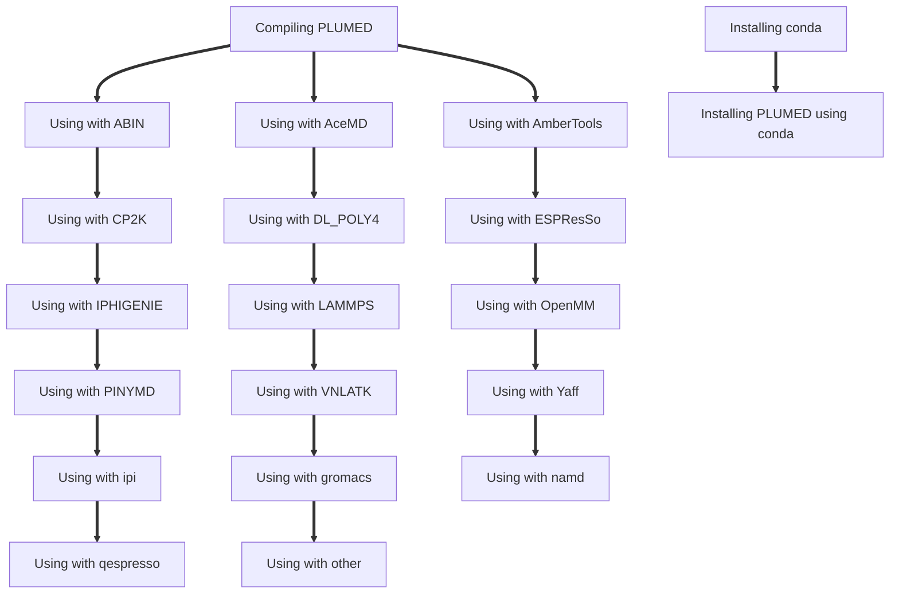

#  PLUMED Installation: An interactive guide

This interactive tutorial explains how to compile PLUMED and how to link it with a number of different MD codes.
The information in these tutorials is a reworked version you can find on the [installation page](https://www.plumed.org/doc-master/user-doc/html/_installation.html).
of the PLUMED manual.  There are a variety of different ways of getting your hands on PLUMED.  For example you can:

* Install it from Conda
* Install it from MacPorts
* Compile it yourself

If you just want to run the code on your local machine to do the exercises for the tutorials here we would recommend installing 
PLUMED from Conda. However, if you want to use PLUMED to do production calculations we would recommend compiling 
it yourself.  The flow chart below shows these two options and links to resources that explain how to go about these different jobs.
Many of the arrows here do indicated depedencies.  Obviously, you do not need to know how to use PLUMED with ABIN to use it with CP2K.
However, to use PLUMED with any MD code you do need to know how to compile it.

