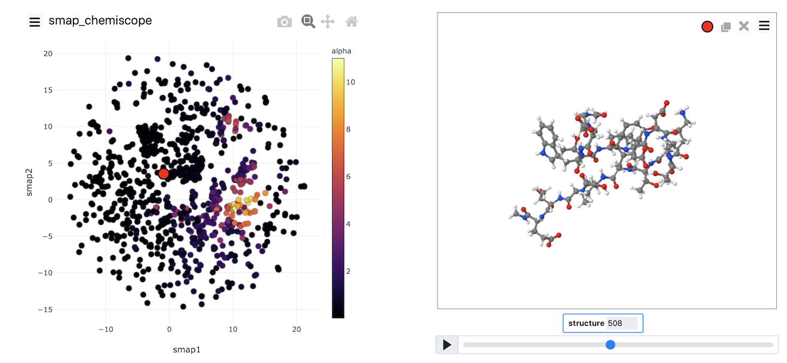

# PLUMED Masterclass 21.6: Dimensionality reduction

## Aims

The primary aim of this Masterclass is to show you how you might use PLUMED in your work.
We will see how to call PLUMED from a python notebook and discuss some strategies for selecting
collective variables.

## Objectives

Once this series of exercises is completed, users will be able to:

- Run dimensionality reduction algorithms with PLUMED

## Resources

The data needed to complete this Masterclass can be found on [GitHub](https://github.com/plumed/masterclass-21-6).
You can clone this repository locally on your machine using the following command:

````
git clone https://github.com/plumed/masterclass-21-6.git
````

I recommend that you run each exercise in a separate sub-directory (i.e. Exercise-1, Exercise-2, ...), which you can create inside the root directory `masterclass-21-6`. Organizing your data this way will help you to keep things clean.

_All the exercises have been tested with PLUMED version 2.7.0._

## Acknowledgements

Throughout this exercise, we use the [atomistic simulation environment](https://wiki.fysik.dtu.dk/ase/) 
and [chemiscope](https://chemiscope.org/).  Please look at the information at the links I have provided here 
for more information about these codes.

## Exercises

Chemiscope comes into its own when you are working with a machine learning algorithm.  These algorithms can (in theory) learn the collective variables you need to use from the trajectory data.
To make sense of the coordinates that have been learned, you have to carefully visualize where structures are projected in the low dimensional space.  You can use chemiscope to complete this 
process of visualizing the representation the computer has found for you.  In this next set of exercises, we will apply various dimensionality reduction algorithms to the data 
contained in the file traj.pdb.  If you visualize the contents of that file using VMD, you will see that this file contains a short protein trajectory.  You are perhaps unsure what 
CV to analyze this data and thus want to see if you can shed any light on the contents of the trajectory by using machine learning.

Typically, PLUMED analyses one set of atomic coordinates at a time.  To run a machine learning algorithm, however, you need to gather information on multiple configurations.
Therefore, the first thing you need to learn to use these algorithms is how to store configurations for later analysis with a machine learning algorithm.  The following input
illustrates how to complete this task using PLUMED.
        

<div style="width: 100%; float:left">
<div style="width: 90%; float:left" id="value_details_work/plumed_ex1.dat"> Click on the labels of the actions for more information on what each action computes </div>
<div style="width: 10%; float:left"><table><tr><td style="padding:1px"><a href="work/plumed_ex1.dat.plumed.stderr"></a></td></tr><tr><td style="padding:1px"><a href="work/plumed_ex1.dat.plumed_master.stderr"></a></td></tr><tr><td style="padding:0px"></td></tr>
</table></div></div>
<div id="work/plumed_ex1.dat_short">
<pre style="width=97%;">
<span style="color:blue" class="comment"># This reads in the template pdb file and thus allows us to use the @nonhydrogens</span>
<span style="color:blue" class="comment"># special group later in the input</span>
<div class="tooltip" style="color:green">MOLINFO<div class="right">This command is used to provide information on the molecules that are present in your system. <a href="https://www.plumed.org/doc-master/user-doc/html/_m_o_l_i_n_f_o.html" style="color:green">More details</a><i></i></div></div> <div class="tooltip">STRUCTURE<div class="right">a file in pdb format containing a reference structure<i></i></div></div>=<span style="background-color:yellow">__FILL__</span> <div class="tooltip">MOLTYPE<div class="right"> what kind of molecule is contained in the pdb file - usually not needed since protein/RNA/DNA are compatible<i></i></div></div>=protein
<br/><span style="color:blue" class="comment"># This stores the positions of all the nonhydrogen atoms for later analysis</span>
<span style="display:none;" id="work/plumed_ex1.dat">The MOLINFO action with label <b></b> calculates something</span><b name="work/plumed_ex1.datcc" onclick='showPath("work/plumed_ex1.dat","work/plumed_ex1.datcc","work/plumed_ex1.datcc","brown")'>cc</b>: <div class="tooltip" style="color:green">COLLECT_FRAMES<div class="right">This allows you to convert a trajectory and a dissimilarity matrix into a dissimilarity object <a href="https://www.plumed.org/doc-master/user-doc/html/_c_o_l_l_e_c_t__f_r_a_m_e_s.html" style="color:green">More details</a><i></i></div></div> <span style="background-color:yellow">__FILL__</span>=<div class="tooltip">@nonhydrogens<div class="right">all non hydrogen atoms. <a href="https://www.plumed.org/doc-master/user-doc/html/_m_o_l_i_n_f_o.html">Click here</a> for more information. <i></i></div></div>
<br/><span style="color:blue" class="comment"># This should output the atomic positions for the frames that were collected to a pdb file called traj.pdb</span>
<span style="display:none;" id="work/plumed_ex1.datcc">The COLLECT_FRAMES action with label <b>cc</b> calculates the following quantities:<table  align="center" frame="void" width="95%" cellpadding="5%"><tr><td width="5%"><b> Quantity </b>  </td><td><b> Description </b> </td></tr><tr><td width="5%">cc.data</td><td>the data that is being collected by this action</td></tr><tr><td width="5%">cc.logweights</td><td>the logarithms of the weights of the data points</td></tr></table></span><div class="tooltip" style="color:green">DUMPPDB<div class="right">Output PDB file. <a href="https://www.plumed.org/doc-master/user-doc/html/_d_u_m_p_p_d_b.html" style="color:green">More details</a><i></i></div></div> <div class="tooltip">ATOMS<div class="right">value containing positions of atoms that should be output<i></i></div></div>=cc_data <div class="tooltip">ATOM_INDICES<div class="right">the indices of the atoms in your PDB output<i></i></div></div>=<div class="tooltip">@nonhydrogens<div class="right">all non hydrogen atoms. <a href="https://www.plumed.org/doc-master/user-doc/html/_m_o_l_i_n_f_o.html">Click here</a> for more information. <i></i></div></div> <div class="tooltip">FILE<div class="right">the name of the file on which to output these quantities<i></i></div></div>=traj.pdb
</pre></div>
<div style="display:none;" id="work/plumed_ex1.dat_long"><pre style="width=97%;">
<span style="color:blue" class="comment"># This reads in the template pdb file and thus allows us to use the @nonhydrogens</span>
<span style="color:blue" class="comment"># special group later in the input</span>
<div class="tooltip" style="color:green">MOLINFO<div class="right">This command is used to provide information on the molecules that are present in your system. <a href="https://www.plumed.org/doc-master/user-doc/html/_m_o_l_i_n_f_o.html" style="color:green">More details</a><i></i></div></div> <div class="tooltip">STRUCTURE<div class="right">a file in pdb format containing a reference structure<i></i></div></div>=../data/bhp.pdb <div class="tooltip">MOLTYPE<div class="right"> what kind of molecule is contained in the pdb file - usually not needed since protein/RNA/DNA are compatible<i></i></div></div>=protein
<br/><span style="color:blue" class="comment"># This stores the positions of all the nonhydrogen atoms for later analysis</span>
<span style="display:none;" id="work/plumed_ex1.dat_sol">The MOLINFO action with label <b></b> calculates something</span><b name="work/plumed_ex1.dat_solcc" onclick='showPath("work/plumed_ex1.dat","work/plumed_ex1.dat_solcc","work/plumed_ex1.dat_solcc","brown")'>cc</b>: <div class="tooltip" style="color:green">COLLECT_FRAMES<div class="right">This allows you to convert a trajectory and a dissimilarity matrix into a dissimilarity object <a href="https://www.plumed.org/doc-master/user-doc/html/_c_o_l_l_e_c_t__f_r_a_m_e_s.html" style="color:green">More details</a><i></i></div></div> <div class="tooltip">ATOMS<div class="right">list of atomic positions that you would like to collect and store for later analysis<i></i></div></div>=<div class="tooltip">@nonhydrogens<div class="right">all non hydrogen atoms. <a href="https://www.plumed.org/doc-master/user-doc/html/_m_o_l_i_n_f_o.html">Click here</a> for more information. <i></i></div></div>
<br/><span style="color:blue" class="comment"># This should output the atomic positions for the frames that were collected to a pdb file called traj.pdb</span>
<span style="display:none;" id="work/plumed_ex1.dat_solcc">The COLLECT_FRAMES action with label <b>cc</b> calculates the following quantities:<table  align="center" frame="void" width="95%" cellpadding="5%"><tr><td width="5%"><b> Quantity </b>  </td><td><b> Description </b> </td></tr><tr><td width="5%">cc.data</td><td>the data that is being collected by this action</td></tr><tr><td width="5%">cc.logweights</td><td>the logarithms of the weights of the data points</td></tr></table></span><div class="tooltip" style="color:green">DUMPPDB<div class="right">Output PDB file. <a href="https://www.plumed.org/doc-master/user-doc/html/_d_u_m_p_p_d_b.html" style="color:green">More details</a><i></i></div></div> <div class="tooltip">ATOMS<div class="right">value containing positions of atoms that should be output<i></i></div></div>=cc_data <div class="tooltip">ATOM_INDICES<div class="right">the indices of the atoms in your PDB output<i></i></div></div>=<div class="tooltip">@nonhydrogens<div class="right">all non hydrogen atoms. <a href="https://www.plumed.org/doc-master/user-doc/html/_m_o_l_i_n_f_o.html">Click here</a> for more information. <i></i></div></div> <div class="tooltip">FILE<div class="right">the name of the file on which to output these quantities<i></i></div></div>=traj.pdb
</pre></div>

  

__Copy the input above into a plumed file and fill in the blanks.__  You should then be able to run the command using:

Then, once all the blanks are filled in, run the command using:

````
plumed driver --mf_pdb traj.pdb
````

You can also store the values of collective variables for later analysis with these algorithms.  __Modify the input above so that all
Thirty backbone dihedral angles in the protein are stored, and output using [OUTPUT_ANALYSIS_DATA_TO_COLVAR](https://www.plumed.org/doc-master/user-doc/html/_o_u_t_p_u_t__a_n_a_l_y_s_i_s__d_a_t_a__t_o__c_o_l_v_a_r.html) and rerun the calculation.__

You can find more information on the dimensionality reduction algorithms that we are using in this section in [this paper](https://arxiv.org/abs/1907.04170).

### PCA

Having learned how to store data for later analysis with a dimensionality reduction algorithm, lets now apply principal component analysis (PCA) upon
our stored data.  In principle component analysis, low dimensional projections for our trajectory are constructed by:

- Computing a covariance matrix from the trajectory data
- Diagonalizing the covariance matrix.
- Calculating the projection of each trajectory frame on a subset of the eigenvectors of the covariance matrix.

To perform PCA using PLUMED, we are going to use the following input with the blanks filled in: 


<div style="width: 100%; float:left">
<div style="width: 90%; float:left" id="value_details_work/plumed_ex2.dat"> Click on the labels of the actions for more information on what each action computes </div>
<div style="width: 10%; float:left"><table><tr><td style="padding:1px"><a href="work/plumed_ex2.dat.plumed.stderr"></a></td></tr><tr><td style="padding:1px"><a href="work/plumed_ex2.dat.plumed_master.stderr"></a></td></tr><tr><td style="padding:0px"></td></tr>
</table></div></div>
<div id="work/plumed_ex2.dat_short">
<pre style="width=97%;">
<span style="color:blue" class="comment"># This reads in the template pdb file and thus allows us to use the @nonhydrogens</span>
<span style="color:blue" class="comment"># special group later in the input</span>
<div class="tooltip" style="color:green">MOLINFO<div class="right">This command is used to provide information on the molecules that are present in your system. <a href="https://www.plumed.org/doc-master/user-doc/html/_m_o_l_i_n_f_o.html" style="color:green">More details</a><i></i></div></div> <div class="tooltip">STRUCTURE<div class="right">a file in pdb format containing a reference structure<i></i></div></div>=<span style="background-color:yellow">__FILL__</span> <div class="tooltip">MOLTYPE<div class="right"> what kind of molecule is contained in the pdb file - usually not needed since protein/RNA/DNA are compatible<i></i></div></div>=protein
<br/><span style="color:blue" class="comment"># This stores the positions of all the nonhydrogen atoms for later analysis</span>
<span style="display:none;" id="work/plumed_ex2.dat">The MOLINFO action with label <b></b> calculates something</span><b name="work/plumed_ex2.datcc" onclick='showPath("work/plumed_ex2.dat","work/plumed_ex2.datcc","work/plumed_ex2.datcc","brown")'>cc</b>: <div class="tooltip" style="color:green">COLLECT_FRAMES<div class="right">This allows you to convert a trajectory and a dissimilarity matrix into a dissimilarity object <a href="https://www.plumed.org/doc-master/user-doc/html/_c_o_l_l_e_c_t__f_r_a_m_e_s.html" style="color:green">More details</a><i></i></div></div> <span style="background-color:yellow">__FILL__</span>=<div class="tooltip">@nonhydrogens<div class="right">all non hydrogen atoms. <a href="https://www.plumed.org/doc-master/user-doc/html/_m_o_l_i_n_f_o.html">Click here</a> for more information. <i></i></div></div>
<span style="color:blue" class="comment"># This computes and diagonalizes the covariance matrix and projects each of the input coordinates into the low dimensional space</span>
<span style="color:blue" class="comment"># The output file here contains details of the eigenvectors that were obtained</span>
<span style="display:none;" id="work/plumed_ex2.datcc">The COLLECT_FRAMES action with label <b>cc</b> calculates the following quantities:<table  align="center" frame="void" width="95%" cellpadding="5%"><tr><td width="5%"><b> Quantity </b>  </td><td><b> Description </b> </td></tr><tr><td width="5%">cc.data</td><td>the data that is being collected by this action</td></tr><tr><td width="5%">cc.logweights</td><td>the logarithms of the weights of the data points</td></tr></table></span><b name="work/plumed_ex2.datpca" onclick='showPath("work/plumed_ex2.dat","work/plumed_ex2.datpca","work/plumed_ex2.datpca","brown")'>pca</b>: <div class="tooltip" style="color:green">PCA<div class="right">Perform principal component analysis (PCA) using either the positions of the atoms a large number of collective variables as input. <a href="https://www.plumed.org/doc-master/user-doc/html/_p_c_a.html" style="color:green">More details</a><i></i></div></div> <div class="tooltip">ARG<div class="right">the arguments that you would like to make the histogram for<i></i></div></div>=<span style="background-color:yellow">__FILL__</span> <div class="tooltip">NLOW_DIM<div class="right">number of low-dimensional coordinates required<i></i></div></div>=2 <div class="tooltip">FILE<div class="right">the file on which to output the low dimensional coordinates<i></i></div></div>=pca_proj.pdb
<span style="color:blue" class="comment"># This will output the PCA projections of all the coordinates</span>
<span style="display:none;" id="work/plumed_ex2.datpca">The PCA action with label <b>pca</b> calculates the following quantities:<table  align="center" frame="void" width="95%" cellpadding="5%"><tr><td width="5%"><b> Quantity </b>  </td><td><b> Description </b> </td></tr><tr><td width="5%">pca.value</td><td>the projections of the input coordinates on the PCA components that were found from the covariance matrix</td></tr></table></span><div class="tooltip" style="color:green">DUMPVECTOR<div class="right">Print a vector to a file <a href="https://www.plumed.org/doc-master/user-doc/html/_d_u_m_p_v_e_c_t_o_r.html" style="color:green">More details</a><i></i></div></div> <div class="tooltip">ARG<div class="right">the labels of vectors/matrices that should be output in the file<i></i></div></div>=<span style="background-color:yellow">__FILL__</span> <div class="tooltip">FILE<div class="right"> the file on which to write the vetors<i></i></div></div>=pca_data
<br/><span style="color:blue" class="comment"># These next three commands calculate the secondary structure variables.  These</span>
<span style="color:blue" class="comment"># variables measure how much of the structure resembles an alpha helix, an antiparallel beta-sheet</span>
<span style="color:blue" class="comment"># and a parallel beta-sheet.  Configurations that have different secondary structures should be projected</span>
<span style="color:blue" class="comment"># in different parts of the low dimensional space.</span>
<b name="work/plumed_ex2.datalpha" onclick='showPath("work/plumed_ex2.dat","work/plumed_ex2.datalpha","work/plumed_ex2.datalpha","brown")'>alpha</b>: <div class="tooltip" style="color:green">ALPHARMSD<div class="right">Probe the alpha helical content of a protein structure. <a href="https://www.plumed.org/doc-master/user-doc/html/_a_l_p_h_a_r_m_s_d.html" style="color:green">More details</a><i></i></div></div> <div class="tooltip">RESIDUES<div class="right">this command is used to specify the set of residues that could conceivably form part of the secondary structure<i></i></div></div>=all
<span style="display:none;" id="work/plumed_ex2.datalpha">The ALPHARMSD action with label <b>alpha</b> calculates the following quantities:<table  align="center" frame="void" width="95%" cellpadding="5%"><tr><td width="5%"><b> Quantity </b>  </td><td><b> Description </b> </td></tr><tr><td width="5%">alpha.value</td><td>if LESS_THAN is present the RMSD distance between each residue and the ideal alpha helix</td></tr><tr><td width="5%">alpha.struct</td><td>the vectors containing the rmsd distances between the residues and each of the reference structures</td></tr><tr><td width="5%">alpha.lessthan</td><td>the number blocks of residues that have an RMSD from the secondary structure that is less than the threshold</td></tr></table></span><b name="work/plumed_ex2.databeta" onclick='showPath("work/plumed_ex2.dat","work/plumed_ex2.databeta","work/plumed_ex2.databeta","brown")'>abeta</b>: <div class="tooltip" style="color:green">ANTIBETARMSD<div class="right">Probe the antiparallel beta sheet content of your protein structure. <a href="https://www.plumed.org/doc-master/user-doc/html/_a_n_t_i_b_e_t_a_r_m_s_d.html" style="color:green">More details</a><i></i></div></div> <div class="tooltip">RESIDUES<div class="right">this command is used to specify the set of residues that could conceivably form part of the secondary structure<i></i></div></div>=all <div class="tooltip">STRANDS_CUTOFF<div class="right">If in a segment of protein the two strands are further apart then the calculation of the actual RMSD is skipped as the structure is very far from being beta-sheet like<i></i></div></div>=1.0
<span style="display:none;" id="work/plumed_ex2.databeta">The ANTIBETARMSD action with label <b>abeta</b> calculates the following quantities:<table  align="center" frame="void" width="95%" cellpadding="5%"><tr><td width="5%"><b> Quantity </b>  </td><td><b> Description </b> </td></tr><tr><td width="5%">abeta.value</td><td>if LESS_THAN is present the RMSD distance between each residue and the ideal antiparallel beta sheet</td></tr><tr><td width="5%">abeta.struct</td><td>the vectors containing the rmsd distances between the residues and each of the reference structures</td></tr><tr><td width="5%">abeta.lessthan</td><td>the number blocks of residues that have an RMSD from the secondary structure that is less than the threshold</td></tr></table></span><b name="work/plumed_ex2.datpbeta" onclick='showPath("work/plumed_ex2.dat","work/plumed_ex2.datpbeta","work/plumed_ex2.datpbeta","brown")'>pbeta</b>: <div class="tooltip" style="color:green">PARABETARMSD<div class="right">Probe the parallel beta sheet content of your protein structure. <a href="https://www.plumed.org/doc-master/user-doc/html/_p_a_r_a_b_e_t_a_r_m_s_d.html" style="color:green">More details</a><i></i></div></div> <div class="tooltip">RESIDUES<div class="right">this command is used to specify the set of residues that could conceivably form part of the secondary structure<i></i></div></div>=all <div class="tooltip">STRANDS_CUTOFF<div class="right">If in a segment of protein the two strands are further apart then the calculation of the actual RMSD is skipped as the structure is very far from being beta-sheet like<i></i></div></div>=1.0
<br/><span style="color:blue" class="comment"># These commands collect and output the secondary structure variables so that we can use this information to</span>
<span style="color:blue" class="comment"># determine how good our projection of the trajectory data is.</span>
<span style="display:none;" id="work/plumed_ex2.datpbeta">The PARABETARMSD action with label <b>pbeta</b> calculates the following quantities:<table  align="center" frame="void" width="95%" cellpadding="5%"><tr><td width="5%"><b> Quantity </b>  </td><td><b> Description </b> </td></tr><tr><td width="5%">pbeta.value</td><td>if LESS_THAN is present the RMSD distance between each residue and the ideal parallel beta sheet</td></tr><tr><td width="5%">pbeta.struct</td><td>the vectors containing the rmsd distances between the residues and each of the reference structures</td></tr><tr><td width="5%">pbeta.lessthan</td><td>the number blocks of residues that have an RMSD from the secondary structure that is less than the threshold</td></tr></table></span><b name="work/plumed_ex2.datcc2" onclick='showPath("work/plumed_ex2.dat","work/plumed_ex2.datcc2","work/plumed_ex2.datcc2","brown")'>cc2</b>: <div class="tooltip" style="color:green">COLLECT_FRAMES<div class="right">This allows you to convert a trajectory and a dissimilarity matrix into a dissimilarity object <a href="https://www.plumed.org/doc-master/user-doc/html/_c_o_l_l_e_c_t__f_r_a_m_e_s.html" style="color:green">More details</a><i></i></div></div> <div class="tooltip">ARG<div class="right">the labels of the values whose time series you would like to collect for later analysis<i></i></div></div>=<b name="work/plumed_ex2.datalpha">alpha</b>,<b name="work/plumed_ex2.databeta">abeta</b>,<b name="work/plumed_ex2.datpbeta">pbeta</b>
<span style="display:none;" id="work/plumed_ex2.datcc2">The COLLECT_FRAMES action with label <b>cc2</b> calculates the following quantities:<table  align="center" frame="void" width="95%" cellpadding="5%"><tr><td width="5%"><b> Quantity </b>  </td><td><b> Description </b> </td></tr><tr><td width="5%">cc2.data</td><td>the data that is being collected by this action</td></tr><tr><td width="5%">cc2.logweights</td><td>the logarithms of the weights of the data points</td></tr></table></span><div class="tooltip" style="color:green">DUMPVECTOR<div class="right">Print a vector to a file <a href="https://www.plumed.org/doc-master/user-doc/html/_d_u_m_p_v_e_c_t_o_r.html" style="color:green">More details</a><i></i></div></div> <div class="tooltip">ARG<div class="right">the labels of vectors/matrices that should be output in the file<i></i></div></div>=cc2_data <div class="tooltip">FILE<div class="right"> the file on which to write the vetors<i></i></div></div>=secondary_structure_data
</pre></div>
<div style="display:none;" id="work/plumed_ex2.dat_long"><pre style="width=97%;">
<span style="color:blue" class="comment"># This reads in the template pdb file and thus allows us to use the @nonhydrogens</span>
<span style="color:blue" class="comment"># special group later in the input</span>
<div class="tooltip" style="color:green">MOLINFO<div class="right">This command is used to provide information on the molecules that are present in your system. <a href="https://www.plumed.org/doc-master/user-doc/html/_m_o_l_i_n_f_o.html" style="color:green">More details</a><i></i></div></div> <div class="tooltip">STRUCTURE<div class="right">a file in pdb format containing a reference structure<i></i></div></div>=../data/bhp.pdb <div class="tooltip">MOLTYPE<div class="right"> what kind of molecule is contained in the pdb file - usually not needed since protein/RNA/DNA are compatible<i></i></div></div>=protein
<br/><span style="color:blue" class="comment"># This stores the positions of all the nonhydrogen atoms for later analysis</span>
<span style="display:none;" id="work/plumed_ex2.dat_sol">The MOLINFO action with label <b></b> calculates something</span><b name="work/plumed_ex2.dat_solcc" onclick='showPath("work/plumed_ex2.dat","work/plumed_ex2.dat_solcc","work/plumed_ex2.dat_solcc","brown")'>cc</b>: <div class="tooltip" style="color:green">COLLECT_FRAMES<div class="right">This allows you to convert a trajectory and a dissimilarity matrix into a dissimilarity object <a href="https://www.plumed.org/doc-master/user-doc/html/_c_o_l_l_e_c_t__f_r_a_m_e_s.html" style="color:green">More details</a><i></i></div></div> <div class="tooltip">ATOMS<div class="right">list of atomic positions that you would like to collect and store for later analysis<i></i></div></div>=<div class="tooltip">@nonhydrogens<div class="right">all non hydrogen atoms. <a href="https://www.plumed.org/doc-master/user-doc/html/_m_o_l_i_n_f_o.html">Click here</a> for more information. <i></i></div></div>
<span style="color:blue" class="comment"># This computes and diagonalizes the covariance matrix and projects each of the input coordinates into the low dimensional space</span>
<span style="color:blue" class="comment"># The output file here contains details of the eigenvectors that were obtained</span>
<span style="display:none;" id="work/plumed_ex2.dat_solcc">The COLLECT_FRAMES action with label <b>cc</b> calculates the following quantities:<table  align="center" frame="void" width="95%" cellpadding="5%"><tr><td width="5%"><b> Quantity </b>  </td><td><b> Description </b> </td></tr><tr><td width="5%">cc.data</td><td>the data that is being collected by this action</td></tr><tr><td width="5%">cc.logweights</td><td>the logarithms of the weights of the data points</td></tr></table></span><b name="work/plumed_ex2.dat_solpca" onclick='showPath("work/plumed_ex2.dat","work/plumed_ex2.dat_solpca","work/plumed_ex2.dat_solpca","brown")'>pca</b>: <div class="tooltip" style="color:green">PCA<div class="right">Perform principal component analysis (PCA) using either the positions of the atoms a large number of collective variables as input. <a href="https://www.plumed.org/doc-master/user-doc/html/_p_c_a.html" style="color:green">More details</a><i></i></div></div> <div class="tooltip">ARG<div class="right">the arguments that you would like to make the histogram for<i></i></div></div>=<b name="work/plumed_ex2.dat_solcc">cc</b> <div class="tooltip">NLOW_DIM<div class="right">number of low-dimensional coordinates required<i></i></div></div>=2 <div class="tooltip">FILE<div class="right">the file on which to output the low dimensional coordinates<i></i></div></div>=pca_proj.pdb
<span style="color:blue" class="comment"># This will output the PCA projections of all the coordinates</span>
<span style="display:none;" id="work/plumed_ex2.dat_solpca">The PCA action with label <b>pca</b> calculates the following quantities:<table  align="center" frame="void" width="95%" cellpadding="5%"><tr><td width="5%"><b> Quantity </b>  </td><td><b> Description </b> </td></tr><tr><td width="5%">pca.value</td><td>the projections of the input coordinates on the PCA components that were found from the covariance matrix</td></tr></table></span><div class="tooltip" style="color:green">DUMPVECTOR<div class="right">Print a vector to a file <a href="https://www.plumed.org/doc-master/user-doc/html/_d_u_m_p_v_e_c_t_o_r.html" style="color:green">More details</a><i></i></div></div> <div class="tooltip">ARG<div class="right">the labels of vectors/matrices that should be output in the file<i></i></div></div>=<b name="work/plumed_ex2.dat_solpca">pca</b> <div class="tooltip">FILE<div class="right"> the file on which to write the vetors<i></i></div></div>=pca_data
<br/><span style="color:blue" class="comment"># These next three commands calculate the secondary structure variables.  These</span>
<span style="color:blue" class="comment"># variables measure how much of the structure resembles an alpha helix, an antiparallel beta-sheet</span>
<span style="color:blue" class="comment"># and a parallel beta-sheet.  Configurations that have different secondary structures should be projected</span>
<span style="color:blue" class="comment"># in different parts of the low dimensional space.</span>
<b name="work/plumed_ex2.dat_solalpha" onclick='showPath("work/plumed_ex2.dat","work/plumed_ex2.dat_solalpha","work/plumed_ex2.dat_solalpha","brown")'>alpha</b>: <div class="tooltip" style="color:green">ALPHARMSD<div class="right">Probe the alpha helical content of a protein structure. <a href="https://www.plumed.org/doc-master/user-doc/html/_a_l_p_h_a_r_m_s_d.html" style="color:green">More details</a><i></i></div></div> <div class="tooltip">RESIDUES<div class="right">this command is used to specify the set of residues that could conceivably form part of the secondary structure<i></i></div></div>=all
<span style="display:none;" id="work/plumed_ex2.dat_solalpha">The ALPHARMSD action with label <b>alpha</b> calculates the following quantities:<table  align="center" frame="void" width="95%" cellpadding="5%"><tr><td width="5%"><b> Quantity </b>  </td><td><b> Description </b> </td></tr><tr><td width="5%">alpha.value</td><td>if LESS_THAN is present the RMSD distance between each residue and the ideal alpha helix</td></tr><tr><td width="5%">alpha.struct</td><td>the vectors containing the rmsd distances between the residues and each of the reference structures</td></tr><tr><td width="5%">alpha.lessthan</td><td>the number blocks of residues that have an RMSD from the secondary structure that is less than the threshold</td></tr></table></span><b name="work/plumed_ex2.dat_solabeta" onclick='showPath("work/plumed_ex2.dat","work/plumed_ex2.dat_solabeta","work/plumed_ex2.dat_solabeta","brown")'>abeta</b>: <div class="tooltip" style="color:green">ANTIBETARMSD<div class="right">Probe the antiparallel beta sheet content of your protein structure. <a href="https://www.plumed.org/doc-master/user-doc/html/_a_n_t_i_b_e_t_a_r_m_s_d.html" style="color:green">More details</a><i></i></div></div> <div class="tooltip">RESIDUES<div class="right">this command is used to specify the set of residues that could conceivably form part of the secondary structure<i></i></div></div>=all <div class="tooltip">STRANDS_CUTOFF<div class="right">If in a segment of protein the two strands are further apart then the calculation of the actual RMSD is skipped as the structure is very far from being beta-sheet like<i></i></div></div>=1.0
<span style="display:none;" id="work/plumed_ex2.dat_solabeta">The ANTIBETARMSD action with label <b>abeta</b> calculates the following quantities:<table  align="center" frame="void" width="95%" cellpadding="5%"><tr><td width="5%"><b> Quantity </b>  </td><td><b> Description </b> </td></tr><tr><td width="5%">abeta.value</td><td>if LESS_THAN is present the RMSD distance between each residue and the ideal antiparallel beta sheet</td></tr><tr><td width="5%">abeta.struct</td><td>the vectors containing the rmsd distances between the residues and each of the reference structures</td></tr><tr><td width="5%">abeta.lessthan</td><td>the number blocks of residues that have an RMSD from the secondary structure that is less than the threshold</td></tr></table></span><b name="work/plumed_ex2.dat_solpbeta" onclick='showPath("work/plumed_ex2.dat","work/plumed_ex2.dat_solpbeta","work/plumed_ex2.dat_solpbeta","brown")'>pbeta</b>: <div class="tooltip" style="color:green">PARABETARMSD<div class="right">Probe the parallel beta sheet content of your protein structure. <a href="https://www.plumed.org/doc-master/user-doc/html/_p_a_r_a_b_e_t_a_r_m_s_d.html" style="color:green">More details</a><i></i></div></div> <div class="tooltip">RESIDUES<div class="right">this command is used to specify the set of residues that could conceivably form part of the secondary structure<i></i></div></div>=all <div class="tooltip">STRANDS_CUTOFF<div class="right">If in a segment of protein the two strands are further apart then the calculation of the actual RMSD is skipped as the structure is very far from being beta-sheet like<i></i></div></div>=1.0
<br/><span style="color:blue" class="comment"># These commands collect and output the secondary structure variables so that we can use this information to</span>
<span style="color:blue" class="comment"># determine how good our projection of the trajectory data is.</span>
<span style="display:none;" id="work/plumed_ex2.dat_solpbeta">The PARABETARMSD action with label <b>pbeta</b> calculates the following quantities:<table  align="center" frame="void" width="95%" cellpadding="5%"><tr><td width="5%"><b> Quantity </b>  </td><td><b> Description </b> </td></tr><tr><td width="5%">pbeta.value</td><td>if LESS_THAN is present the RMSD distance between each residue and the ideal parallel beta sheet</td></tr><tr><td width="5%">pbeta.struct</td><td>the vectors containing the rmsd distances between the residues and each of the reference structures</td></tr><tr><td width="5%">pbeta.lessthan</td><td>the number blocks of residues that have an RMSD from the secondary structure that is less than the threshold</td></tr></table></span><b name="work/plumed_ex2.dat_solcc2" onclick='showPath("work/plumed_ex2.dat","work/plumed_ex2.dat_solcc2","work/plumed_ex2.dat_solcc2","brown")'>cc2</b>: <div class="tooltip" style="color:green">COLLECT_FRAMES<div class="right">This allows you to convert a trajectory and a dissimilarity matrix into a dissimilarity object <a href="https://www.plumed.org/doc-master/user-doc/html/_c_o_l_l_e_c_t__f_r_a_m_e_s.html" style="color:green">More details</a><i></i></div></div> <div class="tooltip">ARG<div class="right">the labels of the values whose time series you would like to collect for later analysis<i></i></div></div>=<b name="work/plumed_ex2.dat_solalpha">alpha</b>,<b name="work/plumed_ex2.dat_solabeta">abeta</b>,<b name="work/plumed_ex2.dat_solpbeta">pbeta</b>
<span style="display:none;" id="work/plumed_ex2.dat_solcc2">The COLLECT_FRAMES action with label <b>cc2</b> calculates the following quantities:<table  align="center" frame="void" width="95%" cellpadding="5%"><tr><td width="5%"><b> Quantity </b>  </td><td><b> Description </b> </td></tr><tr><td width="5%">cc2.data</td><td>the data that is being collected by this action</td></tr><tr><td width="5%">cc2.logweights</td><td>the logarithms of the weights of the data points</td></tr></table></span><div class="tooltip" style="color:green">DUMPVECTOR<div class="right">Print a vector to a file <a href="https://www.plumed.org/doc-master/user-doc/html/_d_u_m_p_v_e_c_t_o_r.html" style="color:green">More details</a><i></i></div></div> <div class="tooltip">ARG<div class="right">the labels of vectors/matrices that should be output in the file<i></i></div></div>=cc2_data <div class="tooltip">FILE<div class="right"> the file on which to write the vetors<i></i></div></div>=secondary_structure_data
</pre></div>

  

To generate the projection, you run the command:

````
plumed driver --mf_pdb traj.pdb
````

You can generate a projection of the data above using chemiscope by using the following script:

```python
# This ase command should read in the traj.pdb file that was analyzed.  Notice that the analysis
# actions below ignore the first frame in this trajectory, so we need to take that into account
# when we generated the chemiscope
traj = ase.io.read('../data/traj.pdb',':')
# This reads in the PCA projection that are output by by the OUTPUT_ANALYSIS_DATA_TO_COLVAR command
# above
projection = np.loadtxt("pca_data")
# We also read in the secondary structure data by colouring points following the secondary
# structure. We can get a sense of how good our projection is.
structure = np.loadtxt("secondary_structure_data")

# This ensures that the atomic masses are used in place of the symbols
# when constructing the atomic configurations' chemiscope representations.
# Using the symbols will not work because ase is written by chemists and not
# biologists.  For a chemist, HG1 is mercury as opposed to the first hydrogen
# on a guanine residue.
for frame in traj:
    frame.numbers = np.array(
        [
            np.argmin(np.subtract(atomic_masses, float(am)) ** 2)
            for am in frame.arrays["occupancy"]
        ]
    )

# This constructs the dictionary of properties for chemiscope
properties = {
    "pca1": {
        "target": "structure",
        "values": projection[:,0],
        "description": "First principle component",
    },
    "pca2": {
        "target": "structure",
        "values": projection[:,1],
        "description": "Second principle component",
    },
    "alpha": {
        "target": "structure",
        "values": structure[:,0],
        "description": "Alpha helical content",
    },
    "antibeta": {
        "target": "structure",
        "values": structure[:,1],
        "description": "Anti parallel beta sheet content",
    },
    "parabeta": {
        "target": "structure",
        "values": structure[:,2],
        "description": "Parallel beta sheet content",
    },
}

# This generates our chemiscope output
write_input("pca_chemiscope.json.gz", frames=traj[1:], properties=properties )
```

When the output from this set of commands is loaded into chemiscope, we can construct figures like the one shown below.  On the axes here, we have plotted the PCA coordinates.  The
points are then coloured according to the alpha-helical content.


__See if you can use PLUMED and chemiscope to generate a figure similar to the one above.__  Try to experiment with the way the points are coloured.  Look at the beta-sheet content as well.

### MDS

In the previous section, we performed PCA on the atomic positions directly.  In the section before last, however, we also saw how we could store high-dimensional vectors of collective variables and then
use them as input to a dimensionality reduction algorithm.  Therefore, we might legitimately ask if we can do PCA using these high-dimensional vectors as input rather than atomic positions.
The answer to this question is yes as long as the CV is not periodic.  If any of our CVs are not periodic, we cannot analyze them using the PCA action.  We can, however, formulate the PCA algorithm
differently.  In this alternative formulation, which is known as classical multidimensional scaling (MDS), we do the following:

- We calculate the matrix of distances between configurations
- We perform an operation known as centring the matrix.
- We diagonalize the centred matrix
The eigenvectors multiplied by the corresponding eigenvalue's square root can then be used as a set of projections for our input points.

This method is used less often than PCA as the matrix that we have to diagonalize here in the third step can be considerably larger than the matrix that we have to diagonalize when we perform PCA.  
To avoid this expensive diagonalization step, we often select a subset of so-called landmark points on which to run the algorithm directly.  Projections for the remaining points are then found
by using a so-called out-of-sample procedure.  This is what has been done in the following input:


<div style="width: 100%; float:left">
<div style="width: 90%; float:left" id="value_details_work/plumed_ex3.dat"> Click on the labels of the actions for more information on what each action computes </div>
<div style="width: 10%; float:left"><table><tr><td style="padding:1px"><a href="work/plumed_ex3.dat.plumed.stderr"></a></td></tr><tr><td style="padding:1px"><a href="work/plumed_ex3.dat.plumed_master.stderr"></a></td></tr><tr><td style="padding:0px"></td></tr>
</table></div></div>
<div id="work/plumed_ex3.dat_short">
<pre style="width=97%;">
<span style="color:blue" class="comment"># This command reads in the template pdb file and thus allows us to use the @nonhydrogens</span>
<span style="color:blue" class="comment"># group later in the input</span>
<div class="tooltip" style="color:green">MOLINFO<div class="right">This command is used to provide information on the molecules that are present in your system. <a href="https://www.plumed.org/doc-master/user-doc/html/_m_o_l_i_n_f_o.html" style="color:green">More details</a><i></i></div></div> <div class="tooltip">STRUCTURE<div class="right">a file in pdb format containing a reference structure<i></i></div></div>=<span style="background-color:yellow">__FILL__</span> <div class="tooltip">MOLTYPE<div class="right"> what kind of molecule is contained in the pdb file - usually not needed since protein/RNA/DNA are compatible<i></i></div></div>=protein
<br/><span style="color:blue" class="comment"># This stores the positions of all the nonhydrogen atoms for later analysis</span>
<span style="display:none;" id="work/plumed_ex3.dat">The MOLINFO action with label <b></b> calculates something</span><b name="work/plumed_ex3.datcc" onclick='showPath("work/plumed_ex3.dat","work/plumed_ex3.datcc","work/plumed_ex3.datcc","brown")'>cc</b>: <div class="tooltip" style="color:green">COLLECT_FRAMES<div class="right">This allows you to convert a trajectory and a dissimilarity matrix into a dissimilarity object <a href="https://www.plumed.org/doc-master/user-doc/html/_c_o_l_l_e_c_t__f_r_a_m_e_s.html" style="color:green">More details</a><i></i></div></div> <div class="tooltip">ATOMS<div class="right">list of atomic positions that you would like to collect and store for later analysis<i></i></div></div>=<div class="tooltip">@nonhydrogens<div class="right">all non hydrogen atoms. <a href="https://www.plumed.org/doc-master/user-doc/html/_m_o_l_i_n_f_o.html">Click here</a> for more information. <i></i></div></div>
<br/><span style="color:blue" class="comment"># The following commands compute all the Ramachandran angles of the protein for you</span>
<span style="display:none;" id="work/plumed_ex3.datcc">The COLLECT_FRAMES action with label <b>cc</b> calculates the following quantities:<table  align="center" frame="void" width="95%" cellpadding="5%"><tr><td width="5%"><b> Quantity </b>  </td><td><b> Description </b> </td></tr><tr><td width="5%">cc.data</td><td>the data that is being collected by this action</td></tr><tr><td width="5%">cc.logweights</td><td>the logarithms of the weights of the data points</td></tr></table></span><b name="work/plumed_ex3.datr2-phi" onclick='showPath("work/plumed_ex3.dat","work/plumed_ex3.datr2-phi","work/plumed_ex3.datr2-phi","brown")'>r2-phi</b>: <div class="tooltip" style="color:green">TORSION<div class="right">Calculate a torsional angle. <a href="https://www.plumed.org/doc-master/user-doc/html/_t_o_r_s_i_o_n.html" style="color:green">More details</a><i></i></div></div> <div class="tooltip">ATOMS<div class="right">the four atoms involved in the torsional angle<i></i></div></div>=<div class="tooltip">@phi-2<div class="right">the four atoms that are required to calculate the phi dihedral for residue 2. <a href="https://www.plumed.org/doc-master/user-doc/html/_m_o_l_i_n_f_o.html">Click here</a> for more information. <i></i></div></div>
<span style="display:none;" id="work/plumed_ex3.datr2-phi">The TORSION action with label <b>r2-phi</b> calculates the following quantities:<table  align="center" frame="void" width="95%" cellpadding="5%"><tr><td width="5%"><b> Quantity </b>  </td><td><b> Description </b> </td></tr><tr><td width="5%">r2-phi.value</td><td>the TORSION involving these atoms</td></tr></table></span><b name="work/plumed_ex3.datr2-psi" onclick='showPath("work/plumed_ex3.dat","work/plumed_ex3.datr2-psi","work/plumed_ex3.datr2-psi","brown")'>r2-psi</b>: <div class="tooltip" style="color:green">TORSION<div class="right">Calculate a torsional angle. <a href="https://www.plumed.org/doc-master/user-doc/html/_t_o_r_s_i_o_n.html" style="color:green">More details</a><i></i></div></div> <div class="tooltip">ATOMS<div class="right">the four atoms involved in the torsional angle<i></i></div></div>=<div class="tooltip">@psi-2<div class="right">the four atoms that are required to calculate the psi dihedral for residue 2. <a href="https://www.plumed.org/doc-master/user-doc/html/_m_o_l_i_n_f_o.html">Click here</a> for more information. <i></i></div></div>
<span style="display:none;" id="work/plumed_ex3.datr2-psi">The TORSION action with label <b>r2-psi</b> calculates the following quantities:<table  align="center" frame="void" width="95%" cellpadding="5%"><tr><td width="5%"><b> Quantity </b>  </td><td><b> Description </b> </td></tr><tr><td width="5%">r2-psi.value</td><td>the TORSION involving these atoms</td></tr></table></span><b name="work/plumed_ex3.datr3-phi" onclick='showPath("work/plumed_ex3.dat","work/plumed_ex3.datr3-phi","work/plumed_ex3.datr3-phi","brown")'>r3-phi</b>: <div class="tooltip" style="color:green">TORSION<div class="right">Calculate a torsional angle. <a href="https://www.plumed.org/doc-master/user-doc/html/_t_o_r_s_i_o_n.html" style="color:green">More details</a><i></i></div></div> <div class="tooltip">ATOMS<div class="right">the four atoms involved in the torsional angle<i></i></div></div>=<div class="tooltip">@phi-3<div class="right">the four atoms that are required to calculate the phi dihedral for residue 3. <a href="https://www.plumed.org/doc-master/user-doc/html/_m_o_l_i_n_f_o.html">Click here</a> for more information. <i></i></div></div>
<span style="display:none;" id="work/plumed_ex3.datr3-phi">The TORSION action with label <b>r3-phi</b> calculates the following quantities:<table  align="center" frame="void" width="95%" cellpadding="5%"><tr><td width="5%"><b> Quantity </b>  </td><td><b> Description </b> </td></tr><tr><td width="5%">r3-phi.value</td><td>the TORSION involving these atoms</td></tr></table></span><b name="work/plumed_ex3.datr3-psi" onclick='showPath("work/plumed_ex3.dat","work/plumed_ex3.datr3-psi","work/plumed_ex3.datr3-psi","brown")'>r3-psi</b>: <div class="tooltip" style="color:green">TORSION<div class="right">Calculate a torsional angle. <a href="https://www.plumed.org/doc-master/user-doc/html/_t_o_r_s_i_o_n.html" style="color:green">More details</a><i></i></div></div> <div class="tooltip">ATOMS<div class="right">the four atoms involved in the torsional angle<i></i></div></div>=<div class="tooltip">@psi-3<div class="right">the four atoms that are required to calculate the psi dihedral for residue 3. <a href="https://www.plumed.org/doc-master/user-doc/html/_m_o_l_i_n_f_o.html">Click here</a> for more information. <i></i></div></div>
<span style="display:none;" id="work/plumed_ex3.datr3-psi">The TORSION action with label <b>r3-psi</b> calculates the following quantities:<table  align="center" frame="void" width="95%" cellpadding="5%"><tr><td width="5%"><b> Quantity </b>  </td><td><b> Description </b> </td></tr><tr><td width="5%">r3-psi.value</td><td>the TORSION involving these atoms</td></tr></table></span><b name="work/plumed_ex3.datr4-phi" onclick='showPath("work/plumed_ex3.dat","work/plumed_ex3.datr4-phi","work/plumed_ex3.datr4-phi","brown")'>r4-phi</b>: <div class="tooltip" style="color:green">TORSION<div class="right">Calculate a torsional angle. <a href="https://www.plumed.org/doc-master/user-doc/html/_t_o_r_s_i_o_n.html" style="color:green">More details</a><i></i></div></div> <span style="background-color:yellow">__FILL__</span>
<span style="display:none;" id="work/plumed_ex3.datr4-phi">The TORSION action with label <b>r4-phi</b> calculates the TORSION involving these atoms</span><b name="work/plumed_ex3.datr4-psi" onclick='showPath("work/plumed_ex3.dat","work/plumed_ex3.datr4-psi","work/plumed_ex3.datr4-psi","brown")'>r4-psi</b>: <div class="tooltip" style="color:green">TORSION<div class="right">Calculate a torsional angle. <a href="https://www.plumed.org/doc-master/user-doc/html/_t_o_r_s_i_o_n.html" style="color:green">More details</a><i></i></div></div> <span style="background-color:yellow">__FILL__</span>
<span style="display:none;" id="work/plumed_ex3.datr4-psi">The TORSION action with label <b>r4-psi</b> calculates the TORSION involving these atoms</span><b name="work/plumed_ex3.datr5-phi" onclick='showPath("work/plumed_ex3.dat","work/plumed_ex3.datr5-phi","work/plumed_ex3.datr5-phi","brown")'>r5-phi</b>: <div class="tooltip" style="color:green">TORSION<div class="right">Calculate a torsional angle. <a href="https://www.plumed.org/doc-master/user-doc/html/_t_o_r_s_i_o_n.html" style="color:green">More details</a><i></i></div></div> <span style="background-color:yellow">__FILL__</span>
<span style="display:none;" id="work/plumed_ex3.datr5-phi">The TORSION action with label <b>r5-phi</b> calculates the TORSION involving these atoms</span><b name="work/plumed_ex3.datr5-psi" onclick='showPath("work/plumed_ex3.dat","work/plumed_ex3.datr5-psi","work/plumed_ex3.datr5-psi","brown")'>r5-psi</b>: <div class="tooltip" style="color:green">TORSION<div class="right">Calculate a torsional angle. <a href="https://www.plumed.org/doc-master/user-doc/html/_t_o_r_s_i_o_n.html" style="color:green">More details</a><i></i></div></div> <span style="background-color:yellow">__FILL__</span>
<span style="display:none;" id="work/plumed_ex3.datr5-psi">The TORSION action with label <b>r5-psi</b> calculates the TORSION involving these atoms</span><b name="work/plumed_ex3.datr6-phi" onclick='showPath("work/plumed_ex3.dat","work/plumed_ex3.datr6-phi","work/plumed_ex3.datr6-phi","brown")'>r6-phi</b>: <div class="tooltip" style="color:green">TORSION<div class="right">Calculate a torsional angle. <a href="https://www.plumed.org/doc-master/user-doc/html/_t_o_r_s_i_o_n.html" style="color:green">More details</a><i></i></div></div> <span style="background-color:yellow">__FILL__</span>
<span style="display:none;" id="work/plumed_ex3.datr6-phi">The TORSION action with label <b>r6-phi</b> calculates the TORSION involving these atoms</span><b name="work/plumed_ex3.datr6-psi" onclick='showPath("work/plumed_ex3.dat","work/plumed_ex3.datr6-psi","work/plumed_ex3.datr6-psi","brown")'>r6-psi</b>: <div class="tooltip" style="color:green">TORSION<div class="right">Calculate a torsional angle. <a href="https://www.plumed.org/doc-master/user-doc/html/_t_o_r_s_i_o_n.html" style="color:green">More details</a><i></i></div></div> <span style="background-color:yellow">__FILL__</span>
<span style="display:none;" id="work/plumed_ex3.datr6-psi">The TORSION action with label <b>r6-psi</b> calculates the TORSION involving these atoms</span><b name="work/plumed_ex3.datr7-phi" onclick='showPath("work/plumed_ex3.dat","work/plumed_ex3.datr7-phi","work/plumed_ex3.datr7-phi","brown")'>r7-phi</b>: <div class="tooltip" style="color:green">TORSION<div class="right">Calculate a torsional angle. <a href="https://www.plumed.org/doc-master/user-doc/html/_t_o_r_s_i_o_n.html" style="color:green">More details</a><i></i></div></div> <span style="background-color:yellow">__FILL__</span>
<span style="display:none;" id="work/plumed_ex3.datr7-phi">The TORSION action with label <b>r7-phi</b> calculates the TORSION involving these atoms</span><b name="work/plumed_ex3.datr7-psi" onclick='showPath("work/plumed_ex3.dat","work/plumed_ex3.datr7-psi","work/plumed_ex3.datr7-psi","brown")'>r7-psi</b>: <div class="tooltip" style="color:green">TORSION<div class="right">Calculate a torsional angle. <a href="https://www.plumed.org/doc-master/user-doc/html/_t_o_r_s_i_o_n.html" style="color:green">More details</a><i></i></div></div> <span style="background-color:yellow">__FILL__</span>
<span style="display:none;" id="work/plumed_ex3.datr7-psi">The TORSION action with label <b>r7-psi</b> calculates the TORSION involving these atoms</span><b name="work/plumed_ex3.datr8-phi" onclick='showPath("work/plumed_ex3.dat","work/plumed_ex3.datr8-phi","work/plumed_ex3.datr8-phi","brown")'>r8-phi</b>: <div class="tooltip" style="color:green">TORSION<div class="right">Calculate a torsional angle. <a href="https://www.plumed.org/doc-master/user-doc/html/_t_o_r_s_i_o_n.html" style="color:green">More details</a><i></i></div></div> <span style="background-color:yellow">__FILL__</span>
<span style="display:none;" id="work/plumed_ex3.datr8-phi">The TORSION action with label <b>r8-phi</b> calculates the TORSION involving these atoms</span><b name="work/plumed_ex3.datr8-psi" onclick='showPath("work/plumed_ex3.dat","work/plumed_ex3.datr8-psi","work/plumed_ex3.datr8-psi","brown")'>r8-psi</b>: <div class="tooltip" style="color:green">TORSION<div class="right">Calculate a torsional angle. <a href="https://www.plumed.org/doc-master/user-doc/html/_t_o_r_s_i_o_n.html" style="color:green">More details</a><i></i></div></div> <span style="background-color:yellow">__FILL__</span>
<span style="display:none;" id="work/plumed_ex3.datr8-psi">The TORSION action with label <b>r8-psi</b> calculates the TORSION involving these atoms</span><b name="work/plumed_ex3.datr9-phi" onclick='showPath("work/plumed_ex3.dat","work/plumed_ex3.datr9-phi","work/plumed_ex3.datr9-phi","brown")'>r9-phi</b>: <div class="tooltip" style="color:green">TORSION<div class="right">Calculate a torsional angle. <a href="https://www.plumed.org/doc-master/user-doc/html/_t_o_r_s_i_o_n.html" style="color:green">More details</a><i></i></div></div> <span style="background-color:yellow">__FILL__</span>
<span style="display:none;" id="work/plumed_ex3.datr9-phi">The TORSION action with label <b>r9-phi</b> calculates the TORSION involving these atoms</span><b name="work/plumed_ex3.datr9-psi" onclick='showPath("work/plumed_ex3.dat","work/plumed_ex3.datr9-psi","work/plumed_ex3.datr9-psi","brown")'>r9-psi</b>: <div class="tooltip" style="color:green">TORSION<div class="right">Calculate a torsional angle. <a href="https://www.plumed.org/doc-master/user-doc/html/_t_o_r_s_i_o_n.html" style="color:green">More details</a><i></i></div></div> <span style="background-color:yellow">__FILL__</span>
<span style="display:none;" id="work/plumed_ex3.datr9-psi">The TORSION action with label <b>r9-psi</b> calculates the TORSION involving these atoms</span><b name="work/plumed_ex3.datr10-phi" onclick='showPath("work/plumed_ex3.dat","work/plumed_ex3.datr10-phi","work/plumed_ex3.datr10-phi","brown")'>r10-phi</b>: <div class="tooltip" style="color:green">TORSION<div class="right">Calculate a torsional angle. <a href="https://www.plumed.org/doc-master/user-doc/html/_t_o_r_s_i_o_n.html" style="color:green">More details</a><i></i></div></div> <span style="background-color:yellow">__FILL__</span>
<span style="display:none;" id="work/plumed_ex3.datr10-phi">The TORSION action with label <b>r10-phi</b> calculates the TORSION involving these atoms</span><b name="work/plumed_ex3.datr10-psi" onclick='showPath("work/plumed_ex3.dat","work/plumed_ex3.datr10-psi","work/plumed_ex3.datr10-psi","brown")'>r10-psi</b>: <div class="tooltip" style="color:green">TORSION<div class="right">Calculate a torsional angle. <a href="https://www.plumed.org/doc-master/user-doc/html/_t_o_r_s_i_o_n.html" style="color:green">More details</a><i></i></div></div> <span style="background-color:yellow">__FILL__</span>
<span style="display:none;" id="work/plumed_ex3.datr10-psi">The TORSION action with label <b>r10-psi</b> calculates the TORSION involving these atoms</span><b name="work/plumed_ex3.datr11-phi" onclick='showPath("work/plumed_ex3.dat","work/plumed_ex3.datr11-phi","work/plumed_ex3.datr11-phi","brown")'>r11-phi</b>: <div class="tooltip" style="color:green">TORSION<div class="right">Calculate a torsional angle. <a href="https://www.plumed.org/doc-master/user-doc/html/_t_o_r_s_i_o_n.html" style="color:green">More details</a><i></i></div></div> <span style="background-color:yellow">__FILL__</span>
<span style="display:none;" id="work/plumed_ex3.datr11-phi">The TORSION action with label <b>r11-phi</b> calculates the TORSION involving these atoms</span><b name="work/plumed_ex3.datr11-psi" onclick='showPath("work/plumed_ex3.dat","work/plumed_ex3.datr11-psi","work/plumed_ex3.datr11-psi","brown")'>r11-psi</b>: <div class="tooltip" style="color:green">TORSION<div class="right">Calculate a torsional angle. <a href="https://www.plumed.org/doc-master/user-doc/html/_t_o_r_s_i_o_n.html" style="color:green">More details</a><i></i></div></div> <span style="background-color:yellow">__FILL__</span>
<span style="display:none;" id="work/plumed_ex3.datr11-psi">The TORSION action with label <b>r11-psi</b> calculates the TORSION involving these atoms</span><b name="work/plumed_ex3.datr12-phi" onclick='showPath("work/plumed_ex3.dat","work/plumed_ex3.datr12-phi","work/plumed_ex3.datr12-phi","brown")'>r12-phi</b>: <div class="tooltip" style="color:green">TORSION<div class="right">Calculate a torsional angle. <a href="https://www.plumed.org/doc-master/user-doc/html/_t_o_r_s_i_o_n.html" style="color:green">More details</a><i></i></div></div> <span style="background-color:yellow">__FILL__</span>
<span style="display:none;" id="work/plumed_ex3.datr12-phi">The TORSION action with label <b>r12-phi</b> calculates the TORSION involving these atoms</span><b name="work/plumed_ex3.datr12-psi" onclick='showPath("work/plumed_ex3.dat","work/plumed_ex3.datr12-psi","work/plumed_ex3.datr12-psi","brown")'>r12-psi</b>: <div class="tooltip" style="color:green">TORSION<div class="right">Calculate a torsional angle. <a href="https://www.plumed.org/doc-master/user-doc/html/_t_o_r_s_i_o_n.html" style="color:green">More details</a><i></i></div></div> <span style="background-color:yellow">__FILL__</span>
<span style="display:none;" id="work/plumed_ex3.datr12-psi">The TORSION action with label <b>r12-psi</b> calculates the TORSION involving these atoms</span><b name="work/plumed_ex3.datr13-phi" onclick='showPath("work/plumed_ex3.dat","work/plumed_ex3.datr13-phi","work/plumed_ex3.datr13-phi","brown")'>r13-phi</b>: <div class="tooltip" style="color:green">TORSION<div class="right">Calculate a torsional angle. <a href="https://www.plumed.org/doc-master/user-doc/html/_t_o_r_s_i_o_n.html" style="color:green">More details</a><i></i></div></div> <span style="background-color:yellow">__FILL__</span>
<span style="display:none;" id="work/plumed_ex3.datr13-phi">The TORSION action with label <b>r13-phi</b> calculates the TORSION involving these atoms</span><b name="work/plumed_ex3.datr13-psi" onclick='showPath("work/plumed_ex3.dat","work/plumed_ex3.datr13-psi","work/plumed_ex3.datr13-psi","brown")'>r13-psi</b>: <div class="tooltip" style="color:green">TORSION<div class="right">Calculate a torsional angle. <a href="https://www.plumed.org/doc-master/user-doc/html/_t_o_r_s_i_o_n.html" style="color:green">More details</a><i></i></div></div> <span style="background-color:yellow">__FILL__</span>
<span style="display:none;" id="work/plumed_ex3.datr13-psi">The TORSION action with label <b>r13-psi</b> calculates the TORSION involving these atoms</span><b name="work/plumed_ex3.datr14-phi" onclick='showPath("work/plumed_ex3.dat","work/plumed_ex3.datr14-phi","work/plumed_ex3.datr14-phi","brown")'>r14-phi</b>: <div class="tooltip" style="color:green">TORSION<div class="right">Calculate a torsional angle. <a href="https://www.plumed.org/doc-master/user-doc/html/_t_o_r_s_i_o_n.html" style="color:green">More details</a><i></i></div></div> <span style="background-color:yellow">__FILL__</span>
<span style="display:none;" id="work/plumed_ex3.datr14-phi">The TORSION action with label <b>r14-phi</b> calculates the TORSION involving these atoms</span><b name="work/plumed_ex3.datr14-psi" onclick='showPath("work/plumed_ex3.dat","work/plumed_ex3.datr14-psi","work/plumed_ex3.datr14-psi","brown")'>r14-psi</b>: <div class="tooltip" style="color:green">TORSION<div class="right">Calculate a torsional angle. <a href="https://www.plumed.org/doc-master/user-doc/html/_t_o_r_s_i_o_n.html" style="color:green">More details</a><i></i></div></div> <span style="background-color:yellow">__FILL__</span>
<span style="display:none;" id="work/plumed_ex3.datr14-psi">The TORSION action with label <b>r14-psi</b> calculates the TORSION involving these atoms</span><b name="work/plumed_ex3.datr15-phi" onclick='showPath("work/plumed_ex3.dat","work/plumed_ex3.datr15-phi","work/plumed_ex3.datr15-phi","brown")'>r15-phi</b>: <div class="tooltip" style="color:green">TORSION<div class="right">Calculate a torsional angle. <a href="https://www.plumed.org/doc-master/user-doc/html/_t_o_r_s_i_o_n.html" style="color:green">More details</a><i></i></div></div> <span style="background-color:yellow">__FILL__</span>
<span style="display:none;" id="work/plumed_ex3.datr15-phi">The TORSION action with label <b>r15-phi</b> calculates the TORSION involving these atoms</span><b name="work/plumed_ex3.datr15-psi" onclick='showPath("work/plumed_ex3.dat","work/plumed_ex3.datr15-psi","work/plumed_ex3.datr15-psi","brown")'>r15-psi</b>: <div class="tooltip" style="color:green">TORSION<div class="right">Calculate a torsional angle. <a href="https://www.plumed.org/doc-master/user-doc/html/_t_o_r_s_i_o_n.html" style="color:green">More details</a><i></i></div></div> <span style="background-color:yellow">__FILL__</span>
<span style="display:none;" id="work/plumed_ex3.datr15-psi">The TORSION action with label <b>r15-psi</b> calculates the TORSION involving these atoms</span><b name="work/plumed_ex3.datr16-phi" onclick='showPath("work/plumed_ex3.dat","work/plumed_ex3.datr16-phi","work/plumed_ex3.datr16-phi","brown")'>r16-phi</b>: <div class="tooltip" style="color:green">TORSION<div class="right">Calculate a torsional angle. <a href="https://www.plumed.org/doc-master/user-doc/html/_t_o_r_s_i_o_n.html" style="color:green">More details</a><i></i></div></div> <span style="background-color:yellow">__FILL__</span>
<span style="display:none;" id="work/plumed_ex3.datr16-phi">The TORSION action with label <b>r16-phi</b> calculates the TORSION involving these atoms</span><b name="work/plumed_ex3.datr16-psi" onclick='showPath("work/plumed_ex3.dat","work/plumed_ex3.datr16-psi","work/plumed_ex3.datr16-psi","brown")'>r16-psi</b>: <div class="tooltip" style="color:green">TORSION<div class="right">Calculate a torsional angle. <a href="https://www.plumed.org/doc-master/user-doc/html/_t_o_r_s_i_o_n.html" style="color:green">More details</a><i></i></div></div> <span style="background-color:yellow">__FILL__</span>
<br/><span style="color:blue" class="comment"># This command stores all the Ramachandran angles that were computed</span>
<span style="display:none;" id="work/plumed_ex3.datr16-psi">The TORSION action with label <b>r16-psi</b> calculates the TORSION involving these atoms</span><b name="work/plumed_ex3.datangles" onclick='showPath("work/plumed_ex3.dat","work/plumed_ex3.datangles","work/plumed_ex3.datangles","brown")'>angles</b>: <div class="tooltip" style="color:green">COLLECT_FRAMES<div class="right">This allows you to convert a trajectory and a dissimilarity matrix into a dissimilarity object <a href="https://www.plumed.org/doc-master/user-doc/html/_c_o_l_l_e_c_t__f_r_a_m_e_s.html" style="color:green">More details</a><i></i></div></div> <span style="background-color:yellow">__FILL__</span>=<b name="work/plumed_ex3.datr2-phi">r2-phi</b>,<b name="work/plumed_ex3.datr2-psi">r2-psi</b>,<b name="work/plumed_ex3.datr3-phi">r3-phi</b>,<b name="work/plumed_ex3.datr3-psi">r3-psi</b>,<b name="work/plumed_ex3.datr4-phi">r4-phi</b>,<b name="work/plumed_ex3.datr4-psi">r4-psi</b>,<b name="work/plumed_ex3.datr5-phi">r5-phi</b>,<b name="work/plumed_ex3.datr5-psi">r5-psi</b>,<b name="work/plumed_ex3.datr6-phi">r6-phi</b>,<b name="work/plumed_ex3.datr6-psi">r6-psi</b>,<b name="work/plumed_ex3.datr7-phi">r7-phi</b>,<b name="work/plumed_ex3.datr7-psi">r7-psi</b>,<b name="work/plumed_ex3.datr8-phi">r8-phi</b>,<b name="work/plumed_ex3.datr8-psi">r8-psi</b>,<b name="work/plumed_ex3.datr9-phi">r9-phi</b>,<b name="work/plumed_ex3.datr9-psi">r9-psi</b>,<b name="work/plumed_ex3.datr10-phi">r10-phi</b>,<b name="work/plumed_ex3.datr10-psi">r10-psi</b>,<b name="work/plumed_ex3.datr11-phi">r11-phi</b>,<b name="work/plumed_ex3.datr11-psi">r11-psi</b>,<b name="work/plumed_ex3.datr12-phi">r12-phi</b>,<b name="work/plumed_ex3.datr12-psi">r12-psi</b>,<b name="work/plumed_ex3.datr13-phi">r13-phi</b>,<b name="work/plumed_ex3.datr13-psi">r13-psi</b>,<b name="work/plumed_ex3.datr14-phi">r14-phi</b>,<b name="work/plumed_ex3.datr14-psi">r14-psi</b>,<b name="work/plumed_ex3.datr15-phi">r15-phi</b>,<b name="work/plumed_ex3.datr15-psi">r15-psi</b>,<b name="work/plumed_ex3.datr16-phi">r16-phi</b>,<b name="work/plumed_ex3.datr16-psi">r16-psi</b>
<span style="color:blue" class="comment"># Now select 500 landmark points to analyze</span>
<span style="display:none;" id="work/plumed_ex3.datangles">The COLLECT_FRAMES action with label <b>angles</b> calculates the following quantities:<table  align="center" frame="void" width="95%" cellpadding="5%"><tr><td width="5%"><b> Quantity </b>  </td><td><b> Description </b> </td></tr><tr><td width="5%">angles.data</td><td>the data that is being collected by this action</td></tr><tr><td width="5%">angles.logweights</td><td>the logarithms of the weights of the data points</td></tr></table></span><b name="work/plumed_ex3.datfps" onclick='showPath("work/plumed_ex3.dat","work/plumed_ex3.datfps","work/plumed_ex3.datfps","brown")'>fps</b>: <div class="tooltip" style="color:green">LANDMARK_SELECT_FPS<div class="right">Select a of landmarks from a large set of configurations using farthest point sampling. <a href="https://www.plumed.org/doc-master/user-doc/html/_l_a_n_d_m_a_r_k__s_e_l_e_c_t__f_p_s.html" style="color:green">More details</a><i></i></div></div> <div class="tooltip">ARG<div class="right">the COLLECT_FRAMES action that you used to get the data<i></i></div></div>=<span style="background-color:yellow">__FILL__</span> <div class="tooltip">NLANDMARKS<div class="right">the numbe rof landmarks you would like to create<i></i></div></div>=500
<span style="color:blue" class="comment"># Run MDS on the landmarks</span>
<span style="display:none;" id="work/plumed_ex3.datfps">The LANDMARK_SELECT_FPS action with label <b>fps</b> calculates the following quantities:<table  align="center" frame="void" width="95%" cellpadding="5%"><tr><td width="5%"><b> Quantity </b>  </td><td><b> Description </b> </td></tr><tr><td width="5%">fps.data</td><td>the data that is being collected by this action</td></tr><tr><td width="5%">fps.logweights</td><td>the logarithms of the weights of the data points</td></tr></table></span><b name="work/plumed_ex3.datmds" onclick='showPath("work/plumed_ex3.dat","work/plumed_ex3.datmds","work/plumed_ex3.datmds","brown")'>mds</b>: <div class="tooltip" style="color:green">CLASSICAL_MDS<div class="right">Create a low-dimensional projection of a trajectory using the classical multidimensional <a href="https://www.plumed.org/doc-master/user-doc/html/_c_l_a_s_s_i_c_a_l__m_d_s.html" style="color:green">More details</a><i></i></div></div> <span style="background-color:yellow">__FILL__</span>=<b name="work/plumed_ex3.datfps">fps</b> <div class="tooltip">NLOW_DIM<div class="right">number of low-dimensional coordinates required<i></i></div></div>=2
<span style="color:blue" class="comment"># Project the remaining trajectory data</span>
<span style="display:none;" id="work/plumed_ex3.datmds">The CLASSICAL_MDS action with label <b>mds</b> calculates the following quantities:<table  align="center" frame="void" width="95%" cellpadding="5%"><tr><td width="5%"><b> Quantity </b>  </td><td><b> Description </b> </td></tr><tr><td width="5%">mds.value</td><td>the low dimensional projections for the input data points</td></tr></table></span><b name="work/plumed_ex3.datosample" onclick='showPath("work/plumed_ex3.dat","work/plumed_ex3.datosample","work/plumed_ex3.datosample","brown")'>osample</b>: <div class="tooltip" style="color:green">PROJECT_POINTS<div class="right">Find the projection of a point in a low dimensional space by matching the (transformed) distance between it and a series of reference configurations that were input <a href="https://www.plumed.org/doc-master/user-doc/html/_p_r_o_j_e_c_t__p_o_i_n_t_s.html" style="color:green">More details</a><i></i></div></div> <div class="tooltip">ARG<div class="right">the projections of the landmark points<i></i></div></div>=<span style="background-color:yellow">__FILL__</span> <div class="tooltip">TARGET1<div class="right">the matrix of target quantities that you would like to match<i></i></div></div>=fps_rectdissims <div class="tooltip">FUNC1<div class="right">a function that is applied on the distances between the points in the low dimensional space<i></i></div></div>={CUSTOM R_0=1 FUNC=sqrt(x)} <div class="tooltip">WEIGHTS1<div class="right">the matrix with the weights of the target quantities<i></i></div></div>=fps_weights
<br/><span style="color:blue" class="comment"># This command outputs all the projections of all the points in the low dimensional space</span>
<span style="display:none;" id="work/plumed_ex3.datosample">The PROJECT_POINTS action with label <b>osample</b> calculates the following quantities:<table  align="center" frame="void" width="95%" cellpadding="5%"><tr><td width="5%"><b> Quantity </b>  </td><td><b> Description </b> </td></tr><tr><td width="5%">osample.coord</td><td>the coordinates of the points in the low dimensional space</td></tr></table></span><div class="tooltip" style="color:green">DUMPVECTOR<div class="right">Print a vector to a file <a href="https://www.plumed.org/doc-master/user-doc/html/_d_u_m_p_v_e_c_t_o_r.html" style="color:green">More details</a><i></i></div></div> <div class="tooltip">ARG<div class="right">the labels of vectors/matrices that should be output in the file<i></i></div></div>=<span style="background-color:yellow">__FILL__</span> <div class="tooltip">FILE<div class="right"> the file on which to write the vetors<i></i></div></div>=mds_data
<br/><span style="color:blue" class="comment"># These next three commands calculate the secondary structure variables.  These</span>
<span style="color:blue" class="comment"># variables measure how much of the structure resembles an alpha helix, an antiparallel beta-sheet</span>
<span style="color:blue" class="comment"># and a parallel beta-sheet.  Configurations that have different secondary structures should be projected</span>
<span style="color:blue" class="comment"># in different parts of the low dimensional space.</span>
<b name="work/plumed_ex3.datalpha" onclick='showPath("work/plumed_ex3.dat","work/plumed_ex3.datalpha","work/plumed_ex3.datalpha","brown")'>alpha</b>: <div class="tooltip" style="color:green">ALPHARMSD<div class="right">Probe the alpha helical content of a protein structure. <a href="https://www.plumed.org/doc-master/user-doc/html/_a_l_p_h_a_r_m_s_d.html" style="color:green">More details</a><i></i></div></div> <div class="tooltip">RESIDUES<div class="right">this command is used to specify the set of residues that could conceivably form part of the secondary structure<i></i></div></div>=all
<span style="display:none;" id="work/plumed_ex3.datalpha">The ALPHARMSD action with label <b>alpha</b> calculates the following quantities:<table  align="center" frame="void" width="95%" cellpadding="5%"><tr><td width="5%"><b> Quantity </b>  </td><td><b> Description </b> </td></tr><tr><td width="5%">alpha.value</td><td>if LESS_THAN is present the RMSD distance between each residue and the ideal alpha helix</td></tr><tr><td width="5%">alpha.struct</td><td>the vectors containing the rmsd distances between the residues and each of the reference structures</td></tr><tr><td width="5%">alpha.lessthan</td><td>the number blocks of residues that have an RMSD from the secondary structure that is less than the threshold</td></tr></table></span><b name="work/plumed_ex3.databeta" onclick='showPath("work/plumed_ex3.dat","work/plumed_ex3.databeta","work/plumed_ex3.databeta","brown")'>abeta</b>: <div class="tooltip" style="color:green">ANTIBETARMSD<div class="right">Probe the antiparallel beta sheet content of your protein structure. <a href="https://www.plumed.org/doc-master/user-doc/html/_a_n_t_i_b_e_t_a_r_m_s_d.html" style="color:green">More details</a><i></i></div></div> <div class="tooltip">RESIDUES<div class="right">this command is used to specify the set of residues that could conceivably form part of the secondary structure<i></i></div></div>=all <div class="tooltip">STRANDS_CUTOFF<div class="right">If in a segment of protein the two strands are further apart then the calculation of the actual RMSD is skipped as the structure is very far from being beta-sheet like<i></i></div></div>=1.0
<span style="display:none;" id="work/plumed_ex3.databeta">The ANTIBETARMSD action with label <b>abeta</b> calculates the following quantities:<table  align="center" frame="void" width="95%" cellpadding="5%"><tr><td width="5%"><b> Quantity </b>  </td><td><b> Description </b> </td></tr><tr><td width="5%">abeta.value</td><td>if LESS_THAN is present the RMSD distance between each residue and the ideal antiparallel beta sheet</td></tr><tr><td width="5%">abeta.struct</td><td>the vectors containing the rmsd distances between the residues and each of the reference structures</td></tr><tr><td width="5%">abeta.lessthan</td><td>the number blocks of residues that have an RMSD from the secondary structure that is less than the threshold</td></tr></table></span><b name="work/plumed_ex3.datpbeta" onclick='showPath("work/plumed_ex3.dat","work/plumed_ex3.datpbeta","work/plumed_ex3.datpbeta","brown")'>pbeta</b>: <div class="tooltip" style="color:green">PARABETARMSD<div class="right">Probe the parallel beta sheet content of your protein structure. <a href="https://www.plumed.org/doc-master/user-doc/html/_p_a_r_a_b_e_t_a_r_m_s_d.html" style="color:green">More details</a><i></i></div></div> <div class="tooltip">RESIDUES<div class="right">this command is used to specify the set of residues that could conceivably form part of the secondary structure<i></i></div></div>=all <div class="tooltip">STRANDS_CUTOFF<div class="right">If in a segment of protein the two strands are further apart then the calculation of the actual RMSD is skipped as the structure is very far from being beta-sheet like<i></i></div></div>=1.0
<br/><span style="color:blue" class="comment"># These commands collect and output the secondary structure variables so that we can use this information to</span>
<span style="color:blue" class="comment"># determine how good our projection of the trajectory data is.</span>
<span style="display:none;" id="work/plumed_ex3.datpbeta">The PARABETARMSD action with label <b>pbeta</b> calculates the following quantities:<table  align="center" frame="void" width="95%" cellpadding="5%"><tr><td width="5%"><b> Quantity </b>  </td><td><b> Description </b> </td></tr><tr><td width="5%">pbeta.value</td><td>if LESS_THAN is present the RMSD distance between each residue and the ideal parallel beta sheet</td></tr><tr><td width="5%">pbeta.struct</td><td>the vectors containing the rmsd distances between the residues and each of the reference structures</td></tr><tr><td width="5%">pbeta.lessthan</td><td>the number blocks of residues that have an RMSD from the secondary structure that is less than the threshold</td></tr></table></span><b name="work/plumed_ex3.datcc2" onclick='showPath("work/plumed_ex3.dat","work/plumed_ex3.datcc2","work/plumed_ex3.datcc2","brown")'>cc2</b>: <div class="tooltip" style="color:green">COLLECT_FRAMES<div class="right">This allows you to convert a trajectory and a dissimilarity matrix into a dissimilarity object <a href="https://www.plumed.org/doc-master/user-doc/html/_c_o_l_l_e_c_t__f_r_a_m_e_s.html" style="color:green">More details</a><i></i></div></div> <div class="tooltip">ARG<div class="right">the labels of the values whose time series you would like to collect for later analysis<i></i></div></div>=<b name="work/plumed_ex3.datalpha">alpha</b>,<b name="work/plumed_ex3.databeta">abeta</b>,<b name="work/plumed_ex3.datpbeta">pbeta</b>
<span style="display:none;" id="work/plumed_ex3.datcc2">The COLLECT_FRAMES action with label <b>cc2</b> calculates the following quantities:<table  align="center" frame="void" width="95%" cellpadding="5%"><tr><td width="5%"><b> Quantity </b>  </td><td><b> Description </b> </td></tr><tr><td width="5%">cc2.data</td><td>the data that is being collected by this action</td></tr><tr><td width="5%">cc2.logweights</td><td>the logarithms of the weights of the data points</td></tr></table></span><div class="tooltip" style="color:green">DUMPVECTOR<div class="right">Print a vector to a file <a href="https://www.plumed.org/doc-master/user-doc/html/_d_u_m_p_v_e_c_t_o_r.html" style="color:green">More details</a><i></i></div></div> <div class="tooltip">ARG<div class="right">the labels of vectors/matrices that should be output in the file<i></i></div></div>=cc2_data <div class="tooltip">FILE<div class="right"> the file on which to write the vetors<i></i></div></div>=secondary_structure_data
</pre></div>
<div style="display:none;" id="work/plumed_ex3.dat_long"><pre style="width=97%;">
<span style="color:blue" class="comment"># This command reads in the template pdb file and thus allows us to use the @nonhydrogens</span>
<span style="color:blue" class="comment"># group later in the input</span>
<div class="tooltip" style="color:green">MOLINFO<div class="right">This command is used to provide information on the molecules that are present in your system. <a href="https://www.plumed.org/doc-master/user-doc/html/_m_o_l_i_n_f_o.html" style="color:green">More details</a><i></i></div></div> <div class="tooltip">STRUCTURE<div class="right">a file in pdb format containing a reference structure<i></i></div></div>=../data/bhp.pdb <div class="tooltip">MOLTYPE<div class="right"> what kind of molecule is contained in the pdb file - usually not needed since protein/RNA/DNA are compatible<i></i></div></div>=protein
<br/><span style="color:blue" class="comment"># This stores the positions of all the nonhydrogen atoms for later analysis</span>
<span style="display:none;" id="work/plumed_ex3.dat_sol">The MOLINFO action with label <b></b> calculates something</span><b name="work/plumed_ex3.dat_solcc" onclick='showPath("work/plumed_ex3.dat","work/plumed_ex3.dat_solcc","work/plumed_ex3.dat_solcc","brown")'>cc</b>: <div class="tooltip" style="color:green">COLLECT_FRAMES<div class="right">This allows you to convert a trajectory and a dissimilarity matrix into a dissimilarity object <a href="https://www.plumed.org/doc-master/user-doc/html/_c_o_l_l_e_c_t__f_r_a_m_e_s.html" style="color:green">More details</a><i></i></div></div> <div class="tooltip">ATOMS<div class="right">list of atomic positions that you would like to collect and store for later analysis<i></i></div></div>=<div class="tooltip">@nonhydrogens<div class="right">all non hydrogen atoms. <a href="https://www.plumed.org/doc-master/user-doc/html/_m_o_l_i_n_f_o.html">Click here</a> for more information. <i></i></div></div>
<br/><span style="color:blue" class="comment"># The following commands compute all the Ramachandran angles of the protein for you</span>
<span style="display:none;" id="work/plumed_ex3.dat_solcc">The COLLECT_FRAMES action with label <b>cc</b> calculates the following quantities:<table  align="center" frame="void" width="95%" cellpadding="5%"><tr><td width="5%"><b> Quantity </b>  </td><td><b> Description </b> </td></tr><tr><td width="5%">cc.data</td><td>the data that is being collected by this action</td></tr><tr><td width="5%">cc.logweights</td><td>the logarithms of the weights of the data points</td></tr></table></span><b name="work/plumed_ex3.dat_solr2-phi" onclick='showPath("work/plumed_ex3.dat","work/plumed_ex3.dat_solr2-phi","work/plumed_ex3.dat_solr2-phi","brown")'>r2-phi</b>: <div class="tooltip" style="color:green">TORSION<div class="right">Calculate a torsional angle. <a href="https://www.plumed.org/doc-master/user-doc/html/_t_o_r_s_i_o_n.html" style="color:green">More details</a><i></i></div></div> <div class="tooltip">ATOMS<div class="right">the four atoms involved in the torsional angle<i></i></div></div>=<div class="tooltip">@phi-2<div class="right">the four atoms that are required to calculate the phi dihedral for residue 2. <a href="https://www.plumed.org/doc-master/user-doc/html/_m_o_l_i_n_f_o.html">Click here</a> for more information. <i></i></div></div>
<span style="display:none;" id="work/plumed_ex3.dat_solr2-phi">The TORSION action with label <b>r2-phi</b> calculates the following quantities:<table  align="center" frame="void" width="95%" cellpadding="5%"><tr><td width="5%"><b> Quantity </b>  </td><td><b> Description </b> </td></tr><tr><td width="5%">r2-phi.value</td><td>the TORSION involving these atoms</td></tr></table></span><b name="work/plumed_ex3.dat_solr2-psi" onclick='showPath("work/plumed_ex3.dat","work/plumed_ex3.dat_solr2-psi","work/plumed_ex3.dat_solr2-psi","brown")'>r2-psi</b>: <div class="tooltip" style="color:green">TORSION<div class="right">Calculate a torsional angle. <a href="https://www.plumed.org/doc-master/user-doc/html/_t_o_r_s_i_o_n.html" style="color:green">More details</a><i></i></div></div> <div class="tooltip">ATOMS<div class="right">the four atoms involved in the torsional angle<i></i></div></div>=<div class="tooltip">@psi-2<div class="right">the four atoms that are required to calculate the psi dihedral for residue 2. <a href="https://www.plumed.org/doc-master/user-doc/html/_m_o_l_i_n_f_o.html">Click here</a> for more information. <i></i></div></div>
<span style="display:none;" id="work/plumed_ex3.dat_solr2-psi">The TORSION action with label <b>r2-psi</b> calculates the following quantities:<table  align="center" frame="void" width="95%" cellpadding="5%"><tr><td width="5%"><b> Quantity </b>  </td><td><b> Description </b> </td></tr><tr><td width="5%">r2-psi.value</td><td>the TORSION involving these atoms</td></tr></table></span><b name="work/plumed_ex3.dat_solr3-phi" onclick='showPath("work/plumed_ex3.dat","work/plumed_ex3.dat_solr3-phi","work/plumed_ex3.dat_solr3-phi","brown")'>r3-phi</b>: <div class="tooltip" style="color:green">TORSION<div class="right">Calculate a torsional angle. <a href="https://www.plumed.org/doc-master/user-doc/html/_t_o_r_s_i_o_n.html" style="color:green">More details</a><i></i></div></div> <div class="tooltip">ATOMS<div class="right">the four atoms involved in the torsional angle<i></i></div></div>=<div class="tooltip">@phi-3<div class="right">the four atoms that are required to calculate the phi dihedral for residue 3. <a href="https://www.plumed.org/doc-master/user-doc/html/_m_o_l_i_n_f_o.html">Click here</a> for more information. <i></i></div></div>
<span style="display:none;" id="work/plumed_ex3.dat_solr3-phi">The TORSION action with label <b>r3-phi</b> calculates the following quantities:<table  align="center" frame="void" width="95%" cellpadding="5%"><tr><td width="5%"><b> Quantity </b>  </td><td><b> Description </b> </td></tr><tr><td width="5%">r3-phi.value</td><td>the TORSION involving these atoms</td></tr></table></span><b name="work/plumed_ex3.dat_solr3-psi" onclick='showPath("work/plumed_ex3.dat","work/plumed_ex3.dat_solr3-psi","work/plumed_ex3.dat_solr3-psi","brown")'>r3-psi</b>: <div class="tooltip" style="color:green">TORSION<div class="right">Calculate a torsional angle. <a href="https://www.plumed.org/doc-master/user-doc/html/_t_o_r_s_i_o_n.html" style="color:green">More details</a><i></i></div></div> <div class="tooltip">ATOMS<div class="right">the four atoms involved in the torsional angle<i></i></div></div>=<div class="tooltip">@psi-3<div class="right">the four atoms that are required to calculate the psi dihedral for residue 3. <a href="https://www.plumed.org/doc-master/user-doc/html/_m_o_l_i_n_f_o.html">Click here</a> for more information. <i></i></div></div>
<span style="display:none;" id="work/plumed_ex3.dat_solr3-psi">The TORSION action with label <b>r3-psi</b> calculates the following quantities:<table  align="center" frame="void" width="95%" cellpadding="5%"><tr><td width="5%"><b> Quantity </b>  </td><td><b> Description </b> </td></tr><tr><td width="5%">r3-psi.value</td><td>the TORSION involving these atoms</td></tr></table></span><b name="work/plumed_ex3.dat_solr4-phi" onclick='showPath("work/plumed_ex3.dat","work/plumed_ex3.dat_solr4-phi","work/plumed_ex3.dat_solr4-phi","brown")'>r4-phi</b>: <div class="tooltip" style="color:green">TORSION<div class="right">Calculate a torsional angle. <a href="https://www.plumed.org/doc-master/user-doc/html/_t_o_r_s_i_o_n.html" style="color:green">More details</a><i></i></div></div> <div class="tooltip">ATOMS<div class="right">the four atoms involved in the torsional angle<i></i></div></div>=<div class="tooltip">@phi-4<div class="right">the four atoms that are required to calculate the phi dihedral for residue 4. <a href="https://www.plumed.org/doc-master/user-doc/html/_m_o_l_i_n_f_o.html">Click here</a> for more information. <i></i></div></div>
<span style="display:none;" id="work/plumed_ex3.dat_solr4-phi">The TORSION action with label <b>r4-phi</b> calculates the following quantities:<table  align="center" frame="void" width="95%" cellpadding="5%"><tr><td width="5%"><b> Quantity </b>  </td><td><b> Description </b> </td></tr><tr><td width="5%">r4-phi.value</td><td>the TORSION involving these atoms</td></tr></table></span><b name="work/plumed_ex3.dat_solr4-psi" onclick='showPath("work/plumed_ex3.dat","work/plumed_ex3.dat_solr4-psi","work/plumed_ex3.dat_solr4-psi","brown")'>r4-psi</b>: <div class="tooltip" style="color:green">TORSION<div class="right">Calculate a torsional angle. <a href="https://www.plumed.org/doc-master/user-doc/html/_t_o_r_s_i_o_n.html" style="color:green">More details</a><i></i></div></div> <div class="tooltip">ATOMS<div class="right">the four atoms involved in the torsional angle<i></i></div></div>=<div class="tooltip">@psi-4<div class="right">the four atoms that are required to calculate the psi dihedral for residue 4. <a href="https://www.plumed.org/doc-master/user-doc/html/_m_o_l_i_n_f_o.html">Click here</a> for more information. <i></i></div></div>
<span style="display:none;" id="work/plumed_ex3.dat_solr4-psi">The TORSION action with label <b>r4-psi</b> calculates the following quantities:<table  align="center" frame="void" width="95%" cellpadding="5%"><tr><td width="5%"><b> Quantity </b>  </td><td><b> Description </b> </td></tr><tr><td width="5%">r4-psi.value</td><td>the TORSION involving these atoms</td></tr></table></span><b name="work/plumed_ex3.dat_solr5-phi" onclick='showPath("work/plumed_ex3.dat","work/plumed_ex3.dat_solr5-phi","work/plumed_ex3.dat_solr5-phi","brown")'>r5-phi</b>: <div class="tooltip" style="color:green">TORSION<div class="right">Calculate a torsional angle. <a href="https://www.plumed.org/doc-master/user-doc/html/_t_o_r_s_i_o_n.html" style="color:green">More details</a><i></i></div></div> <div class="tooltip">ATOMS<div class="right">the four atoms involved in the torsional angle<i></i></div></div>=<div class="tooltip">@phi-5<div class="right">the four atoms that are required to calculate the phi dihedral for residue 5. <a href="https://www.plumed.org/doc-master/user-doc/html/_m_o_l_i_n_f_o.html">Click here</a> for more information. <i></i></div></div>
<span style="display:none;" id="work/plumed_ex3.dat_solr5-phi">The TORSION action with label <b>r5-phi</b> calculates the following quantities:<table  align="center" frame="void" width="95%" cellpadding="5%"><tr><td width="5%"><b> Quantity </b>  </td><td><b> Description </b> </td></tr><tr><td width="5%">r5-phi.value</td><td>the TORSION involving these atoms</td></tr></table></span><b name="work/plumed_ex3.dat_solr5-psi" onclick='showPath("work/plumed_ex3.dat","work/plumed_ex3.dat_solr5-psi","work/plumed_ex3.dat_solr5-psi","brown")'>r5-psi</b>: <div class="tooltip" style="color:green">TORSION<div class="right">Calculate a torsional angle. <a href="https://www.plumed.org/doc-master/user-doc/html/_t_o_r_s_i_o_n.html" style="color:green">More details</a><i></i></div></div> <div class="tooltip">ATOMS<div class="right">the four atoms involved in the torsional angle<i></i></div></div>=<div class="tooltip">@psi-5<div class="right">the four atoms that are required to calculate the psi dihedral for residue 5. <a href="https://www.plumed.org/doc-master/user-doc/html/_m_o_l_i_n_f_o.html">Click here</a> for more information. <i></i></div></div>
<span style="display:none;" id="work/plumed_ex3.dat_solr5-psi">The TORSION action with label <b>r5-psi</b> calculates the following quantities:<table  align="center" frame="void" width="95%" cellpadding="5%"><tr><td width="5%"><b> Quantity </b>  </td><td><b> Description </b> </td></tr><tr><td width="5%">r5-psi.value</td><td>the TORSION involving these atoms</td></tr></table></span><b name="work/plumed_ex3.dat_solr6-phi" onclick='showPath("work/plumed_ex3.dat","work/plumed_ex3.dat_solr6-phi","work/plumed_ex3.dat_solr6-phi","brown")'>r6-phi</b>: <div class="tooltip" style="color:green">TORSION<div class="right">Calculate a torsional angle. <a href="https://www.plumed.org/doc-master/user-doc/html/_t_o_r_s_i_o_n.html" style="color:green">More details</a><i></i></div></div> <div class="tooltip">ATOMS<div class="right">the four atoms involved in the torsional angle<i></i></div></div>=<div class="tooltip">@phi-6<div class="right">the four atoms that are required to calculate the phi dihedral for residue 6. <a href="https://www.plumed.org/doc-master/user-doc/html/_m_o_l_i_n_f_o.html">Click here</a> for more information. <i></i></div></div> 
<span style="display:none;" id="work/plumed_ex3.dat_solr6-phi">The TORSION action with label <b>r6-phi</b> calculates the following quantities:<table  align="center" frame="void" width="95%" cellpadding="5%"><tr><td width="5%"><b> Quantity </b>  </td><td><b> Description </b> </td></tr><tr><td width="5%">r6-phi.value</td><td>the TORSION involving these atoms</td></tr></table></span><b name="work/plumed_ex3.dat_solr6-psi" onclick='showPath("work/plumed_ex3.dat","work/plumed_ex3.dat_solr6-psi","work/plumed_ex3.dat_solr6-psi","brown")'>r6-psi</b>: <div class="tooltip" style="color:green">TORSION<div class="right">Calculate a torsional angle. <a href="https://www.plumed.org/doc-master/user-doc/html/_t_o_r_s_i_o_n.html" style="color:green">More details</a><i></i></div></div> <div class="tooltip">ATOMS<div class="right">the four atoms involved in the torsional angle<i></i></div></div>=<div class="tooltip">@psi-6<div class="right">the four atoms that are required to calculate the psi dihedral for residue 6. <a href="https://www.plumed.org/doc-master/user-doc/html/_m_o_l_i_n_f_o.html">Click here</a> for more information. <i></i></div></div>
<span style="display:none;" id="work/plumed_ex3.dat_solr6-psi">The TORSION action with label <b>r6-psi</b> calculates the following quantities:<table  align="center" frame="void" width="95%" cellpadding="5%"><tr><td width="5%"><b> Quantity </b>  </td><td><b> Description </b> </td></tr><tr><td width="5%">r6-psi.value</td><td>the TORSION involving these atoms</td></tr></table></span><b name="work/plumed_ex3.dat_solr7-phi" onclick='showPath("work/plumed_ex3.dat","work/plumed_ex3.dat_solr7-phi","work/plumed_ex3.dat_solr7-phi","brown")'>r7-phi</b>: <div class="tooltip" style="color:green">TORSION<div class="right">Calculate a torsional angle. <a href="https://www.plumed.org/doc-master/user-doc/html/_t_o_r_s_i_o_n.html" style="color:green">More details</a><i></i></div></div> <div class="tooltip">ATOMS<div class="right">the four atoms involved in the torsional angle<i></i></div></div>=<div class="tooltip">@phi-7<div class="right">the four atoms that are required to calculate the phi dihedral for residue 7. <a href="https://www.plumed.org/doc-master/user-doc/html/_m_o_l_i_n_f_o.html">Click here</a> for more information. <i></i></div></div>
<span style="display:none;" id="work/plumed_ex3.dat_solr7-phi">The TORSION action with label <b>r7-phi</b> calculates the following quantities:<table  align="center" frame="void" width="95%" cellpadding="5%"><tr><td width="5%"><b> Quantity </b>  </td><td><b> Description </b> </td></tr><tr><td width="5%">r7-phi.value</td><td>the TORSION involving these atoms</td></tr></table></span><b name="work/plumed_ex3.dat_solr7-psi" onclick='showPath("work/plumed_ex3.dat","work/plumed_ex3.dat_solr7-psi","work/plumed_ex3.dat_solr7-psi","brown")'>r7-psi</b>: <div class="tooltip" style="color:green">TORSION<div class="right">Calculate a torsional angle. <a href="https://www.plumed.org/doc-master/user-doc/html/_t_o_r_s_i_o_n.html" style="color:green">More details</a><i></i></div></div> <div class="tooltip">ATOMS<div class="right">the four atoms involved in the torsional angle<i></i></div></div>=<div class="tooltip">@psi-7<div class="right">the four atoms that are required to calculate the psi dihedral for residue 7. <a href="https://www.plumed.org/doc-master/user-doc/html/_m_o_l_i_n_f_o.html">Click here</a> for more information. <i></i></div></div>
<span style="display:none;" id="work/plumed_ex3.dat_solr7-psi">The TORSION action with label <b>r7-psi</b> calculates the following quantities:<table  align="center" frame="void" width="95%" cellpadding="5%"><tr><td width="5%"><b> Quantity </b>  </td><td><b> Description </b> </td></tr><tr><td width="5%">r7-psi.value</td><td>the TORSION involving these atoms</td></tr></table></span><b name="work/plumed_ex3.dat_solr8-phi" onclick='showPath("work/plumed_ex3.dat","work/plumed_ex3.dat_solr8-phi","work/plumed_ex3.dat_solr8-phi","brown")'>r8-phi</b>: <div class="tooltip" style="color:green">TORSION<div class="right">Calculate a torsional angle. <a href="https://www.plumed.org/doc-master/user-doc/html/_t_o_r_s_i_o_n.html" style="color:green">More details</a><i></i></div></div> <div class="tooltip">ATOMS<div class="right">the four atoms involved in the torsional angle<i></i></div></div>=<div class="tooltip">@phi-8<div class="right">the four atoms that are required to calculate the phi dihedral for residue 8. <a href="https://www.plumed.org/doc-master/user-doc/html/_m_o_l_i_n_f_o.html">Click here</a> for more information. <i></i></div></div>
<span style="display:none;" id="work/plumed_ex3.dat_solr8-phi">The TORSION action with label <b>r8-phi</b> calculates the following quantities:<table  align="center" frame="void" width="95%" cellpadding="5%"><tr><td width="5%"><b> Quantity </b>  </td><td><b> Description </b> </td></tr><tr><td width="5%">r8-phi.value</td><td>the TORSION involving these atoms</td></tr></table></span><b name="work/plumed_ex3.dat_solr8-psi" onclick='showPath("work/plumed_ex3.dat","work/plumed_ex3.dat_solr8-psi","work/plumed_ex3.dat_solr8-psi","brown")'>r8-psi</b>: <div class="tooltip" style="color:green">TORSION<div class="right">Calculate a torsional angle. <a href="https://www.plumed.org/doc-master/user-doc/html/_t_o_r_s_i_o_n.html" style="color:green">More details</a><i></i></div></div> <div class="tooltip">ATOMS<div class="right">the four atoms involved in the torsional angle<i></i></div></div>=<div class="tooltip">@psi-8<div class="right">the four atoms that are required to calculate the psi dihedral for residue 8. <a href="https://www.plumed.org/doc-master/user-doc/html/_m_o_l_i_n_f_o.html">Click here</a> for more information. <i></i></div></div>
<span style="display:none;" id="work/plumed_ex3.dat_solr8-psi">The TORSION action with label <b>r8-psi</b> calculates the following quantities:<table  align="center" frame="void" width="95%" cellpadding="5%"><tr><td width="5%"><b> Quantity </b>  </td><td><b> Description </b> </td></tr><tr><td width="5%">r8-psi.value</td><td>the TORSION involving these atoms</td></tr></table></span><b name="work/plumed_ex3.dat_solr9-phi" onclick='showPath("work/plumed_ex3.dat","work/plumed_ex3.dat_solr9-phi","work/plumed_ex3.dat_solr9-phi","brown")'>r9-phi</b>: <div class="tooltip" style="color:green">TORSION<div class="right">Calculate a torsional angle. <a href="https://www.plumed.org/doc-master/user-doc/html/_t_o_r_s_i_o_n.html" style="color:green">More details</a><i></i></div></div> <div class="tooltip">ATOMS<div class="right">the four atoms involved in the torsional angle<i></i></div></div>=<div class="tooltip">@phi-9<div class="right">the four atoms that are required to calculate the phi dihedral for residue 9. <a href="https://www.plumed.org/doc-master/user-doc/html/_m_o_l_i_n_f_o.html">Click here</a> for more information. <i></i></div></div> 
<span style="display:none;" id="work/plumed_ex3.dat_solr9-phi">The TORSION action with label <b>r9-phi</b> calculates the following quantities:<table  align="center" frame="void" width="95%" cellpadding="5%"><tr><td width="5%"><b> Quantity </b>  </td><td><b> Description </b> </td></tr><tr><td width="5%">r9-phi.value</td><td>the TORSION involving these atoms</td></tr></table></span><b name="work/plumed_ex3.dat_solr9-psi" onclick='showPath("work/plumed_ex3.dat","work/plumed_ex3.dat_solr9-psi","work/plumed_ex3.dat_solr9-psi","brown")'>r9-psi</b>: <div class="tooltip" style="color:green">TORSION<div class="right">Calculate a torsional angle. <a href="https://www.plumed.org/doc-master/user-doc/html/_t_o_r_s_i_o_n.html" style="color:green">More details</a><i></i></div></div> <div class="tooltip">ATOMS<div class="right">the four atoms involved in the torsional angle<i></i></div></div>=<div class="tooltip">@psi-9<div class="right">the four atoms that are required to calculate the psi dihedral for residue 9. <a href="https://www.plumed.org/doc-master/user-doc/html/_m_o_l_i_n_f_o.html">Click here</a> for more information. <i></i></div></div>
<span style="display:none;" id="work/plumed_ex3.dat_solr9-psi">The TORSION action with label <b>r9-psi</b> calculates the following quantities:<table  align="center" frame="void" width="95%" cellpadding="5%"><tr><td width="5%"><b> Quantity </b>  </td><td><b> Description </b> </td></tr><tr><td width="5%">r9-psi.value</td><td>the TORSION involving these atoms</td></tr></table></span><b name="work/plumed_ex3.dat_solr10-phi" onclick='showPath("work/plumed_ex3.dat","work/plumed_ex3.dat_solr10-phi","work/plumed_ex3.dat_solr10-phi","brown")'>r10-phi</b>: <div class="tooltip" style="color:green">TORSION<div class="right">Calculate a torsional angle. <a href="https://www.plumed.org/doc-master/user-doc/html/_t_o_r_s_i_o_n.html" style="color:green">More details</a><i></i></div></div> <div class="tooltip">ATOMS<div class="right">the four atoms involved in the torsional angle<i></i></div></div>=<div class="tooltip">@phi-10<div class="right">the four atoms that are required to calculate the phi dihedral for residue 10. <a href="https://www.plumed.org/doc-master/user-doc/html/_m_o_l_i_n_f_o.html">Click here</a> for more information. <i></i></div></div>
<span style="display:none;" id="work/plumed_ex3.dat_solr10-phi">The TORSION action with label <b>r10-phi</b> calculates the following quantities:<table  align="center" frame="void" width="95%" cellpadding="5%"><tr><td width="5%"><b> Quantity </b>  </td><td><b> Description </b> </td></tr><tr><td width="5%">r10-phi.value</td><td>the TORSION involving these atoms</td></tr></table></span><b name="work/plumed_ex3.dat_solr10-psi" onclick='showPath("work/plumed_ex3.dat","work/plumed_ex3.dat_solr10-psi","work/plumed_ex3.dat_solr10-psi","brown")'>r10-psi</b>: <div class="tooltip" style="color:green">TORSION<div class="right">Calculate a torsional angle. <a href="https://www.plumed.org/doc-master/user-doc/html/_t_o_r_s_i_o_n.html" style="color:green">More details</a><i></i></div></div> <div class="tooltip">ATOMS<div class="right">the four atoms involved in the torsional angle<i></i></div></div>=<div class="tooltip">@psi-10<div class="right">the four atoms that are required to calculate the psi dihedral for residue 10. <a href="https://www.plumed.org/doc-master/user-doc/html/_m_o_l_i_n_f_o.html">Click here</a> for more information. <i></i></div></div>
<span style="display:none;" id="work/plumed_ex3.dat_solr10-psi">The TORSION action with label <b>r10-psi</b> calculates the following quantities:<table  align="center" frame="void" width="95%" cellpadding="5%"><tr><td width="5%"><b> Quantity </b>  </td><td><b> Description </b> </td></tr><tr><td width="5%">r10-psi.value</td><td>the TORSION involving these atoms</td></tr></table></span><b name="work/plumed_ex3.dat_solr11-phi" onclick='showPath("work/plumed_ex3.dat","work/plumed_ex3.dat_solr11-phi","work/plumed_ex3.dat_solr11-phi","brown")'>r11-phi</b>: <div class="tooltip" style="color:green">TORSION<div class="right">Calculate a torsional angle. <a href="https://www.plumed.org/doc-master/user-doc/html/_t_o_r_s_i_o_n.html" style="color:green">More details</a><i></i></div></div> <div class="tooltip">ATOMS<div class="right">the four atoms involved in the torsional angle<i></i></div></div>=<div class="tooltip">@phi-11<div class="right">the four atoms that are required to calculate the phi dihedral for residue 11. <a href="https://www.plumed.org/doc-master/user-doc/html/_m_o_l_i_n_f_o.html">Click here</a> for more information. <i></i></div></div>
<span style="display:none;" id="work/plumed_ex3.dat_solr11-phi">The TORSION action with label <b>r11-phi</b> calculates the following quantities:<table  align="center" frame="void" width="95%" cellpadding="5%"><tr><td width="5%"><b> Quantity </b>  </td><td><b> Description </b> </td></tr><tr><td width="5%">r11-phi.value</td><td>the TORSION involving these atoms</td></tr></table></span><b name="work/plumed_ex3.dat_solr11-psi" onclick='showPath("work/plumed_ex3.dat","work/plumed_ex3.dat_solr11-psi","work/plumed_ex3.dat_solr11-psi","brown")'>r11-psi</b>: <div class="tooltip" style="color:green">TORSION<div class="right">Calculate a torsional angle. <a href="https://www.plumed.org/doc-master/user-doc/html/_t_o_r_s_i_o_n.html" style="color:green">More details</a><i></i></div></div> <div class="tooltip">ATOMS<div class="right">the four atoms involved in the torsional angle<i></i></div></div>=<div class="tooltip">@psi-11<div class="right">the four atoms that are required to calculate the psi dihedral for residue 11. <a href="https://www.plumed.org/doc-master/user-doc/html/_m_o_l_i_n_f_o.html">Click here</a> for more information. <i></i></div></div>
<span style="display:none;" id="work/plumed_ex3.dat_solr11-psi">The TORSION action with label <b>r11-psi</b> calculates the following quantities:<table  align="center" frame="void" width="95%" cellpadding="5%"><tr><td width="5%"><b> Quantity </b>  </td><td><b> Description </b> </td></tr><tr><td width="5%">r11-psi.value</td><td>the TORSION involving these atoms</td></tr></table></span><b name="work/plumed_ex3.dat_solr12-phi" onclick='showPath("work/plumed_ex3.dat","work/plumed_ex3.dat_solr12-phi","work/plumed_ex3.dat_solr12-phi","brown")'>r12-phi</b>: <div class="tooltip" style="color:green">TORSION<div class="right">Calculate a torsional angle. <a href="https://www.plumed.org/doc-master/user-doc/html/_t_o_r_s_i_o_n.html" style="color:green">More details</a><i></i></div></div> <div class="tooltip">ATOMS<div class="right">the four atoms involved in the torsional angle<i></i></div></div>=<div class="tooltip">@phi-12<div class="right">the four atoms that are required to calculate the phi dihedral for residue 12. <a href="https://www.plumed.org/doc-master/user-doc/html/_m_o_l_i_n_f_o.html">Click here</a> for more information. <i></i></div></div> 
<span style="display:none;" id="work/plumed_ex3.dat_solr12-phi">The TORSION action with label <b>r12-phi</b> calculates the following quantities:<table  align="center" frame="void" width="95%" cellpadding="5%"><tr><td width="5%"><b> Quantity </b>  </td><td><b> Description </b> </td></tr><tr><td width="5%">r12-phi.value</td><td>the TORSION involving these atoms</td></tr></table></span><b name="work/plumed_ex3.dat_solr12-psi" onclick='showPath("work/plumed_ex3.dat","work/plumed_ex3.dat_solr12-psi","work/plumed_ex3.dat_solr12-psi","brown")'>r12-psi</b>: <div class="tooltip" style="color:green">TORSION<div class="right">Calculate a torsional angle. <a href="https://www.plumed.org/doc-master/user-doc/html/_t_o_r_s_i_o_n.html" style="color:green">More details</a><i></i></div></div> <div class="tooltip">ATOMS<div class="right">the four atoms involved in the torsional angle<i></i></div></div>=<div class="tooltip">@psi-12<div class="right">the four atoms that are required to calculate the psi dihedral for residue 12. <a href="https://www.plumed.org/doc-master/user-doc/html/_m_o_l_i_n_f_o.html">Click here</a> for more information. <i></i></div></div>
<span style="display:none;" id="work/plumed_ex3.dat_solr12-psi">The TORSION action with label <b>r12-psi</b> calculates the following quantities:<table  align="center" frame="void" width="95%" cellpadding="5%"><tr><td width="5%"><b> Quantity </b>  </td><td><b> Description </b> </td></tr><tr><td width="5%">r12-psi.value</td><td>the TORSION involving these atoms</td></tr></table></span><b name="work/plumed_ex3.dat_solr13-phi" onclick='showPath("work/plumed_ex3.dat","work/plumed_ex3.dat_solr13-phi","work/plumed_ex3.dat_solr13-phi","brown")'>r13-phi</b>: <div class="tooltip" style="color:green">TORSION<div class="right">Calculate a torsional angle. <a href="https://www.plumed.org/doc-master/user-doc/html/_t_o_r_s_i_o_n.html" style="color:green">More details</a><i></i></div></div> <div class="tooltip">ATOMS<div class="right">the four atoms involved in the torsional angle<i></i></div></div>=<div class="tooltip">@phi-13<div class="right">the four atoms that are required to calculate the phi dihedral for residue 13. <a href="https://www.plumed.org/doc-master/user-doc/html/_m_o_l_i_n_f_o.html">Click here</a> for more information. <i></i></div></div>
<span style="display:none;" id="work/plumed_ex3.dat_solr13-phi">The TORSION action with label <b>r13-phi</b> calculates the following quantities:<table  align="center" frame="void" width="95%" cellpadding="5%"><tr><td width="5%"><b> Quantity </b>  </td><td><b> Description </b> </td></tr><tr><td width="5%">r13-phi.value</td><td>the TORSION involving these atoms</td></tr></table></span><b name="work/plumed_ex3.dat_solr13-psi" onclick='showPath("work/plumed_ex3.dat","work/plumed_ex3.dat_solr13-psi","work/plumed_ex3.dat_solr13-psi","brown")'>r13-psi</b>: <div class="tooltip" style="color:green">TORSION<div class="right">Calculate a torsional angle. <a href="https://www.plumed.org/doc-master/user-doc/html/_t_o_r_s_i_o_n.html" style="color:green">More details</a><i></i></div></div> <div class="tooltip">ATOMS<div class="right">the four atoms involved in the torsional angle<i></i></div></div>=<div class="tooltip">@psi-13<div class="right">the four atoms that are required to calculate the psi dihedral for residue 13. <a href="https://www.plumed.org/doc-master/user-doc/html/_m_o_l_i_n_f_o.html">Click here</a> for more information. <i></i></div></div>
<span style="display:none;" id="work/plumed_ex3.dat_solr13-psi">The TORSION action with label <b>r13-psi</b> calculates the following quantities:<table  align="center" frame="void" width="95%" cellpadding="5%"><tr><td width="5%"><b> Quantity </b>  </td><td><b> Description </b> </td></tr><tr><td width="5%">r13-psi.value</td><td>the TORSION involving these atoms</td></tr></table></span><b name="work/plumed_ex3.dat_solr14-phi" onclick='showPath("work/plumed_ex3.dat","work/plumed_ex3.dat_solr14-phi","work/plumed_ex3.dat_solr14-phi","brown")'>r14-phi</b>: <div class="tooltip" style="color:green">TORSION<div class="right">Calculate a torsional angle. <a href="https://www.plumed.org/doc-master/user-doc/html/_t_o_r_s_i_o_n.html" style="color:green">More details</a><i></i></div></div> <div class="tooltip">ATOMS<div class="right">the four atoms involved in the torsional angle<i></i></div></div>=<div class="tooltip">@phi-14<div class="right">the four atoms that are required to calculate the phi dihedral for residue 14. <a href="https://www.plumed.org/doc-master/user-doc/html/_m_o_l_i_n_f_o.html">Click here</a> for more information. <i></i></div></div>
<span style="display:none;" id="work/plumed_ex3.dat_solr14-phi">The TORSION action with label <b>r14-phi</b> calculates the following quantities:<table  align="center" frame="void" width="95%" cellpadding="5%"><tr><td width="5%"><b> Quantity </b>  </td><td><b> Description </b> </td></tr><tr><td width="5%">r14-phi.value</td><td>the TORSION involving these atoms</td></tr></table></span><b name="work/plumed_ex3.dat_solr14-psi" onclick='showPath("work/plumed_ex3.dat","work/plumed_ex3.dat_solr14-psi","work/plumed_ex3.dat_solr14-psi","brown")'>r14-psi</b>: <div class="tooltip" style="color:green">TORSION<div class="right">Calculate a torsional angle. <a href="https://www.plumed.org/doc-master/user-doc/html/_t_o_r_s_i_o_n.html" style="color:green">More details</a><i></i></div></div> <div class="tooltip">ATOMS<div class="right">the four atoms involved in the torsional angle<i></i></div></div>=<div class="tooltip">@psi-14<div class="right">the four atoms that are required to calculate the psi dihedral for residue 14. <a href="https://www.plumed.org/doc-master/user-doc/html/_m_o_l_i_n_f_o.html">Click here</a> for more information. <i></i></div></div>
<span style="display:none;" id="work/plumed_ex3.dat_solr14-psi">The TORSION action with label <b>r14-psi</b> calculates the following quantities:<table  align="center" frame="void" width="95%" cellpadding="5%"><tr><td width="5%"><b> Quantity </b>  </td><td><b> Description </b> </td></tr><tr><td width="5%">r14-psi.value</td><td>the TORSION involving these atoms</td></tr></table></span><b name="work/plumed_ex3.dat_solr15-phi" onclick='showPath("work/plumed_ex3.dat","work/plumed_ex3.dat_solr15-phi","work/plumed_ex3.dat_solr15-phi","brown")'>r15-phi</b>: <div class="tooltip" style="color:green">TORSION<div class="right">Calculate a torsional angle. <a href="https://www.plumed.org/doc-master/user-doc/html/_t_o_r_s_i_o_n.html" style="color:green">More details</a><i></i></div></div> <div class="tooltip">ATOMS<div class="right">the four atoms involved in the torsional angle<i></i></div></div>=<div class="tooltip">@phi-15<div class="right">the four atoms that are required to calculate the phi dihedral for residue 15. <a href="https://www.plumed.org/doc-master/user-doc/html/_m_o_l_i_n_f_o.html">Click here</a> for more information. <i></i></div></div>
<span style="display:none;" id="work/plumed_ex3.dat_solr15-phi">The TORSION action with label <b>r15-phi</b> calculates the following quantities:<table  align="center" frame="void" width="95%" cellpadding="5%"><tr><td width="5%"><b> Quantity </b>  </td><td><b> Description </b> </td></tr><tr><td width="5%">r15-phi.value</td><td>the TORSION involving these atoms</td></tr></table></span><b name="work/plumed_ex3.dat_solr15-psi" onclick='showPath("work/plumed_ex3.dat","work/plumed_ex3.dat_solr15-psi","work/plumed_ex3.dat_solr15-psi","brown")'>r15-psi</b>: <div class="tooltip" style="color:green">TORSION<div class="right">Calculate a torsional angle. <a href="https://www.plumed.org/doc-master/user-doc/html/_t_o_r_s_i_o_n.html" style="color:green">More details</a><i></i></div></div> <div class="tooltip">ATOMS<div class="right">the four atoms involved in the torsional angle<i></i></div></div>=<div class="tooltip">@psi-15<div class="right">the four atoms that are required to calculate the psi dihedral for residue 15. <a href="https://www.plumed.org/doc-master/user-doc/html/_m_o_l_i_n_f_o.html">Click here</a> for more information. <i></i></div></div>
<span style="display:none;" id="work/plumed_ex3.dat_solr15-psi">The TORSION action with label <b>r15-psi</b> calculates the following quantities:<table  align="center" frame="void" width="95%" cellpadding="5%"><tr><td width="5%"><b> Quantity </b>  </td><td><b> Description </b> </td></tr><tr><td width="5%">r15-psi.value</td><td>the TORSION involving these atoms</td></tr></table></span><b name="work/plumed_ex3.dat_solr16-phi" onclick='showPath("work/plumed_ex3.dat","work/plumed_ex3.dat_solr16-phi","work/plumed_ex3.dat_solr16-phi","brown")'>r16-phi</b>: <div class="tooltip" style="color:green">TORSION<div class="right">Calculate a torsional angle. <a href="https://www.plumed.org/doc-master/user-doc/html/_t_o_r_s_i_o_n.html" style="color:green">More details</a><i></i></div></div> <div class="tooltip">ATOMS<div class="right">the four atoms involved in the torsional angle<i></i></div></div>=<div class="tooltip">@phi-16<div class="right">the four atoms that are required to calculate the phi dihedral for residue 16. <a href="https://www.plumed.org/doc-master/user-doc/html/_m_o_l_i_n_f_o.html">Click here</a> for more information. <i></i></div></div>
<span style="display:none;" id="work/plumed_ex3.dat_solr16-phi">The TORSION action with label <b>r16-phi</b> calculates the following quantities:<table  align="center" frame="void" width="95%" cellpadding="5%"><tr><td width="5%"><b> Quantity </b>  </td><td><b> Description </b> </td></tr><tr><td width="5%">r16-phi.value</td><td>the TORSION involving these atoms</td></tr></table></span><b name="work/plumed_ex3.dat_solr16-psi" onclick='showPath("work/plumed_ex3.dat","work/plumed_ex3.dat_solr16-psi","work/plumed_ex3.dat_solr16-psi","brown")'>r16-psi</b>: <div class="tooltip" style="color:green">TORSION<div class="right">Calculate a torsional angle. <a href="https://www.plumed.org/doc-master/user-doc/html/_t_o_r_s_i_o_n.html" style="color:green">More details</a><i></i></div></div> <div class="tooltip">ATOMS<div class="right">the four atoms involved in the torsional angle<i></i></div></div>=<div class="tooltip">@psi-16<div class="right">the four atoms that are required to calculate the psi dihedral for residue 16. <a href="https://www.plumed.org/doc-master/user-doc/html/_m_o_l_i_n_f_o.html">Click here</a> for more information. <i></i></div></div>
<br/><span style="color:blue" class="comment"># This command stores all the Ramachandran angles that were computed</span>
<span style="display:none;" id="work/plumed_ex3.dat_solr16-psi">The TORSION action with label <b>r16-psi</b> calculates the following quantities:<table  align="center" frame="void" width="95%" cellpadding="5%"><tr><td width="5%"><b> Quantity </b>  </td><td><b> Description </b> </td></tr><tr><td width="5%">r16-psi.value</td><td>the TORSION involving these atoms</td></tr></table></span><b name="work/plumed_ex3.dat_solangles" onclick='showPath("work/plumed_ex3.dat","work/plumed_ex3.dat_solangles","work/plumed_ex3.dat_solangles","brown")'>angles</b>: <div class="tooltip" style="color:green">COLLECT_FRAMES<div class="right">This allows you to convert a trajectory and a dissimilarity matrix into a dissimilarity object <a href="https://www.plumed.org/doc-master/user-doc/html/_c_o_l_l_e_c_t__f_r_a_m_e_s.html" style="color:green">More details</a><i></i></div></div> <div class="tooltip">ARG<div class="right">the labels of the values whose time series you would like to collect for later analysis<i></i></div></div>=<b name="work/plumed_ex3.dat_solr2-phi">r2-phi</b>,<b name="work/plumed_ex3.dat_solr2-psi">r2-psi</b>,<b name="work/plumed_ex3.dat_solr3-phi">r3-phi</b>,<b name="work/plumed_ex3.dat_solr3-psi">r3-psi</b>,<b name="work/plumed_ex3.dat_solr4-phi">r4-phi</b>,<b name="work/plumed_ex3.dat_solr4-psi">r4-psi</b>,<b name="work/plumed_ex3.dat_solr5-phi">r5-phi</b>,<b name="work/plumed_ex3.dat_solr5-psi">r5-psi</b>,<b name="work/plumed_ex3.dat_solr6-phi">r6-phi</b>,<b name="work/plumed_ex3.dat_solr6-psi">r6-psi</b>,<b name="work/plumed_ex3.dat_solr7-phi">r7-phi</b>,<b name="work/plumed_ex3.dat_solr7-psi">r7-psi</b>,<b name="work/plumed_ex3.dat_solr8-phi">r8-phi</b>,<b name="work/plumed_ex3.dat_solr8-psi">r8-psi</b>,<b name="work/plumed_ex3.dat_solr9-phi">r9-phi</b>,<b name="work/plumed_ex3.dat_solr9-psi">r9-psi</b>,<b name="work/plumed_ex3.dat_solr10-phi">r10-phi</b>,<b name="work/plumed_ex3.dat_solr10-psi">r10-psi</b>,<b name="work/plumed_ex3.dat_solr11-phi">r11-phi</b>,<b name="work/plumed_ex3.dat_solr11-psi">r11-psi</b>,<b name="work/plumed_ex3.dat_solr12-phi">r12-phi</b>,<b name="work/plumed_ex3.dat_solr12-psi">r12-psi</b>,<b name="work/plumed_ex3.dat_solr13-phi">r13-phi</b>,<b name="work/plumed_ex3.dat_solr13-psi">r13-psi</b>,<b name="work/plumed_ex3.dat_solr14-phi">r14-phi</b>,<b name="work/plumed_ex3.dat_solr14-psi">r14-psi</b>,<b name="work/plumed_ex3.dat_solr15-phi">r15-phi</b>,<b name="work/plumed_ex3.dat_solr15-psi">r15-psi</b>,<b name="work/plumed_ex3.dat_solr16-phi">r16-phi</b>,<b name="work/plumed_ex3.dat_solr16-psi">r16-psi</b>
<span style="color:blue" class="comment"># Now select 500 landmark points to analyze</span>
<span style="display:none;" id="work/plumed_ex3.dat_solangles">The COLLECT_FRAMES action with label <b>angles</b> calculates the following quantities:<table  align="center" frame="void" width="95%" cellpadding="5%"><tr><td width="5%"><b> Quantity </b>  </td><td><b> Description </b> </td></tr><tr><td width="5%">angles.data</td><td>the data that is being collected by this action</td></tr><tr><td width="5%">angles.logweights</td><td>the logarithms of the weights of the data points</td></tr></table></span><b name="work/plumed_ex3.dat_solfps" onclick='showPath("work/plumed_ex3.dat","work/plumed_ex3.dat_solfps","work/plumed_ex3.dat_solfps","brown")'>fps</b>: <div class="tooltip" style="color:green">LANDMARK_SELECT_FPS<div class="right">Select a of landmarks from a large set of configurations using farthest point sampling. <a href="https://www.plumed.org/doc-master/user-doc/html/_l_a_n_d_m_a_r_k__s_e_l_e_c_t__f_p_s.html" style="color:green">More details</a><i></i></div></div> <div class="tooltip">ARG<div class="right">the COLLECT_FRAMES action that you used to get the data<i></i></div></div>=<b name="work/plumed_ex3.dat_solangles">angles</b> <div class="tooltip">NLANDMARKS<div class="right">the numbe rof landmarks you would like to create<i></i></div></div>=500
<span style="color:blue" class="comment"># Run MDS on the landmarks</span>
<span style="display:none;" id="work/plumed_ex3.dat_solfps">The LANDMARK_SELECT_FPS action with label <b>fps</b> calculates the following quantities:<table  align="center" frame="void" width="95%" cellpadding="5%"><tr><td width="5%"><b> Quantity </b>  </td><td><b> Description </b> </td></tr><tr><td width="5%">fps.data</td><td>the data that is being collected by this action</td></tr><tr><td width="5%">fps.logweights</td><td>the logarithms of the weights of the data points</td></tr></table></span><b name="work/plumed_ex3.dat_solmds" onclick='showPath("work/plumed_ex3.dat","work/plumed_ex3.dat_solmds","work/plumed_ex3.dat_solmds","brown")'>mds</b>: <div class="tooltip" style="color:green">CLASSICAL_MDS<div class="right">Create a low-dimensional projection of a trajectory using the classical multidimensional <a href="https://www.plumed.org/doc-master/user-doc/html/_c_l_a_s_s_i_c_a_l__m_d_s.html" style="color:green">More details</a><i></i></div></div> <div class="tooltip">ARG<div class="right">the arguments that you would like to make the histogram for<i></i></div></div>=<b name="work/plumed_ex3.dat_solfps">fps</b> <div class="tooltip">NLOW_DIM<div class="right">number of low-dimensional coordinates required<i></i></div></div>=2 
<span style="color:blue" class="comment"># Project the remaining trajectory data</span>
<span style="display:none;" id="work/plumed_ex3.dat_solmds">The CLASSICAL_MDS action with label <b>mds</b> calculates the following quantities:<table  align="center" frame="void" width="95%" cellpadding="5%"><tr><td width="5%"><b> Quantity </b>  </td><td><b> Description </b> </td></tr><tr><td width="5%">mds.value</td><td>the low dimensional projections for the input data points</td></tr></table></span><b name="work/plumed_ex3.dat_solosample" onclick='showPath("work/plumed_ex3.dat","work/plumed_ex3.dat_solosample","work/plumed_ex3.dat_solosample","brown")'>osample</b>: <div class="tooltip" style="color:green">PROJECT_POINTS<div class="right">Find the projection of a point in a low dimensional space by matching the (transformed) distance between it and a series of reference configurations that were input <a href="https://www.plumed.org/doc-master/user-doc/html/_p_r_o_j_e_c_t__p_o_i_n_t_s.html" style="color:green">More details</a><i></i></div></div> <div class="tooltip">ARG<div class="right">the projections of the landmark points<i></i></div></div>=mds-1,mds-2 <div class="tooltip">TARGET1<div class="right">the matrix of target quantities that you would like to match<i></i></div></div>=fps_rectdissims <div class="tooltip">FUNC1<div class="right">a function that is applied on the distances between the points in the low dimensional space<i></i></div></div>={CUSTOM R_0=1 FUNC=sqrt(x)} <div class="tooltip">WEIGHTS1<div class="right">the matrix with the weights of the target quantities<i></i></div></div>=fps_weights
<span style="color:blue" class="comment"># This command outputs all the projections of all the points in the low dimensional space</span>
<span style="display:none;" id="work/plumed_ex3.dat_solosample">The PROJECT_POINTS action with label <b>osample</b> calculates the following quantities:<table  align="center" frame="void" width="95%" cellpadding="5%"><tr><td width="5%"><b> Quantity </b>  </td><td><b> Description </b> </td></tr><tr><td width="5%">osample.coord</td><td>the coordinates of the points in the low dimensional space</td></tr></table></span><div class="tooltip" style="color:green">DUMPVECTOR<div class="right">Print a vector to a file <a href="https://www.plumed.org/doc-master/user-doc/html/_d_u_m_p_v_e_c_t_o_r.html" style="color:green">More details</a><i></i></div></div> <div class="tooltip">ARG<div class="right">the labels of vectors/matrices that should be output in the file<i></i></div></div>=<b name="work/plumed_ex3.dat_solosample">osample.coord-1</b>,<b name="work/plumed_ex3.dat_solosample">osample.coord-2</b> <div class="tooltip">FILE<div class="right"> the file on which to write the vetors<i></i></div></div>=mds_data
<br/><span style="color:blue" class="comment"># These next three commands calculate the secondary structure variables.  These</span>
<span style="color:blue" class="comment"># variables measure how much of the structure resembles an alpha helix, an antiparallel beta-sheet</span>
<span style="color:blue" class="comment"># and a parallel beta-sheet.  Configurations that have different secondary structures should be projected</span>
<span style="color:blue" class="comment"># in different parts of the low dimensional space.</span>
<b name="work/plumed_ex3.dat_solalpha" onclick='showPath("work/plumed_ex3.dat","work/plumed_ex3.dat_solalpha","work/plumed_ex3.dat_solalpha","brown")'>alpha</b>: <div class="tooltip" style="color:green">ALPHARMSD<div class="right">Probe the alpha helical content of a protein structure. <a href="https://www.plumed.org/doc-master/user-doc/html/_a_l_p_h_a_r_m_s_d.html" style="color:green">More details</a><i></i></div></div> <div class="tooltip">RESIDUES<div class="right">this command is used to specify the set of residues that could conceivably form part of the secondary structure<i></i></div></div>=all
<span style="display:none;" id="work/plumed_ex3.dat_solalpha">The ALPHARMSD action with label <b>alpha</b> calculates the following quantities:<table  align="center" frame="void" width="95%" cellpadding="5%"><tr><td width="5%"><b> Quantity </b>  </td><td><b> Description </b> </td></tr><tr><td width="5%">alpha.value</td><td>if LESS_THAN is present the RMSD distance between each residue and the ideal alpha helix</td></tr><tr><td width="5%">alpha.struct</td><td>the vectors containing the rmsd distances between the residues and each of the reference structures</td></tr><tr><td width="5%">alpha.lessthan</td><td>the number blocks of residues that have an RMSD from the secondary structure that is less than the threshold</td></tr></table></span><b name="work/plumed_ex3.dat_solabeta" onclick='showPath("work/plumed_ex3.dat","work/plumed_ex3.dat_solabeta","work/plumed_ex3.dat_solabeta","brown")'>abeta</b>: <div class="tooltip" style="color:green">ANTIBETARMSD<div class="right">Probe the antiparallel beta sheet content of your protein structure. <a href="https://www.plumed.org/doc-master/user-doc/html/_a_n_t_i_b_e_t_a_r_m_s_d.html" style="color:green">More details</a><i></i></div></div> <div class="tooltip">RESIDUES<div class="right">this command is used to specify the set of residues that could conceivably form part of the secondary structure<i></i></div></div>=all <div class="tooltip">STRANDS_CUTOFF<div class="right">If in a segment of protein the two strands are further apart then the calculation of the actual RMSD is skipped as the structure is very far from being beta-sheet like<i></i></div></div>=1.0
<span style="display:none;" id="work/plumed_ex3.dat_solabeta">The ANTIBETARMSD action with label <b>abeta</b> calculates the following quantities:<table  align="center" frame="void" width="95%" cellpadding="5%"><tr><td width="5%"><b> Quantity </b>  </td><td><b> Description </b> </td></tr><tr><td width="5%">abeta.value</td><td>if LESS_THAN is present the RMSD distance between each residue and the ideal antiparallel beta sheet</td></tr><tr><td width="5%">abeta.struct</td><td>the vectors containing the rmsd distances between the residues and each of the reference structures</td></tr><tr><td width="5%">abeta.lessthan</td><td>the number blocks of residues that have an RMSD from the secondary structure that is less than the threshold</td></tr></table></span><b name="work/plumed_ex3.dat_solpbeta" onclick='showPath("work/plumed_ex3.dat","work/plumed_ex3.dat_solpbeta","work/plumed_ex3.dat_solpbeta","brown")'>pbeta</b>: <div class="tooltip" style="color:green">PARABETARMSD<div class="right">Probe the parallel beta sheet content of your protein structure. <a href="https://www.plumed.org/doc-master/user-doc/html/_p_a_r_a_b_e_t_a_r_m_s_d.html" style="color:green">More details</a><i></i></div></div> <div class="tooltip">RESIDUES<div class="right">this command is used to specify the set of residues that could conceivably form part of the secondary structure<i></i></div></div>=all <div class="tooltip">STRANDS_CUTOFF<div class="right">If in a segment of protein the two strands are further apart then the calculation of the actual RMSD is skipped as the structure is very far from being beta-sheet like<i></i></div></div>=1.0
<br/><span style="color:blue" class="comment"># These commands collect and output the secondary structure variables so that we can use this information to</span>
<span style="color:blue" class="comment"># determine how good our projection of the trajectory data is.</span>
<span style="display:none;" id="work/plumed_ex3.dat_solpbeta">The PARABETARMSD action with label <b>pbeta</b> calculates the following quantities:<table  align="center" frame="void" width="95%" cellpadding="5%"><tr><td width="5%"><b> Quantity </b>  </td><td><b> Description </b> </td></tr><tr><td width="5%">pbeta.value</td><td>if LESS_THAN is present the RMSD distance between each residue and the ideal parallel beta sheet</td></tr><tr><td width="5%">pbeta.struct</td><td>the vectors containing the rmsd distances between the residues and each of the reference structures</td></tr><tr><td width="5%">pbeta.lessthan</td><td>the number blocks of residues that have an RMSD from the secondary structure that is less than the threshold</td></tr></table></span><b name="work/plumed_ex3.dat_solcc2" onclick='showPath("work/plumed_ex3.dat","work/plumed_ex3.dat_solcc2","work/plumed_ex3.dat_solcc2","brown")'>cc2</b>: <div class="tooltip" style="color:green">COLLECT_FRAMES<div class="right">This allows you to convert a trajectory and a dissimilarity matrix into a dissimilarity object <a href="https://www.plumed.org/doc-master/user-doc/html/_c_o_l_l_e_c_t__f_r_a_m_e_s.html" style="color:green">More details</a><i></i></div></div> <div class="tooltip">ARG<div class="right">the labels of the values whose time series you would like to collect for later analysis<i></i></div></div>=<b name="work/plumed_ex3.dat_solalpha">alpha</b>,<b name="work/plumed_ex3.dat_solabeta">abeta</b>,<b name="work/plumed_ex3.dat_solpbeta">pbeta</b>
<span style="display:none;" id="work/plumed_ex3.dat_solcc2">The COLLECT_FRAMES action with label <b>cc2</b> calculates the following quantities:<table  align="center" frame="void" width="95%" cellpadding="5%"><tr><td width="5%"><b> Quantity </b>  </td><td><b> Description </b> </td></tr><tr><td width="5%">cc2.data</td><td>the data that is being collected by this action</td></tr><tr><td width="5%">cc2.logweights</td><td>the logarithms of the weights of the data points</td></tr></table></span><div class="tooltip" style="color:green">DUMPVECTOR<div class="right">Print a vector to a file <a href="https://www.plumed.org/doc-master/user-doc/html/_d_u_m_p_v_e_c_t_o_r.html" style="color:green">More details</a><i></i></div></div> <div class="tooltip">ARG<div class="right">the labels of vectors/matrices that should be output in the file<i></i></div></div>=cc2_data <div class="tooltip">FILE<div class="right"> the file on which to write the vetors<i></i></div></div>=secondary_structure_data
</pre></div>

  

This input collects all the torsional angles for the configurations in the trajectory.  Then, at the end of the calculation, the matrix of distances between these points is computed, and a set of landmark points
is selected using a method known as farthest point sampling.  A matrix that contains only those distances between the landmarks is then constructed and diagonalized by the CLASSICAL_MDS action so that
projections of the landmarks can be built.  The final step is then to project the remainder of the trajectory using the PROJECT_POINTS action.  Try to fill in the blanks in the input above
and run this calculation now using the command:

````
plumed driver --mf_pdb traj.pdb
````

Once the calculation has completed, you can, once again, visualize the data using chemiscope by using a suitably modified version of the script from the previous exercise.  The image below shows the
MDS coordinates coloured according to the alpha-helical content.


__Try to generate an image that looks like this one yourself by completing the input above and then using what you learned about generating chemiscope representations in the previous exercise.__

### Sketch-map

The two algorithms (PCA and MDS) that we have looked at thus far are linear dimensionality reduction algorithms.  In addition to these, there are a whole class of non-linear dimensionality reduction
reduction algorithms which work by transforming the matrix of dissimilarities between configurations, calculating geodesic rather than Euclidean distances between configurations or by changing the form of the
loss function that is optimized.  In this final exercise, we will use an algorithm that uses the last of these three strategies to construct a non-linear projection.  The algorithm is known as sketch-map
and input for sketch-map is provided below:


<div style="width: 100%; float:left">
<div style="width: 90%; float:left" id="value_details_work/plumed_ex4.dat"> Click on the labels of the actions for more information on what each action computes </div>
<div style="width: 10%; float:left"><table><tr><td style="padding:1px"><a href="work/plumed_ex4.dat.plumed.stderr"></a></td></tr><tr><td style="padding:1px"><a href="work/plumed_ex4.dat.plumed_master.stderr"></a></td></tr><tr><td style="padding:0px"></td></tr>
</table></div></div>
<div id="work/plumed_ex4.dat_short">
<pre style="width=97%;">
<span style="color:blue" class="comment"># This reads in the template pdb file and thus allows us to use the @nonhydrogens</span>
<span style="color:blue" class="comment"># special group later in the input</span>
<div class="tooltip" style="color:green">MOLINFO<div class="right">This command is used to provide information on the molecules that are present in your system. <a href="https://www.plumed.org/doc-master/user-doc/html/_m_o_l_i_n_f_o.html" style="color:green">More details</a><i></i></div></div> <div class="tooltip">STRUCTURE<div class="right">a file in pdb format containing a reference structure<i></i></div></div>=<span style="background-color:yellow">__FILL__</span> <div class="tooltip">MOLTYPE<div class="right"> what kind of molecule is contained in the pdb file - usually not needed since protein/RNA/DNA are compatible<i></i></div></div>=protein
<br/><span style="color:blue" class="comment"># This stores the positions of all the nonhydrogen atoms for later analysis</span>
<span style="display:none;" id="work/plumed_ex4.dat">The MOLINFO action with label <b></b> calculates something</span><b name="work/plumed_ex4.datcc" onclick='showPath("work/plumed_ex4.dat","work/plumed_ex4.datcc","work/plumed_ex4.datcc","brown")'>cc</b>: <div class="tooltip" style="color:green">COLLECT_FRAMES<div class="right">This allows you to convert a trajectory and a dissimilarity matrix into a dissimilarity object <a href="https://www.plumed.org/doc-master/user-doc/html/_c_o_l_l_e_c_t__f_r_a_m_e_s.html" style="color:green">More details</a><i></i></div></div> <span style="background-color:yellow">__FILL__</span>=<div class="tooltip">@nonhydrogens<div class="right">all non hydrogen atoms. <a href="https://www.plumed.org/doc-master/user-doc/html/_m_o_l_i_n_f_o.html">Click here</a> for more information. <i></i></div></div>
<span style="color:blue" class="comment"># This should output the atomic positions for the frames that were collected and analyzed using MDS</span>
<span style="display:none;" id="work/plumed_ex4.datcc">The COLLECT_FRAMES action with label <b>cc</b> calculates the following quantities:<table  align="center" frame="void" width="95%" cellpadding="5%"><tr><td width="5%"><b> Quantity </b>  </td><td><b> Description </b> </td></tr><tr><td width="5%">cc.data</td><td>the data that is being collected by this action</td></tr><tr><td width="5%">cc.logweights</td><td>the logarithms of the weights of the data points</td></tr></table></span><div class="tooltip" style="color:green">DUMPPDB<div class="right">Output PDB file. <a href="https://www.plumed.org/doc-master/user-doc/html/_d_u_m_p_p_d_b.html" style="color:green">More details</a><i></i></div></div> <span style="background-color:yellow">__FILL__</span>=cc_data <div class="tooltip">ATOM_INDICES<div class="right">the indices of the atoms in your PDB output<i></i></div></div>=<span style="background-color:yellow">__FILL__</span> <div class="tooltip">FILE<div class="right">the name of the file on which to output these quantities<i></i></div></div>=traj.pdb
<br/><span style="color:blue" class="comment"># The following commands compute all the Ramachandran angles of the protein for you</span>
<b name="work/plumed_ex4.datr2-phi" onclick='showPath("work/plumed_ex4.dat","work/plumed_ex4.datr2-phi","work/plumed_ex4.datr2-phi","brown")'>r2-phi</b>: <div class="tooltip" style="color:green">TORSION<div class="right">Calculate a torsional angle. <a href="https://www.plumed.org/doc-master/user-doc/html/_t_o_r_s_i_o_n.html" style="color:green">More details</a><i></i></div></div> <div class="tooltip">ATOMS<div class="right">the four atoms involved in the torsional angle<i></i></div></div>=<div class="tooltip">@phi-2<div class="right">the four atoms that are required to calculate the phi dihedral for residue 2. <a href="https://www.plumed.org/doc-master/user-doc/html/_m_o_l_i_n_f_o.html">Click here</a> for more information. <i></i></div></div>
<span style="display:none;" id="work/plumed_ex4.datr2-phi">The TORSION action with label <b>r2-phi</b> calculates the following quantities:<table  align="center" frame="void" width="95%" cellpadding="5%"><tr><td width="5%"><b> Quantity </b>  </td><td><b> Description </b> </td></tr><tr><td width="5%">r2-phi.value</td><td>the TORSION involving these atoms</td></tr></table></span><b name="work/plumed_ex4.datr2-psi" onclick='showPath("work/plumed_ex4.dat","work/plumed_ex4.datr2-psi","work/plumed_ex4.datr2-psi","brown")'>r2-psi</b>: <div class="tooltip" style="color:green">TORSION<div class="right">Calculate a torsional angle. <a href="https://www.plumed.org/doc-master/user-doc/html/_t_o_r_s_i_o_n.html" style="color:green">More details</a><i></i></div></div> <div class="tooltip">ATOMS<div class="right">the four atoms involved in the torsional angle<i></i></div></div>=<div class="tooltip">@psi-2<div class="right">the four atoms that are required to calculate the psi dihedral for residue 2. <a href="https://www.plumed.org/doc-master/user-doc/html/_m_o_l_i_n_f_o.html">Click here</a> for more information. <i></i></div></div>
<span style="display:none;" id="work/plumed_ex4.datr2-psi">The TORSION action with label <b>r2-psi</b> calculates the following quantities:<table  align="center" frame="void" width="95%" cellpadding="5%"><tr><td width="5%"><b> Quantity </b>  </td><td><b> Description </b> </td></tr><tr><td width="5%">r2-psi.value</td><td>the TORSION involving these atoms</td></tr></table></span><b name="work/plumed_ex4.datr3-phi" onclick='showPath("work/plumed_ex4.dat","work/plumed_ex4.datr3-phi","work/plumed_ex4.datr3-phi","brown")'>r3-phi</b>: <div class="tooltip" style="color:green">TORSION<div class="right">Calculate a torsional angle. <a href="https://www.plumed.org/doc-master/user-doc/html/_t_o_r_s_i_o_n.html" style="color:green">More details</a><i></i></div></div> <div class="tooltip">ATOMS<div class="right">the four atoms involved in the torsional angle<i></i></div></div>=<div class="tooltip">@phi-3<div class="right">the four atoms that are required to calculate the phi dihedral for residue 3. <a href="https://www.plumed.org/doc-master/user-doc/html/_m_o_l_i_n_f_o.html">Click here</a> for more information. <i></i></div></div>
<span style="display:none;" id="work/plumed_ex4.datr3-phi">The TORSION action with label <b>r3-phi</b> calculates the following quantities:<table  align="center" frame="void" width="95%" cellpadding="5%"><tr><td width="5%"><b> Quantity </b>  </td><td><b> Description </b> </td></tr><tr><td width="5%">r3-phi.value</td><td>the TORSION involving these atoms</td></tr></table></span><b name="work/plumed_ex4.datr3-psi" onclick='showPath("work/plumed_ex4.dat","work/plumed_ex4.datr3-psi","work/plumed_ex4.datr3-psi","brown")'>r3-psi</b>: <div class="tooltip" style="color:green">TORSION<div class="right">Calculate a torsional angle. <a href="https://www.plumed.org/doc-master/user-doc/html/_t_o_r_s_i_o_n.html" style="color:green">More details</a><i></i></div></div> <div class="tooltip">ATOMS<div class="right">the four atoms involved in the torsional angle<i></i></div></div>=<div class="tooltip">@psi-3<div class="right">the four atoms that are required to calculate the psi dihedral for residue 3. <a href="https://www.plumed.org/doc-master/user-doc/html/_m_o_l_i_n_f_o.html">Click here</a> for more information. <i></i></div></div>
<span style="display:none;" id="work/plumed_ex4.datr3-psi">The TORSION action with label <b>r3-psi</b> calculates the following quantities:<table  align="center" frame="void" width="95%" cellpadding="5%"><tr><td width="5%"><b> Quantity </b>  </td><td><b> Description </b> </td></tr><tr><td width="5%">r3-psi.value</td><td>the TORSION involving these atoms</td></tr></table></span><b name="work/plumed_ex4.datr4-phi" onclick='showPath("work/plumed_ex4.dat","work/plumed_ex4.datr4-phi","work/plumed_ex4.datr4-phi","brown")'>r4-phi</b>: <div class="tooltip" style="color:green">TORSION<div class="right">Calculate a torsional angle. <a href="https://www.plumed.org/doc-master/user-doc/html/_t_o_r_s_i_o_n.html" style="color:green">More details</a><i></i></div></div> <span style="background-color:yellow">__FILL__</span>
<span style="display:none;" id="work/plumed_ex4.datr4-phi">The TORSION action with label <b>r4-phi</b> calculates the TORSION involving these atoms</span><b name="work/plumed_ex4.datr4-psi" onclick='showPath("work/plumed_ex4.dat","work/plumed_ex4.datr4-psi","work/plumed_ex4.datr4-psi","brown")'>r4-psi</b>: <div class="tooltip" style="color:green">TORSION<div class="right">Calculate a torsional angle. <a href="https://www.plumed.org/doc-master/user-doc/html/_t_o_r_s_i_o_n.html" style="color:green">More details</a><i></i></div></div> <span style="background-color:yellow">__FILL__</span>
<span style="display:none;" id="work/plumed_ex4.datr4-psi">The TORSION action with label <b>r4-psi</b> calculates the TORSION involving these atoms</span><b name="work/plumed_ex4.datr5-phi" onclick='showPath("work/plumed_ex4.dat","work/plumed_ex4.datr5-phi","work/plumed_ex4.datr5-phi","brown")'>r5-phi</b>: <div class="tooltip" style="color:green">TORSION<div class="right">Calculate a torsional angle. <a href="https://www.plumed.org/doc-master/user-doc/html/_t_o_r_s_i_o_n.html" style="color:green">More details</a><i></i></div></div> <span style="background-color:yellow">__FILL__</span>
<span style="display:none;" id="work/plumed_ex4.datr5-phi">The TORSION action with label <b>r5-phi</b> calculates the TORSION involving these atoms</span><b name="work/plumed_ex4.datr5-psi" onclick='showPath("work/plumed_ex4.dat","work/plumed_ex4.datr5-psi","work/plumed_ex4.datr5-psi","brown")'>r5-psi</b>: <div class="tooltip" style="color:green">TORSION<div class="right">Calculate a torsional angle. <a href="https://www.plumed.org/doc-master/user-doc/html/_t_o_r_s_i_o_n.html" style="color:green">More details</a><i></i></div></div> <span style="background-color:yellow">__FILL__</span>
<span style="display:none;" id="work/plumed_ex4.datr5-psi">The TORSION action with label <b>r5-psi</b> calculates the TORSION involving these atoms</span><b name="work/plumed_ex4.datr6-phi" onclick='showPath("work/plumed_ex4.dat","work/plumed_ex4.datr6-phi","work/plumed_ex4.datr6-phi","brown")'>r6-phi</b>: <div class="tooltip" style="color:green">TORSION<div class="right">Calculate a torsional angle. <a href="https://www.plumed.org/doc-master/user-doc/html/_t_o_r_s_i_o_n.html" style="color:green">More details</a><i></i></div></div> <span style="background-color:yellow">__FILL__</span>
<span style="display:none;" id="work/plumed_ex4.datr6-phi">The TORSION action with label <b>r6-phi</b> calculates the TORSION involving these atoms</span><b name="work/plumed_ex4.datr6-psi" onclick='showPath("work/plumed_ex4.dat","work/plumed_ex4.datr6-psi","work/plumed_ex4.datr6-psi","brown")'>r6-psi</b>: <div class="tooltip" style="color:green">TORSION<div class="right">Calculate a torsional angle. <a href="https://www.plumed.org/doc-master/user-doc/html/_t_o_r_s_i_o_n.html" style="color:green">More details</a><i></i></div></div> <span style="background-color:yellow">__FILL__</span>
<span style="display:none;" id="work/plumed_ex4.datr6-psi">The TORSION action with label <b>r6-psi</b> calculates the TORSION involving these atoms</span><b name="work/plumed_ex4.datr7-phi" onclick='showPath("work/plumed_ex4.dat","work/plumed_ex4.datr7-phi","work/plumed_ex4.datr7-phi","brown")'>r7-phi</b>: <div class="tooltip" style="color:green">TORSION<div class="right">Calculate a torsional angle. <a href="https://www.plumed.org/doc-master/user-doc/html/_t_o_r_s_i_o_n.html" style="color:green">More details</a><i></i></div></div> <span style="background-color:yellow">__FILL__</span>
<span style="display:none;" id="work/plumed_ex4.datr7-phi">The TORSION action with label <b>r7-phi</b> calculates the TORSION involving these atoms</span><b name="work/plumed_ex4.datr7-psi" onclick='showPath("work/plumed_ex4.dat","work/plumed_ex4.datr7-psi","work/plumed_ex4.datr7-psi","brown")'>r7-psi</b>: <div class="tooltip" style="color:green">TORSION<div class="right">Calculate a torsional angle. <a href="https://www.plumed.org/doc-master/user-doc/html/_t_o_r_s_i_o_n.html" style="color:green">More details</a><i></i></div></div> <span style="background-color:yellow">__FILL__</span>
<span style="display:none;" id="work/plumed_ex4.datr7-psi">The TORSION action with label <b>r7-psi</b> calculates the TORSION involving these atoms</span><b name="work/plumed_ex4.datr8-phi" onclick='showPath("work/plumed_ex4.dat","work/plumed_ex4.datr8-phi","work/plumed_ex4.datr8-phi","brown")'>r8-phi</b>: <div class="tooltip" style="color:green">TORSION<div class="right">Calculate a torsional angle. <a href="https://www.plumed.org/doc-master/user-doc/html/_t_o_r_s_i_o_n.html" style="color:green">More details</a><i></i></div></div> <span style="background-color:yellow">__FILL__</span>
<span style="display:none;" id="work/plumed_ex4.datr8-phi">The TORSION action with label <b>r8-phi</b> calculates the TORSION involving these atoms</span><b name="work/plumed_ex4.datr8-psi" onclick='showPath("work/plumed_ex4.dat","work/plumed_ex4.datr8-psi","work/plumed_ex4.datr8-psi","brown")'>r8-psi</b>: <div class="tooltip" style="color:green">TORSION<div class="right">Calculate a torsional angle. <a href="https://www.plumed.org/doc-master/user-doc/html/_t_o_r_s_i_o_n.html" style="color:green">More details</a><i></i></div></div> <span style="background-color:yellow">__FILL__</span>
<span style="display:none;" id="work/plumed_ex4.datr8-psi">The TORSION action with label <b>r8-psi</b> calculates the TORSION involving these atoms</span><b name="work/plumed_ex4.datr9-phi" onclick='showPath("work/plumed_ex4.dat","work/plumed_ex4.datr9-phi","work/plumed_ex4.datr9-phi","brown")'>r9-phi</b>: <div class="tooltip" style="color:green">TORSION<div class="right">Calculate a torsional angle. <a href="https://www.plumed.org/doc-master/user-doc/html/_t_o_r_s_i_o_n.html" style="color:green">More details</a><i></i></div></div> <span style="background-color:yellow">__FILL__</span>
<span style="display:none;" id="work/plumed_ex4.datr9-phi">The TORSION action with label <b>r9-phi</b> calculates the TORSION involving these atoms</span><b name="work/plumed_ex4.datr9-psi" onclick='showPath("work/plumed_ex4.dat","work/plumed_ex4.datr9-psi","work/plumed_ex4.datr9-psi","brown")'>r9-psi</b>: <div class="tooltip" style="color:green">TORSION<div class="right">Calculate a torsional angle. <a href="https://www.plumed.org/doc-master/user-doc/html/_t_o_r_s_i_o_n.html" style="color:green">More details</a><i></i></div></div> <span style="background-color:yellow">__FILL__</span>
<span style="display:none;" id="work/plumed_ex4.datr9-psi">The TORSION action with label <b>r9-psi</b> calculates the TORSION involving these atoms</span><b name="work/plumed_ex4.datr10-phi" onclick='showPath("work/plumed_ex4.dat","work/plumed_ex4.datr10-phi","work/plumed_ex4.datr10-phi","brown")'>r10-phi</b>: <div class="tooltip" style="color:green">TORSION<div class="right">Calculate a torsional angle. <a href="https://www.plumed.org/doc-master/user-doc/html/_t_o_r_s_i_o_n.html" style="color:green">More details</a><i></i></div></div> <span style="background-color:yellow">__FILL__</span>
<span style="display:none;" id="work/plumed_ex4.datr10-phi">The TORSION action with label <b>r10-phi</b> calculates the TORSION involving these atoms</span><b name="work/plumed_ex4.datr10-psi" onclick='showPath("work/plumed_ex4.dat","work/plumed_ex4.datr10-psi","work/plumed_ex4.datr10-psi","brown")'>r10-psi</b>: <div class="tooltip" style="color:green">TORSION<div class="right">Calculate a torsional angle. <a href="https://www.plumed.org/doc-master/user-doc/html/_t_o_r_s_i_o_n.html" style="color:green">More details</a><i></i></div></div> <span style="background-color:yellow">__FILL__</span>
<span style="display:none;" id="work/plumed_ex4.datr10-psi">The TORSION action with label <b>r10-psi</b> calculates the TORSION involving these atoms</span><b name="work/plumed_ex4.datr11-phi" onclick='showPath("work/plumed_ex4.dat","work/plumed_ex4.datr11-phi","work/plumed_ex4.datr11-phi","brown")'>r11-phi</b>: <div class="tooltip" style="color:green">TORSION<div class="right">Calculate a torsional angle. <a href="https://www.plumed.org/doc-master/user-doc/html/_t_o_r_s_i_o_n.html" style="color:green">More details</a><i></i></div></div> <span style="background-color:yellow">__FILL__</span>
<span style="display:none;" id="work/plumed_ex4.datr11-phi">The TORSION action with label <b>r11-phi</b> calculates the TORSION involving these atoms</span><b name="work/plumed_ex4.datr11-psi" onclick='showPath("work/plumed_ex4.dat","work/plumed_ex4.datr11-psi","work/plumed_ex4.datr11-psi","brown")'>r11-psi</b>: <div class="tooltip" style="color:green">TORSION<div class="right">Calculate a torsional angle. <a href="https://www.plumed.org/doc-master/user-doc/html/_t_o_r_s_i_o_n.html" style="color:green">More details</a><i></i></div></div> <span style="background-color:yellow">__FILL__</span>
<span style="display:none;" id="work/plumed_ex4.datr11-psi">The TORSION action with label <b>r11-psi</b> calculates the TORSION involving these atoms</span><b name="work/plumed_ex4.datr12-phi" onclick='showPath("work/plumed_ex4.dat","work/plumed_ex4.datr12-phi","work/plumed_ex4.datr12-phi","brown")'>r12-phi</b>: <div class="tooltip" style="color:green">TORSION<div class="right">Calculate a torsional angle. <a href="https://www.plumed.org/doc-master/user-doc/html/_t_o_r_s_i_o_n.html" style="color:green">More details</a><i></i></div></div> <span style="background-color:yellow">__FILL__</span>
<span style="display:none;" id="work/plumed_ex4.datr12-phi">The TORSION action with label <b>r12-phi</b> calculates the TORSION involving these atoms</span><b name="work/plumed_ex4.datr12-psi" onclick='showPath("work/plumed_ex4.dat","work/plumed_ex4.datr12-psi","work/plumed_ex4.datr12-psi","brown")'>r12-psi</b>: <div class="tooltip" style="color:green">TORSION<div class="right">Calculate a torsional angle. <a href="https://www.plumed.org/doc-master/user-doc/html/_t_o_r_s_i_o_n.html" style="color:green">More details</a><i></i></div></div> <span style="background-color:yellow">__FILL__</span>
<span style="display:none;" id="work/plumed_ex4.datr12-psi">The TORSION action with label <b>r12-psi</b> calculates the TORSION involving these atoms</span><b name="work/plumed_ex4.datr13-phi" onclick='showPath("work/plumed_ex4.dat","work/plumed_ex4.datr13-phi","work/plumed_ex4.datr13-phi","brown")'>r13-phi</b>: <div class="tooltip" style="color:green">TORSION<div class="right">Calculate a torsional angle. <a href="https://www.plumed.org/doc-master/user-doc/html/_t_o_r_s_i_o_n.html" style="color:green">More details</a><i></i></div></div> <span style="background-color:yellow">__FILL__</span>
<span style="display:none;" id="work/plumed_ex4.datr13-phi">The TORSION action with label <b>r13-phi</b> calculates the TORSION involving these atoms</span><b name="work/plumed_ex4.datr13-psi" onclick='showPath("work/plumed_ex4.dat","work/plumed_ex4.datr13-psi","work/plumed_ex4.datr13-psi","brown")'>r13-psi</b>: <div class="tooltip" style="color:green">TORSION<div class="right">Calculate a torsional angle. <a href="https://www.plumed.org/doc-master/user-doc/html/_t_o_r_s_i_o_n.html" style="color:green">More details</a><i></i></div></div> <span style="background-color:yellow">__FILL__</span>
<span style="display:none;" id="work/plumed_ex4.datr13-psi">The TORSION action with label <b>r13-psi</b> calculates the TORSION involving these atoms</span><b name="work/plumed_ex4.datr14-phi" onclick='showPath("work/plumed_ex4.dat","work/plumed_ex4.datr14-phi","work/plumed_ex4.datr14-phi","brown")'>r14-phi</b>: <div class="tooltip" style="color:green">TORSION<div class="right">Calculate a torsional angle. <a href="https://www.plumed.org/doc-master/user-doc/html/_t_o_r_s_i_o_n.html" style="color:green">More details</a><i></i></div></div> <span style="background-color:yellow">__FILL__</span>
<span style="display:none;" id="work/plumed_ex4.datr14-phi">The TORSION action with label <b>r14-phi</b> calculates the TORSION involving these atoms</span><b name="work/plumed_ex4.datr14-psi" onclick='showPath("work/plumed_ex4.dat","work/plumed_ex4.datr14-psi","work/plumed_ex4.datr14-psi","brown")'>r14-psi</b>: <div class="tooltip" style="color:green">TORSION<div class="right">Calculate a torsional angle. <a href="https://www.plumed.org/doc-master/user-doc/html/_t_o_r_s_i_o_n.html" style="color:green">More details</a><i></i></div></div> <span style="background-color:yellow">__FILL__</span>
<span style="display:none;" id="work/plumed_ex4.datr14-psi">The TORSION action with label <b>r14-psi</b> calculates the TORSION involving these atoms</span><b name="work/plumed_ex4.datr15-phi" onclick='showPath("work/plumed_ex4.dat","work/plumed_ex4.datr15-phi","work/plumed_ex4.datr15-phi","brown")'>r15-phi</b>: <div class="tooltip" style="color:green">TORSION<div class="right">Calculate a torsional angle. <a href="https://www.plumed.org/doc-master/user-doc/html/_t_o_r_s_i_o_n.html" style="color:green">More details</a><i></i></div></div> <span style="background-color:yellow">__FILL__</span>
<span style="display:none;" id="work/plumed_ex4.datr15-phi">The TORSION action with label <b>r15-phi</b> calculates the TORSION involving these atoms</span><b name="work/plumed_ex4.datr15-psi" onclick='showPath("work/plumed_ex4.dat","work/plumed_ex4.datr15-psi","work/plumed_ex4.datr15-psi","brown")'>r15-psi</b>: <div class="tooltip" style="color:green">TORSION<div class="right">Calculate a torsional angle. <a href="https://www.plumed.org/doc-master/user-doc/html/_t_o_r_s_i_o_n.html" style="color:green">More details</a><i></i></div></div> <span style="background-color:yellow">__FILL__</span>
<span style="display:none;" id="work/plumed_ex4.datr15-psi">The TORSION action with label <b>r15-psi</b> calculates the TORSION involving these atoms</span><b name="work/plumed_ex4.datr16-phi" onclick='showPath("work/plumed_ex4.dat","work/plumed_ex4.datr16-phi","work/plumed_ex4.datr16-phi","brown")'>r16-phi</b>: <div class="tooltip" style="color:green">TORSION<div class="right">Calculate a torsional angle. <a href="https://www.plumed.org/doc-master/user-doc/html/_t_o_r_s_i_o_n.html" style="color:green">More details</a><i></i></div></div> <span style="background-color:yellow">__FILL__</span>
<span style="display:none;" id="work/plumed_ex4.datr16-phi">The TORSION action with label <b>r16-phi</b> calculates the TORSION involving these atoms</span><b name="work/plumed_ex4.datr16-psi" onclick='showPath("work/plumed_ex4.dat","work/plumed_ex4.datr16-psi","work/plumed_ex4.datr16-psi","brown")'>r16-psi</b>: <div class="tooltip" style="color:green">TORSION<div class="right">Calculate a torsional angle. <a href="https://www.plumed.org/doc-master/user-doc/html/_t_o_r_s_i_o_n.html" style="color:green">More details</a><i></i></div></div> <span style="background-color:yellow">__FILL__</span>
<br/><span style="color:blue" class="comment"># This command stores all the Ramachandran angles that were computed</span>
<span style="display:none;" id="work/plumed_ex4.datr16-psi">The TORSION action with label <b>r16-psi</b> calculates the TORSION involving these atoms</span><b name="work/plumed_ex4.datangles" onclick='showPath("work/plumed_ex4.dat","work/plumed_ex4.datangles","work/plumed_ex4.datangles","brown")'>angles</b>: <div class="tooltip" style="color:green">COLLECT_FRAMES<div class="right">This allows you to convert a trajectory and a dissimilarity matrix into a dissimilarity object <a href="https://www.plumed.org/doc-master/user-doc/html/_c_o_l_l_e_c_t__f_r_a_m_e_s.html" style="color:green">More details</a><i></i></div></div> <span style="background-color:yellow">__FILL__</span>=<b name="work/plumed_ex4.datr2-phi">r2-phi</b>,<b name="work/plumed_ex4.datr2-psi">r2-psi</b>,<b name="work/plumed_ex4.datr3-phi">r3-phi</b>,<b name="work/plumed_ex4.datr3-psi">r3-psi</b>,<b name="work/plumed_ex4.datr4-phi">r4-phi</b>,<b name="work/plumed_ex4.datr4-psi">r4-psi</b>,<b name="work/plumed_ex4.datr5-phi">r5-phi</b>,<b name="work/plumed_ex4.datr5-psi">r5-psi</b>,<b name="work/plumed_ex4.datr6-phi">r6-phi</b>,<b name="work/plumed_ex4.datr6-psi">r6-psi</b>,<b name="work/plumed_ex4.datr7-phi">r7-phi</b>,<b name="work/plumed_ex4.datr7-psi">r7-psi</b>,<b name="work/plumed_ex4.datr8-phi">r8-phi</b>,<b name="work/plumed_ex4.datr8-psi">r8-psi</b>,<b name="work/plumed_ex4.datr9-phi">r9-phi</b>,<b name="work/plumed_ex4.datr9-psi">r9-psi</b>,<b name="work/plumed_ex4.datr10-phi">r10-phi</b>,<b name="work/plumed_ex4.datr10-psi">r10-psi</b>,<b name="work/plumed_ex4.datr11-phi">r11-phi</b>,<b name="work/plumed_ex4.datr11-psi">r11-psi</b>,<b name="work/plumed_ex4.datr12-phi">r12-phi</b>,<b name="work/plumed_ex4.datr12-psi">r12-psi</b>,<b name="work/plumed_ex4.datr13-phi">r13-phi</b>,<b name="work/plumed_ex4.datr13-psi">r13-psi</b>,<b name="work/plumed_ex4.datr14-phi">r14-phi</b>,<b name="work/plumed_ex4.datr14-psi">r14-psi</b>,<b name="work/plumed_ex4.datr15-phi">r15-phi</b>,<b name="work/plumed_ex4.datr15-psi">r15-psi</b>,<b name="work/plumed_ex4.datr16-phi">r16-phi</b>,<b name="work/plumed_ex4.datr16-psi">r16-psi</b>
<span style="color:blue" class="comment"># Now select 500 landmark points to analyze</span>
<span style="display:none;" id="work/plumed_ex4.datangles">The COLLECT_FRAMES action with label <b>angles</b> calculates the following quantities:<table  align="center" frame="void" width="95%" cellpadding="5%"><tr><td width="5%"><b> Quantity </b>  </td><td><b> Description </b> </td></tr><tr><td width="5%">angles.data</td><td>the data that is being collected by this action</td></tr><tr><td width="5%">angles.logweights</td><td>the logarithms of the weights of the data points</td></tr></table></span><b name="work/plumed_ex4.datfps" onclick='showPath("work/plumed_ex4.dat","work/plumed_ex4.datfps","work/plumed_ex4.datfps","brown")'>fps</b>: <div class="tooltip" style="color:green">LANDMARK_SELECT_FPS<div class="right">Select a of landmarks from a large set of configurations using farthest point sampling. <a href="https://www.plumed.org/doc-master/user-doc/html/_l_a_n_d_m_a_r_k__s_e_l_e_c_t__f_p_s.html" style="color:green">More details</a><i></i></div></div> <div class="tooltip">ARG<div class="right">the COLLECT_FRAMES action that you used to get the data<i></i></div></div>=<span style="background-color:yellow">__FILL__</span> <div class="tooltip">NLANDMARKS<div class="right">the numbe rof landmarks you would like to create<i></i></div></div>=500
<span style="color:blue" class="comment"># Run sketch-map on the landmarks</span>
<span style="display:none;" id="work/plumed_ex4.datfps">The LANDMARK_SELECT_FPS action with label <b>fps</b> calculates the following quantities:<table  align="center" frame="void" width="95%" cellpadding="5%"><tr><td width="5%"><b> Quantity </b>  </td><td><b> Description </b> </td></tr><tr><td width="5%">fps.data</td><td>the data that is being collected by this action</td></tr><tr><td width="5%">fps.logweights</td><td>the logarithms of the weights of the data points</td></tr></table></span><b name="work/plumed_ex4.datsmap" onclick='showPath("work/plumed_ex4.dat","work/plumed_ex4.datsmap","work/plumed_ex4.datsmap","brown")'>smap</b>: <div class="tooltip" style="color:green">SKETCHMAP<div class="right">Construct a sketch map projection of the input data <a href="https://www.plumed.org/doc-master/user-doc/html/_s_k_e_t_c_h_m_a_p.html" style="color:green">More details</a><i></i></div></div> <span style="background-color:yellow">__FILL__</span>=<b name="work/plumed_ex4.datfps">fps</b> <div class="tooltip">NLOW_DIM<div class="right">number of low-dimensional coordinates required<i></i></div></div>=2 <div class="tooltip">PROJECT_ALL<div class="right"> if the input are landmark coordinates then project the out of sample configurations<i></i></div></div> <div class="tooltip">HIGH_DIM_FUNCTION<div class="right">the parameters of the switching function in the high dimensional space<i></i></div></div>={SMAP R_0=6 A=8 B=2} <div class="tooltip">LOW_DIM_FUNCTION<div class="right">the parameters of the switching function in the low dimensional space<i></i></div></div>={SMAP R_0=6 A=2 B=2} <div class="tooltip">CGTOL<div class="right"> The tolerance for the conjugate gradient minimization that finds the projection of the landmarks<i></i></div></div>=1E-3 <div class="tooltip">NCYCLES<div class="right"> The number of cycles of pointwise global optimisation that are required<i></i></div></div>=3 <div class="tooltip">CGRID_SIZE<div class="right"> number of points to use in each grid direction<i></i></div></div>=20,20 <div class="tooltip">FGRID_SIZE<div class="right"> interpolate the grid onto this number of points -- only works in 2D<i></i></div></div>=200,200 
<br/><span style="color:blue" class="comment"># This command outputs all the projections of all the points in the low dimensional space</span>
<span style="display:none;" id="work/plumed_ex4.datsmap">The SKETCHMAP action with label <b>smap</b> calculates the following quantities:<table  align="center" frame="void" width="95%" cellpadding="5%"><tr><td width="5%"><b> Quantity </b>  </td><td><b> Description </b> </td></tr><tr><td width="5%">smap.value</td><td>the sketch-map projection of the input points</td></tr><tr><td width="5%">smap.osample</td><td>the out-of-sample projections</td></tr></table></span><div class="tooltip" style="color:green">DUMPVECTOR<div class="right">Print a vector to a file <a href="https://www.plumed.org/doc-master/user-doc/html/_d_u_m_p_v_e_c_t_o_r.html" style="color:green">More details</a><i></i></div></div> <span style="background-color:yellow">__FILL__</span>=smap_osample <div class="tooltip">ARG<div class="right">the labels of vectors/matrices that should be output in the file<i></i></div></div>=osample <div class="tooltip">FILE<div class="right"> the file on which to write the vetors<i></i></div></div>=smap_data
<br/><span style="color:blue" class="comment"># These next three commands calculate the secondary structure variables.  These</span>
<span style="color:blue" class="comment"># variables measure how much of the structure resembles an alpha helix, an antiparallel beta-sheet</span>
<span style="color:blue" class="comment"># and a parallel beta-sheet.  Configurations that have different secondary structures should be projected</span>
<span style="color:blue" class="comment"># in different parts of the low dimensional space.</span>
<b name="work/plumed_ex4.datalpha" onclick='showPath("work/plumed_ex4.dat","work/plumed_ex4.datalpha","work/plumed_ex4.datalpha","brown")'>alpha</b>: <div class="tooltip" style="color:green">ALPHARMSD<div class="right">Probe the alpha helical content of a protein structure. <a href="https://www.plumed.org/doc-master/user-doc/html/_a_l_p_h_a_r_m_s_d.html" style="color:green">More details</a><i></i></div></div> <div class="tooltip">RESIDUES<div class="right">this command is used to specify the set of residues that could conceivably form part of the secondary structure<i></i></div></div>=all
<span style="display:none;" id="work/plumed_ex4.datalpha">The ALPHARMSD action with label <b>alpha</b> calculates the following quantities:<table  align="center" frame="void" width="95%" cellpadding="5%"><tr><td width="5%"><b> Quantity </b>  </td><td><b> Description </b> </td></tr><tr><td width="5%">alpha.value</td><td>if LESS_THAN is present the RMSD distance between each residue and the ideal alpha helix</td></tr><tr><td width="5%">alpha.struct</td><td>the vectors containing the rmsd distances between the residues and each of the reference structures</td></tr><tr><td width="5%">alpha.lessthan</td><td>the number blocks of residues that have an RMSD from the secondary structure that is less than the threshold</td></tr></table></span><b name="work/plumed_ex4.databeta" onclick='showPath("work/plumed_ex4.dat","work/plumed_ex4.databeta","work/plumed_ex4.databeta","brown")'>abeta</b>: <div class="tooltip" style="color:green">ANTIBETARMSD<div class="right">Probe the antiparallel beta sheet content of your protein structure. <a href="https://www.plumed.org/doc-master/user-doc/html/_a_n_t_i_b_e_t_a_r_m_s_d.html" style="color:green">More details</a><i></i></div></div> <div class="tooltip">RESIDUES<div class="right">this command is used to specify the set of residues that could conceivably form part of the secondary structure<i></i></div></div>=all <div class="tooltip">STRANDS_CUTOFF<div class="right">If in a segment of protein the two strands are further apart then the calculation of the actual RMSD is skipped as the structure is very far from being beta-sheet like<i></i></div></div>=1.0
<span style="display:none;" id="work/plumed_ex4.databeta">The ANTIBETARMSD action with label <b>abeta</b> calculates the following quantities:<table  align="center" frame="void" width="95%" cellpadding="5%"><tr><td width="5%"><b> Quantity </b>  </td><td><b> Description </b> </td></tr><tr><td width="5%">abeta.value</td><td>if LESS_THAN is present the RMSD distance between each residue and the ideal antiparallel beta sheet</td></tr><tr><td width="5%">abeta.struct</td><td>the vectors containing the rmsd distances between the residues and each of the reference structures</td></tr><tr><td width="5%">abeta.lessthan</td><td>the number blocks of residues that have an RMSD from the secondary structure that is less than the threshold</td></tr></table></span><b name="work/plumed_ex4.datpbeta" onclick='showPath("work/plumed_ex4.dat","work/plumed_ex4.datpbeta","work/plumed_ex4.datpbeta","brown")'>pbeta</b>: <div class="tooltip" style="color:green">PARABETARMSD<div class="right">Probe the parallel beta sheet content of your protein structure. <a href="https://www.plumed.org/doc-master/user-doc/html/_p_a_r_a_b_e_t_a_r_m_s_d.html" style="color:green">More details</a><i></i></div></div> <div class="tooltip">RESIDUES<div class="right">this command is used to specify the set of residues that could conceivably form part of the secondary structure<i></i></div></div>=all <div class="tooltip">STRANDS_CUTOFF<div class="right">If in a segment of protein the two strands are further apart then the calculation of the actual RMSD is skipped as the structure is very far from being beta-sheet like<i></i></div></div>=1.0
<br/><span style="color:blue" class="comment"># These commands collect and output the secondary structure variables so that we can use this information to</span>
<span style="color:blue" class="comment"># determine how good our projection of the trajectory data is.</span>
<span style="display:none;" id="work/plumed_ex4.datpbeta">The PARABETARMSD action with label <b>pbeta</b> calculates the following quantities:<table  align="center" frame="void" width="95%" cellpadding="5%"><tr><td width="5%"><b> Quantity </b>  </td><td><b> Description </b> </td></tr><tr><td width="5%">pbeta.value</td><td>if LESS_THAN is present the RMSD distance between each residue and the ideal parallel beta sheet</td></tr><tr><td width="5%">pbeta.struct</td><td>the vectors containing the rmsd distances between the residues and each of the reference structures</td></tr><tr><td width="5%">pbeta.lessthan</td><td>the number blocks of residues that have an RMSD from the secondary structure that is less than the threshold</td></tr></table></span><b name="work/plumed_ex4.datcc2" onclick='showPath("work/plumed_ex4.dat","work/plumed_ex4.datcc2","work/plumed_ex4.datcc2","brown")'>cc2</b>: <div class="tooltip" style="color:green">COLLECT_FRAMES<div class="right">This allows you to convert a trajectory and a dissimilarity matrix into a dissimilarity object <a href="https://www.plumed.org/doc-master/user-doc/html/_c_o_l_l_e_c_t__f_r_a_m_e_s.html" style="color:green">More details</a><i></i></div></div> <div class="tooltip">ARG<div class="right">the labels of the values whose time series you would like to collect for later analysis<i></i></div></div>=<b name="work/plumed_ex4.datalpha">alpha</b>,<b name="work/plumed_ex4.databeta">abeta</b>,<b name="work/plumed_ex4.datpbeta">pbeta</b>
<span style="display:none;" id="work/plumed_ex4.datcc2">The COLLECT_FRAMES action with label <b>cc2</b> calculates the following quantities:<table  align="center" frame="void" width="95%" cellpadding="5%"><tr><td width="5%"><b> Quantity </b>  </td><td><b> Description </b> </td></tr><tr><td width="5%">cc2.data</td><td>the data that is being collected by this action</td></tr><tr><td width="5%">cc2.logweights</td><td>the logarithms of the weights of the data points</td></tr></table></span><div class="tooltip" style="color:green">DUMPVECTOR<div class="right">Print a vector to a file <a href="https://www.plumed.org/doc-master/user-doc/html/_d_u_m_p_v_e_c_t_o_r.html" style="color:green">More details</a><i></i></div></div> <div class="tooltip">ARG<div class="right">the labels of vectors/matrices that should be output in the file<i></i></div></div>=cc2_data <div class="tooltip">FILE<div class="right"> the file on which to write the vetors<i></i></div></div>=secondary_structure_data
</pre></div>
<div style="display:none;" id="work/plumed_ex4.dat_long"><pre style="width=97%;">
<span style="color:blue" class="comment"># This reads in the template pdb file and thus allows us to use the @nonhydrogens</span>
<span style="color:blue" class="comment"># special group later in the input</span>
<div class="tooltip" style="color:green">MOLINFO<div class="right">This command is used to provide information on the molecules that are present in your system. <a href="https://www.plumed.org/doc-master/user-doc/html/_m_o_l_i_n_f_o.html" style="color:green">More details</a><i></i></div></div> <div class="tooltip">STRUCTURE<div class="right">a file in pdb format containing a reference structure<i></i></div></div>=../data/bhp.pdb <div class="tooltip">MOLTYPE<div class="right"> what kind of molecule is contained in the pdb file - usually not needed since protein/RNA/DNA are compatible<i></i></div></div>=protein
<br/><span style="color:blue" class="comment"># This stores the positions of all the nonhydrogen atoms for later analysis</span>
<span style="display:none;" id="work/plumed_ex4.dat_sol">The MOLINFO action with label <b></b> calculates something</span><b name="work/plumed_ex4.dat_solcc" onclick='showPath("work/plumed_ex4.dat","work/plumed_ex4.dat_solcc","work/plumed_ex4.dat_solcc","brown")'>cc</b>: <div class="tooltip" style="color:green">COLLECT_FRAMES<div class="right">This allows you to convert a trajectory and a dissimilarity matrix into a dissimilarity object <a href="https://www.plumed.org/doc-master/user-doc/html/_c_o_l_l_e_c_t__f_r_a_m_e_s.html" style="color:green">More details</a><i></i></div></div> <div class="tooltip">ATOMS<div class="right">list of atomic positions that you would like to collect and store for later analysis<i></i></div></div>=<div class="tooltip">@nonhydrogens<div class="right">all non hydrogen atoms. <a href="https://www.plumed.org/doc-master/user-doc/html/_m_o_l_i_n_f_o.html">Click here</a> for more information. <i></i></div></div> 
<span style="color:blue" class="comment"># This should output the atomic positions for the frames that were collected and analyzed using MDS</span>
<span style="display:none;" id="work/plumed_ex4.dat_solcc">The COLLECT_FRAMES action with label <b>cc</b> calculates the following quantities:<table  align="center" frame="void" width="95%" cellpadding="5%"><tr><td width="5%"><b> Quantity </b>  </td><td><b> Description </b> </td></tr><tr><td width="5%">cc.data</td><td>the data that is being collected by this action</td></tr><tr><td width="5%">cc.logweights</td><td>the logarithms of the weights of the data points</td></tr></table></span><div class="tooltip" style="color:green">DUMPPDB<div class="right">Output PDB file. <a href="https://www.plumed.org/doc-master/user-doc/html/_d_u_m_p_p_d_b.html" style="color:green">More details</a><i></i></div></div> <div class="tooltip">ATOMS<div class="right">value containing positions of atoms that should be output<i></i></div></div>=cc_data <div class="tooltip">ATOM_INDICES<div class="right">the indices of the atoms in your PDB output<i></i></div></div>=<div class="tooltip">@nonhydrogens<div class="right">all non hydrogen atoms. <a href="https://www.plumed.org/doc-master/user-doc/html/_m_o_l_i_n_f_o.html">Click here</a> for more information. <i></i></div></div> <div class="tooltip">FILE<div class="right">the name of the file on which to output these quantities<i></i></div></div>=traj.pdb
<br/><span style="color:blue" class="comment"># The following commands compute all the Ramachandran angles of the protein for you</span>
<b name="work/plumed_ex4.dat_solr2-phi" onclick='showPath("work/plumed_ex4.dat","work/plumed_ex4.dat_solr2-phi","work/plumed_ex4.dat_solr2-phi","brown")'>r2-phi</b>: <div class="tooltip" style="color:green">TORSION<div class="right">Calculate a torsional angle. <a href="https://www.plumed.org/doc-master/user-doc/html/_t_o_r_s_i_o_n.html" style="color:green">More details</a><i></i></div></div> <div class="tooltip">ATOMS<div class="right">the four atoms involved in the torsional angle<i></i></div></div>=<div class="tooltip">@phi-2<div class="right">the four atoms that are required to calculate the phi dihedral for residue 2. <a href="https://www.plumed.org/doc-master/user-doc/html/_m_o_l_i_n_f_o.html">Click here</a> for more information. <i></i></div></div>
<span style="display:none;" id="work/plumed_ex4.dat_solr2-phi">The TORSION action with label <b>r2-phi</b> calculates the following quantities:<table  align="center" frame="void" width="95%" cellpadding="5%"><tr><td width="5%"><b> Quantity </b>  </td><td><b> Description </b> </td></tr><tr><td width="5%">r2-phi.value</td><td>the TORSION involving these atoms</td></tr></table></span><b name="work/plumed_ex4.dat_solr2-psi" onclick='showPath("work/plumed_ex4.dat","work/plumed_ex4.dat_solr2-psi","work/plumed_ex4.dat_solr2-psi","brown")'>r2-psi</b>: <div class="tooltip" style="color:green">TORSION<div class="right">Calculate a torsional angle. <a href="https://www.plumed.org/doc-master/user-doc/html/_t_o_r_s_i_o_n.html" style="color:green">More details</a><i></i></div></div> <div class="tooltip">ATOMS<div class="right">the four atoms involved in the torsional angle<i></i></div></div>=<div class="tooltip">@psi-2<div class="right">the four atoms that are required to calculate the psi dihedral for residue 2. <a href="https://www.plumed.org/doc-master/user-doc/html/_m_o_l_i_n_f_o.html">Click here</a> for more information. <i></i></div></div>
<span style="display:none;" id="work/plumed_ex4.dat_solr2-psi">The TORSION action with label <b>r2-psi</b> calculates the following quantities:<table  align="center" frame="void" width="95%" cellpadding="5%"><tr><td width="5%"><b> Quantity </b>  </td><td><b> Description </b> </td></tr><tr><td width="5%">r2-psi.value</td><td>the TORSION involving these atoms</td></tr></table></span><b name="work/plumed_ex4.dat_solr3-phi" onclick='showPath("work/plumed_ex4.dat","work/plumed_ex4.dat_solr3-phi","work/plumed_ex4.dat_solr3-phi","brown")'>r3-phi</b>: <div class="tooltip" style="color:green">TORSION<div class="right">Calculate a torsional angle. <a href="https://www.plumed.org/doc-master/user-doc/html/_t_o_r_s_i_o_n.html" style="color:green">More details</a><i></i></div></div> <div class="tooltip">ATOMS<div class="right">the four atoms involved in the torsional angle<i></i></div></div>=<div class="tooltip">@phi-3<div class="right">the four atoms that are required to calculate the phi dihedral for residue 3. <a href="https://www.plumed.org/doc-master/user-doc/html/_m_o_l_i_n_f_o.html">Click here</a> for more information. <i></i></div></div>
<span style="display:none;" id="work/plumed_ex4.dat_solr3-phi">The TORSION action with label <b>r3-phi</b> calculates the following quantities:<table  align="center" frame="void" width="95%" cellpadding="5%"><tr><td width="5%"><b> Quantity </b>  </td><td><b> Description </b> </td></tr><tr><td width="5%">r3-phi.value</td><td>the TORSION involving these atoms</td></tr></table></span><b name="work/plumed_ex4.dat_solr3-psi" onclick='showPath("work/plumed_ex4.dat","work/plumed_ex4.dat_solr3-psi","work/plumed_ex4.dat_solr3-psi","brown")'>r3-psi</b>: <div class="tooltip" style="color:green">TORSION<div class="right">Calculate a torsional angle. <a href="https://www.plumed.org/doc-master/user-doc/html/_t_o_r_s_i_o_n.html" style="color:green">More details</a><i></i></div></div> <div class="tooltip">ATOMS<div class="right">the four atoms involved in the torsional angle<i></i></div></div>=<div class="tooltip">@psi-3<div class="right">the four atoms that are required to calculate the psi dihedral for residue 3. <a href="https://www.plumed.org/doc-master/user-doc/html/_m_o_l_i_n_f_o.html">Click here</a> for more information. <i></i></div></div>
<span style="display:none;" id="work/plumed_ex4.dat_solr3-psi">The TORSION action with label <b>r3-psi</b> calculates the following quantities:<table  align="center" frame="void" width="95%" cellpadding="5%"><tr><td width="5%"><b> Quantity </b>  </td><td><b> Description </b> </td></tr><tr><td width="5%">r3-psi.value</td><td>the TORSION involving these atoms</td></tr></table></span><b name="work/plumed_ex4.dat_solr4-phi" onclick='showPath("work/plumed_ex4.dat","work/plumed_ex4.dat_solr4-phi","work/plumed_ex4.dat_solr4-phi","brown")'>r4-phi</b>: <div class="tooltip" style="color:green">TORSION<div class="right">Calculate a torsional angle. <a href="https://www.plumed.org/doc-master/user-doc/html/_t_o_r_s_i_o_n.html" style="color:green">More details</a><i></i></div></div> <div class="tooltip">ATOMS<div class="right">the four atoms involved in the torsional angle<i></i></div></div>=<div class="tooltip">@phi-4<div class="right">the four atoms that are required to calculate the phi dihedral for residue 4. <a href="https://www.plumed.org/doc-master/user-doc/html/_m_o_l_i_n_f_o.html">Click here</a> for more information. <i></i></div></div>
<span style="display:none;" id="work/plumed_ex4.dat_solr4-phi">The TORSION action with label <b>r4-phi</b> calculates the following quantities:<table  align="center" frame="void" width="95%" cellpadding="5%"><tr><td width="5%"><b> Quantity </b>  </td><td><b> Description </b> </td></tr><tr><td width="5%">r4-phi.value</td><td>the TORSION involving these atoms</td></tr></table></span><b name="work/plumed_ex4.dat_solr4-psi" onclick='showPath("work/plumed_ex4.dat","work/plumed_ex4.dat_solr4-psi","work/plumed_ex4.dat_solr4-psi","brown")'>r4-psi</b>: <div class="tooltip" style="color:green">TORSION<div class="right">Calculate a torsional angle. <a href="https://www.plumed.org/doc-master/user-doc/html/_t_o_r_s_i_o_n.html" style="color:green">More details</a><i></i></div></div> <div class="tooltip">ATOMS<div class="right">the four atoms involved in the torsional angle<i></i></div></div>=<div class="tooltip">@psi-4<div class="right">the four atoms that are required to calculate the psi dihedral for residue 4. <a href="https://www.plumed.org/doc-master/user-doc/html/_m_o_l_i_n_f_o.html">Click here</a> for more information. <i></i></div></div>
<span style="display:none;" id="work/plumed_ex4.dat_solr4-psi">The TORSION action with label <b>r4-psi</b> calculates the following quantities:<table  align="center" frame="void" width="95%" cellpadding="5%"><tr><td width="5%"><b> Quantity </b>  </td><td><b> Description </b> </td></tr><tr><td width="5%">r4-psi.value</td><td>the TORSION involving these atoms</td></tr></table></span><b name="work/plumed_ex4.dat_solr5-phi" onclick='showPath("work/plumed_ex4.dat","work/plumed_ex4.dat_solr5-phi","work/plumed_ex4.dat_solr5-phi","brown")'>r5-phi</b>: <div class="tooltip" style="color:green">TORSION<div class="right">Calculate a torsional angle. <a href="https://www.plumed.org/doc-master/user-doc/html/_t_o_r_s_i_o_n.html" style="color:green">More details</a><i></i></div></div> <div class="tooltip">ATOMS<div class="right">the four atoms involved in the torsional angle<i></i></div></div>=<div class="tooltip">@phi-5<div class="right">the four atoms that are required to calculate the phi dihedral for residue 5. <a href="https://www.plumed.org/doc-master/user-doc/html/_m_o_l_i_n_f_o.html">Click here</a> for more information. <i></i></div></div>
<span style="display:none;" id="work/plumed_ex4.dat_solr5-phi">The TORSION action with label <b>r5-phi</b> calculates the following quantities:<table  align="center" frame="void" width="95%" cellpadding="5%"><tr><td width="5%"><b> Quantity </b>  </td><td><b> Description </b> </td></tr><tr><td width="5%">r5-phi.value</td><td>the TORSION involving these atoms</td></tr></table></span><b name="work/plumed_ex4.dat_solr5-psi" onclick='showPath("work/plumed_ex4.dat","work/plumed_ex4.dat_solr5-psi","work/plumed_ex4.dat_solr5-psi","brown")'>r5-psi</b>: <div class="tooltip" style="color:green">TORSION<div class="right">Calculate a torsional angle. <a href="https://www.plumed.org/doc-master/user-doc/html/_t_o_r_s_i_o_n.html" style="color:green">More details</a><i></i></div></div> <div class="tooltip">ATOMS<div class="right">the four atoms involved in the torsional angle<i></i></div></div>=<div class="tooltip">@psi-5<div class="right">the four atoms that are required to calculate the psi dihedral for residue 5. <a href="https://www.plumed.org/doc-master/user-doc/html/_m_o_l_i_n_f_o.html">Click here</a> for more information. <i></i></div></div>
<span style="display:none;" id="work/plumed_ex4.dat_solr5-psi">The TORSION action with label <b>r5-psi</b> calculates the following quantities:<table  align="center" frame="void" width="95%" cellpadding="5%"><tr><td width="5%"><b> Quantity </b>  </td><td><b> Description </b> </td></tr><tr><td width="5%">r5-psi.value</td><td>the TORSION involving these atoms</td></tr></table></span><b name="work/plumed_ex4.dat_solr6-phi" onclick='showPath("work/plumed_ex4.dat","work/plumed_ex4.dat_solr6-phi","work/plumed_ex4.dat_solr6-phi","brown")'>r6-phi</b>: <div class="tooltip" style="color:green">TORSION<div class="right">Calculate a torsional angle. <a href="https://www.plumed.org/doc-master/user-doc/html/_t_o_r_s_i_o_n.html" style="color:green">More details</a><i></i></div></div> <div class="tooltip">ATOMS<div class="right">the four atoms involved in the torsional angle<i></i></div></div>=<div class="tooltip">@phi-6<div class="right">the four atoms that are required to calculate the phi dihedral for residue 6. <a href="https://www.plumed.org/doc-master/user-doc/html/_m_o_l_i_n_f_o.html">Click here</a> for more information. <i></i></div></div>
<span style="display:none;" id="work/plumed_ex4.dat_solr6-phi">The TORSION action with label <b>r6-phi</b> calculates the following quantities:<table  align="center" frame="void" width="95%" cellpadding="5%"><tr><td width="5%"><b> Quantity </b>  </td><td><b> Description </b> </td></tr><tr><td width="5%">r6-phi.value</td><td>the TORSION involving these atoms</td></tr></table></span><b name="work/plumed_ex4.dat_solr6-psi" onclick='showPath("work/plumed_ex4.dat","work/plumed_ex4.dat_solr6-psi","work/plumed_ex4.dat_solr6-psi","brown")'>r6-psi</b>: <div class="tooltip" style="color:green">TORSION<div class="right">Calculate a torsional angle. <a href="https://www.plumed.org/doc-master/user-doc/html/_t_o_r_s_i_o_n.html" style="color:green">More details</a><i></i></div></div> <div class="tooltip">ATOMS<div class="right">the four atoms involved in the torsional angle<i></i></div></div>=<div class="tooltip">@psi-6<div class="right">the four atoms that are required to calculate the psi dihedral for residue 6. <a href="https://www.plumed.org/doc-master/user-doc/html/_m_o_l_i_n_f_o.html">Click here</a> for more information. <i></i></div></div>
<span style="display:none;" id="work/plumed_ex4.dat_solr6-psi">The TORSION action with label <b>r6-psi</b> calculates the following quantities:<table  align="center" frame="void" width="95%" cellpadding="5%"><tr><td width="5%"><b> Quantity </b>  </td><td><b> Description </b> </td></tr><tr><td width="5%">r6-psi.value</td><td>the TORSION involving these atoms</td></tr></table></span><b name="work/plumed_ex4.dat_solr7-phi" onclick='showPath("work/plumed_ex4.dat","work/plumed_ex4.dat_solr7-phi","work/plumed_ex4.dat_solr7-phi","brown")'>r7-phi</b>: <div class="tooltip" style="color:green">TORSION<div class="right">Calculate a torsional angle. <a href="https://www.plumed.org/doc-master/user-doc/html/_t_o_r_s_i_o_n.html" style="color:green">More details</a><i></i></div></div> <div class="tooltip">ATOMS<div class="right">the four atoms involved in the torsional angle<i></i></div></div>=<div class="tooltip">@phi-7<div class="right">the four atoms that are required to calculate the phi dihedral for residue 7. <a href="https://www.plumed.org/doc-master/user-doc/html/_m_o_l_i_n_f_o.html">Click here</a> for more information. <i></i></div></div>
<span style="display:none;" id="work/plumed_ex4.dat_solr7-phi">The TORSION action with label <b>r7-phi</b> calculates the following quantities:<table  align="center" frame="void" width="95%" cellpadding="5%"><tr><td width="5%"><b> Quantity </b>  </td><td><b> Description </b> </td></tr><tr><td width="5%">r7-phi.value</td><td>the TORSION involving these atoms</td></tr></table></span><b name="work/plumed_ex4.dat_solr7-psi" onclick='showPath("work/plumed_ex4.dat","work/plumed_ex4.dat_solr7-psi","work/plumed_ex4.dat_solr7-psi","brown")'>r7-psi</b>: <div class="tooltip" style="color:green">TORSION<div class="right">Calculate a torsional angle. <a href="https://www.plumed.org/doc-master/user-doc/html/_t_o_r_s_i_o_n.html" style="color:green">More details</a><i></i></div></div> <div class="tooltip">ATOMS<div class="right">the four atoms involved in the torsional angle<i></i></div></div>=<div class="tooltip">@psi-7<div class="right">the four atoms that are required to calculate the psi dihedral for residue 7. <a href="https://www.plumed.org/doc-master/user-doc/html/_m_o_l_i_n_f_o.html">Click here</a> for more information. <i></i></div></div>
<span style="display:none;" id="work/plumed_ex4.dat_solr7-psi">The TORSION action with label <b>r7-psi</b> calculates the following quantities:<table  align="center" frame="void" width="95%" cellpadding="5%"><tr><td width="5%"><b> Quantity </b>  </td><td><b> Description </b> </td></tr><tr><td width="5%">r7-psi.value</td><td>the TORSION involving these atoms</td></tr></table></span><b name="work/plumed_ex4.dat_solr8-phi" onclick='showPath("work/plumed_ex4.dat","work/plumed_ex4.dat_solr8-phi","work/plumed_ex4.dat_solr8-phi","brown")'>r8-phi</b>: <div class="tooltip" style="color:green">TORSION<div class="right">Calculate a torsional angle. <a href="https://www.plumed.org/doc-master/user-doc/html/_t_o_r_s_i_o_n.html" style="color:green">More details</a><i></i></div></div> <div class="tooltip">ATOMS<div class="right">the four atoms involved in the torsional angle<i></i></div></div>=<div class="tooltip">@phi-8<div class="right">the four atoms that are required to calculate the phi dihedral for residue 8. <a href="https://www.plumed.org/doc-master/user-doc/html/_m_o_l_i_n_f_o.html">Click here</a> for more information. <i></i></div></div>
<span style="display:none;" id="work/plumed_ex4.dat_solr8-phi">The TORSION action with label <b>r8-phi</b> calculates the following quantities:<table  align="center" frame="void" width="95%" cellpadding="5%"><tr><td width="5%"><b> Quantity </b>  </td><td><b> Description </b> </td></tr><tr><td width="5%">r8-phi.value</td><td>the TORSION involving these atoms</td></tr></table></span><b name="work/plumed_ex4.dat_solr8-psi" onclick='showPath("work/plumed_ex4.dat","work/plumed_ex4.dat_solr8-psi","work/plumed_ex4.dat_solr8-psi","brown")'>r8-psi</b>: <div class="tooltip" style="color:green">TORSION<div class="right">Calculate a torsional angle. <a href="https://www.plumed.org/doc-master/user-doc/html/_t_o_r_s_i_o_n.html" style="color:green">More details</a><i></i></div></div> <div class="tooltip">ATOMS<div class="right">the four atoms involved in the torsional angle<i></i></div></div>=<div class="tooltip">@psi-8<div class="right">the four atoms that are required to calculate the psi dihedral for residue 8. <a href="https://www.plumed.org/doc-master/user-doc/html/_m_o_l_i_n_f_o.html">Click here</a> for more information. <i></i></div></div>
<span style="display:none;" id="work/plumed_ex4.dat_solr8-psi">The TORSION action with label <b>r8-psi</b> calculates the following quantities:<table  align="center" frame="void" width="95%" cellpadding="5%"><tr><td width="5%"><b> Quantity </b>  </td><td><b> Description </b> </td></tr><tr><td width="5%">r8-psi.value</td><td>the TORSION involving these atoms</td></tr></table></span><b name="work/plumed_ex4.dat_solr9-phi" onclick='showPath("work/plumed_ex4.dat","work/plumed_ex4.dat_solr9-phi","work/plumed_ex4.dat_solr9-phi","brown")'>r9-phi</b>: <div class="tooltip" style="color:green">TORSION<div class="right">Calculate a torsional angle. <a href="https://www.plumed.org/doc-master/user-doc/html/_t_o_r_s_i_o_n.html" style="color:green">More details</a><i></i></div></div> <div class="tooltip">ATOMS<div class="right">the four atoms involved in the torsional angle<i></i></div></div>=<div class="tooltip">@phi-9<div class="right">the four atoms that are required to calculate the phi dihedral for residue 9. <a href="https://www.plumed.org/doc-master/user-doc/html/_m_o_l_i_n_f_o.html">Click here</a> for more information. <i></i></div></div>
<span style="display:none;" id="work/plumed_ex4.dat_solr9-phi">The TORSION action with label <b>r9-phi</b> calculates the following quantities:<table  align="center" frame="void" width="95%" cellpadding="5%"><tr><td width="5%"><b> Quantity </b>  </td><td><b> Description </b> </td></tr><tr><td width="5%">r9-phi.value</td><td>the TORSION involving these atoms</td></tr></table></span><b name="work/plumed_ex4.dat_solr9-psi" onclick='showPath("work/plumed_ex4.dat","work/plumed_ex4.dat_solr9-psi","work/plumed_ex4.dat_solr9-psi","brown")'>r9-psi</b>: <div class="tooltip" style="color:green">TORSION<div class="right">Calculate a torsional angle. <a href="https://www.plumed.org/doc-master/user-doc/html/_t_o_r_s_i_o_n.html" style="color:green">More details</a><i></i></div></div> <div class="tooltip">ATOMS<div class="right">the four atoms involved in the torsional angle<i></i></div></div>=<div class="tooltip">@psi-9<div class="right">the four atoms that are required to calculate the psi dihedral for residue 9. <a href="https://www.plumed.org/doc-master/user-doc/html/_m_o_l_i_n_f_o.html">Click here</a> for more information. <i></i></div></div>
<span style="display:none;" id="work/plumed_ex4.dat_solr9-psi">The TORSION action with label <b>r9-psi</b> calculates the following quantities:<table  align="center" frame="void" width="95%" cellpadding="5%"><tr><td width="5%"><b> Quantity </b>  </td><td><b> Description </b> </td></tr><tr><td width="5%">r9-psi.value</td><td>the TORSION involving these atoms</td></tr></table></span><b name="work/plumed_ex4.dat_solr10-phi" onclick='showPath("work/plumed_ex4.dat","work/plumed_ex4.dat_solr10-phi","work/plumed_ex4.dat_solr10-phi","brown")'>r10-phi</b>: <div class="tooltip" style="color:green">TORSION<div class="right">Calculate a torsional angle. <a href="https://www.plumed.org/doc-master/user-doc/html/_t_o_r_s_i_o_n.html" style="color:green">More details</a><i></i></div></div> <div class="tooltip">ATOMS<div class="right">the four atoms involved in the torsional angle<i></i></div></div>=<div class="tooltip">@phi-10<div class="right">the four atoms that are required to calculate the phi dihedral for residue 10. <a href="https://www.plumed.org/doc-master/user-doc/html/_m_o_l_i_n_f_o.html">Click here</a> for more information. <i></i></div></div>
<span style="display:none;" id="work/plumed_ex4.dat_solr10-phi">The TORSION action with label <b>r10-phi</b> calculates the following quantities:<table  align="center" frame="void" width="95%" cellpadding="5%"><tr><td width="5%"><b> Quantity </b>  </td><td><b> Description </b> </td></tr><tr><td width="5%">r10-phi.value</td><td>the TORSION involving these atoms</td></tr></table></span><b name="work/plumed_ex4.dat_solr10-psi" onclick='showPath("work/plumed_ex4.dat","work/plumed_ex4.dat_solr10-psi","work/plumed_ex4.dat_solr10-psi","brown")'>r10-psi</b>: <div class="tooltip" style="color:green">TORSION<div class="right">Calculate a torsional angle. <a href="https://www.plumed.org/doc-master/user-doc/html/_t_o_r_s_i_o_n.html" style="color:green">More details</a><i></i></div></div> <div class="tooltip">ATOMS<div class="right">the four atoms involved in the torsional angle<i></i></div></div>=<div class="tooltip">@psi-10<div class="right">the four atoms that are required to calculate the psi dihedral for residue 10. <a href="https://www.plumed.org/doc-master/user-doc/html/_m_o_l_i_n_f_o.html">Click here</a> for more information. <i></i></div></div>
<span style="display:none;" id="work/plumed_ex4.dat_solr10-psi">The TORSION action with label <b>r10-psi</b> calculates the following quantities:<table  align="center" frame="void" width="95%" cellpadding="5%"><tr><td width="5%"><b> Quantity </b>  </td><td><b> Description </b> </td></tr><tr><td width="5%">r10-psi.value</td><td>the TORSION involving these atoms</td></tr></table></span><b name="work/plumed_ex4.dat_solr11-phi" onclick='showPath("work/plumed_ex4.dat","work/plumed_ex4.dat_solr11-phi","work/plumed_ex4.dat_solr11-phi","brown")'>r11-phi</b>: <div class="tooltip" style="color:green">TORSION<div class="right">Calculate a torsional angle. <a href="https://www.plumed.org/doc-master/user-doc/html/_t_o_r_s_i_o_n.html" style="color:green">More details</a><i></i></div></div> <div class="tooltip">ATOMS<div class="right">the four atoms involved in the torsional angle<i></i></div></div>=<div class="tooltip">@phi-11<div class="right">the four atoms that are required to calculate the phi dihedral for residue 11. <a href="https://www.plumed.org/doc-master/user-doc/html/_m_o_l_i_n_f_o.html">Click here</a> for more information. <i></i></div></div>
<span style="display:none;" id="work/plumed_ex4.dat_solr11-phi">The TORSION action with label <b>r11-phi</b> calculates the following quantities:<table  align="center" frame="void" width="95%" cellpadding="5%"><tr><td width="5%"><b> Quantity </b>  </td><td><b> Description </b> </td></tr><tr><td width="5%">r11-phi.value</td><td>the TORSION involving these atoms</td></tr></table></span><b name="work/plumed_ex4.dat_solr11-psi" onclick='showPath("work/plumed_ex4.dat","work/plumed_ex4.dat_solr11-psi","work/plumed_ex4.dat_solr11-psi","brown")'>r11-psi</b>: <div class="tooltip" style="color:green">TORSION<div class="right">Calculate a torsional angle. <a href="https://www.plumed.org/doc-master/user-doc/html/_t_o_r_s_i_o_n.html" style="color:green">More details</a><i></i></div></div> <div class="tooltip">ATOMS<div class="right">the four atoms involved in the torsional angle<i></i></div></div>=<div class="tooltip">@psi-11<div class="right">the four atoms that are required to calculate the psi dihedral for residue 11. <a href="https://www.plumed.org/doc-master/user-doc/html/_m_o_l_i_n_f_o.html">Click here</a> for more information. <i></i></div></div>
<span style="display:none;" id="work/plumed_ex4.dat_solr11-psi">The TORSION action with label <b>r11-psi</b> calculates the following quantities:<table  align="center" frame="void" width="95%" cellpadding="5%"><tr><td width="5%"><b> Quantity </b>  </td><td><b> Description </b> </td></tr><tr><td width="5%">r11-psi.value</td><td>the TORSION involving these atoms</td></tr></table></span><b name="work/plumed_ex4.dat_solr12-phi" onclick='showPath("work/plumed_ex4.dat","work/plumed_ex4.dat_solr12-phi","work/plumed_ex4.dat_solr12-phi","brown")'>r12-phi</b>: <div class="tooltip" style="color:green">TORSION<div class="right">Calculate a torsional angle. <a href="https://www.plumed.org/doc-master/user-doc/html/_t_o_r_s_i_o_n.html" style="color:green">More details</a><i></i></div></div> <div class="tooltip">ATOMS<div class="right">the four atoms involved in the torsional angle<i></i></div></div>=<div class="tooltip">@phi-12<div class="right">the four atoms that are required to calculate the phi dihedral for residue 12. <a href="https://www.plumed.org/doc-master/user-doc/html/_m_o_l_i_n_f_o.html">Click here</a> for more information. <i></i></div></div>
<span style="display:none;" id="work/plumed_ex4.dat_solr12-phi">The TORSION action with label <b>r12-phi</b> calculates the following quantities:<table  align="center" frame="void" width="95%" cellpadding="5%"><tr><td width="5%"><b> Quantity </b>  </td><td><b> Description </b> </td></tr><tr><td width="5%">r12-phi.value</td><td>the TORSION involving these atoms</td></tr></table></span><b name="work/plumed_ex4.dat_solr12-psi" onclick='showPath("work/plumed_ex4.dat","work/plumed_ex4.dat_solr12-psi","work/plumed_ex4.dat_solr12-psi","brown")'>r12-psi</b>: <div class="tooltip" style="color:green">TORSION<div class="right">Calculate a torsional angle. <a href="https://www.plumed.org/doc-master/user-doc/html/_t_o_r_s_i_o_n.html" style="color:green">More details</a><i></i></div></div> <div class="tooltip">ATOMS<div class="right">the four atoms involved in the torsional angle<i></i></div></div>=<div class="tooltip">@psi-12<div class="right">the four atoms that are required to calculate the psi dihedral for residue 12. <a href="https://www.plumed.org/doc-master/user-doc/html/_m_o_l_i_n_f_o.html">Click here</a> for more information. <i></i></div></div>
<span style="display:none;" id="work/plumed_ex4.dat_solr12-psi">The TORSION action with label <b>r12-psi</b> calculates the following quantities:<table  align="center" frame="void" width="95%" cellpadding="5%"><tr><td width="5%"><b> Quantity </b>  </td><td><b> Description </b> </td></tr><tr><td width="5%">r12-psi.value</td><td>the TORSION involving these atoms</td></tr></table></span><b name="work/plumed_ex4.dat_solr13-phi" onclick='showPath("work/plumed_ex4.dat","work/plumed_ex4.dat_solr13-phi","work/plumed_ex4.dat_solr13-phi","brown")'>r13-phi</b>: <div class="tooltip" style="color:green">TORSION<div class="right">Calculate a torsional angle. <a href="https://www.plumed.org/doc-master/user-doc/html/_t_o_r_s_i_o_n.html" style="color:green">More details</a><i></i></div></div> <div class="tooltip">ATOMS<div class="right">the four atoms involved in the torsional angle<i></i></div></div>=<div class="tooltip">@phi-13<div class="right">the four atoms that are required to calculate the phi dihedral for residue 13. <a href="https://www.plumed.org/doc-master/user-doc/html/_m_o_l_i_n_f_o.html">Click here</a> for more information. <i></i></div></div>
<span style="display:none;" id="work/plumed_ex4.dat_solr13-phi">The TORSION action with label <b>r13-phi</b> calculates the following quantities:<table  align="center" frame="void" width="95%" cellpadding="5%"><tr><td width="5%"><b> Quantity </b>  </td><td><b> Description </b> </td></tr><tr><td width="5%">r13-phi.value</td><td>the TORSION involving these atoms</td></tr></table></span><b name="work/plumed_ex4.dat_solr13-psi" onclick='showPath("work/plumed_ex4.dat","work/plumed_ex4.dat_solr13-psi","work/plumed_ex4.dat_solr13-psi","brown")'>r13-psi</b>: <div class="tooltip" style="color:green">TORSION<div class="right">Calculate a torsional angle. <a href="https://www.plumed.org/doc-master/user-doc/html/_t_o_r_s_i_o_n.html" style="color:green">More details</a><i></i></div></div> <div class="tooltip">ATOMS<div class="right">the four atoms involved in the torsional angle<i></i></div></div>=<div class="tooltip">@psi-13<div class="right">the four atoms that are required to calculate the psi dihedral for residue 13. <a href="https://www.plumed.org/doc-master/user-doc/html/_m_o_l_i_n_f_o.html">Click here</a> for more information. <i></i></div></div>
<span style="display:none;" id="work/plumed_ex4.dat_solr13-psi">The TORSION action with label <b>r13-psi</b> calculates the following quantities:<table  align="center" frame="void" width="95%" cellpadding="5%"><tr><td width="5%"><b> Quantity </b>  </td><td><b> Description </b> </td></tr><tr><td width="5%">r13-psi.value</td><td>the TORSION involving these atoms</td></tr></table></span><b name="work/plumed_ex4.dat_solr14-phi" onclick='showPath("work/plumed_ex4.dat","work/plumed_ex4.dat_solr14-phi","work/plumed_ex4.dat_solr14-phi","brown")'>r14-phi</b>: <div class="tooltip" style="color:green">TORSION<div class="right">Calculate a torsional angle. <a href="https://www.plumed.org/doc-master/user-doc/html/_t_o_r_s_i_o_n.html" style="color:green">More details</a><i></i></div></div> <div class="tooltip">ATOMS<div class="right">the four atoms involved in the torsional angle<i></i></div></div>=<div class="tooltip">@phi-14<div class="right">the four atoms that are required to calculate the phi dihedral for residue 14. <a href="https://www.plumed.org/doc-master/user-doc/html/_m_o_l_i_n_f_o.html">Click here</a> for more information. <i></i></div></div>
<span style="display:none;" id="work/plumed_ex4.dat_solr14-phi">The TORSION action with label <b>r14-phi</b> calculates the following quantities:<table  align="center" frame="void" width="95%" cellpadding="5%"><tr><td width="5%"><b> Quantity </b>  </td><td><b> Description </b> </td></tr><tr><td width="5%">r14-phi.value</td><td>the TORSION involving these atoms</td></tr></table></span><b name="work/plumed_ex4.dat_solr14-psi" onclick='showPath("work/plumed_ex4.dat","work/plumed_ex4.dat_solr14-psi","work/plumed_ex4.dat_solr14-psi","brown")'>r14-psi</b>: <div class="tooltip" style="color:green">TORSION<div class="right">Calculate a torsional angle. <a href="https://www.plumed.org/doc-master/user-doc/html/_t_o_r_s_i_o_n.html" style="color:green">More details</a><i></i></div></div> <div class="tooltip">ATOMS<div class="right">the four atoms involved in the torsional angle<i></i></div></div>=<div class="tooltip">@psi-14<div class="right">the four atoms that are required to calculate the psi dihedral for residue 14. <a href="https://www.plumed.org/doc-master/user-doc/html/_m_o_l_i_n_f_o.html">Click here</a> for more information. <i></i></div></div>
<span style="display:none;" id="work/plumed_ex4.dat_solr14-psi">The TORSION action with label <b>r14-psi</b> calculates the following quantities:<table  align="center" frame="void" width="95%" cellpadding="5%"><tr><td width="5%"><b> Quantity </b>  </td><td><b> Description </b> </td></tr><tr><td width="5%">r14-psi.value</td><td>the TORSION involving these atoms</td></tr></table></span><b name="work/plumed_ex4.dat_solr15-phi" onclick='showPath("work/plumed_ex4.dat","work/plumed_ex4.dat_solr15-phi","work/plumed_ex4.dat_solr15-phi","brown")'>r15-phi</b>: <div class="tooltip" style="color:green">TORSION<div class="right">Calculate a torsional angle. <a href="https://www.plumed.org/doc-master/user-doc/html/_t_o_r_s_i_o_n.html" style="color:green">More details</a><i></i></div></div> <div class="tooltip">ATOMS<div class="right">the four atoms involved in the torsional angle<i></i></div></div>=<div class="tooltip">@phi-15<div class="right">the four atoms that are required to calculate the phi dihedral for residue 15. <a href="https://www.plumed.org/doc-master/user-doc/html/_m_o_l_i_n_f_o.html">Click here</a> for more information. <i></i></div></div>
<span style="display:none;" id="work/plumed_ex4.dat_solr15-phi">The TORSION action with label <b>r15-phi</b> calculates the following quantities:<table  align="center" frame="void" width="95%" cellpadding="5%"><tr><td width="5%"><b> Quantity </b>  </td><td><b> Description </b> </td></tr><tr><td width="5%">r15-phi.value</td><td>the TORSION involving these atoms</td></tr></table></span><b name="work/plumed_ex4.dat_solr15-psi" onclick='showPath("work/plumed_ex4.dat","work/plumed_ex4.dat_solr15-psi","work/plumed_ex4.dat_solr15-psi","brown")'>r15-psi</b>: <div class="tooltip" style="color:green">TORSION<div class="right">Calculate a torsional angle. <a href="https://www.plumed.org/doc-master/user-doc/html/_t_o_r_s_i_o_n.html" style="color:green">More details</a><i></i></div></div> <div class="tooltip">ATOMS<div class="right">the four atoms involved in the torsional angle<i></i></div></div>=<div class="tooltip">@psi-15<div class="right">the four atoms that are required to calculate the psi dihedral for residue 15. <a href="https://www.plumed.org/doc-master/user-doc/html/_m_o_l_i_n_f_o.html">Click here</a> for more information. <i></i></div></div>
<span style="display:none;" id="work/plumed_ex4.dat_solr15-psi">The TORSION action with label <b>r15-psi</b> calculates the following quantities:<table  align="center" frame="void" width="95%" cellpadding="5%"><tr><td width="5%"><b> Quantity </b>  </td><td><b> Description </b> </td></tr><tr><td width="5%">r15-psi.value</td><td>the TORSION involving these atoms</td></tr></table></span><b name="work/plumed_ex4.dat_solr16-phi" onclick='showPath("work/plumed_ex4.dat","work/plumed_ex4.dat_solr16-phi","work/plumed_ex4.dat_solr16-phi","brown")'>r16-phi</b>: <div class="tooltip" style="color:green">TORSION<div class="right">Calculate a torsional angle. <a href="https://www.plumed.org/doc-master/user-doc/html/_t_o_r_s_i_o_n.html" style="color:green">More details</a><i></i></div></div> <div class="tooltip">ATOMS<div class="right">the four atoms involved in the torsional angle<i></i></div></div>=<div class="tooltip">@phi-16<div class="right">the four atoms that are required to calculate the phi dihedral for residue 16. <a href="https://www.plumed.org/doc-master/user-doc/html/_m_o_l_i_n_f_o.html">Click here</a> for more information. <i></i></div></div>
<span style="display:none;" id="work/plumed_ex4.dat_solr16-phi">The TORSION action with label <b>r16-phi</b> calculates the following quantities:<table  align="center" frame="void" width="95%" cellpadding="5%"><tr><td width="5%"><b> Quantity </b>  </td><td><b> Description </b> </td></tr><tr><td width="5%">r16-phi.value</td><td>the TORSION involving these atoms</td></tr></table></span><b name="work/plumed_ex4.dat_solr16-psi" onclick='showPath("work/plumed_ex4.dat","work/plumed_ex4.dat_solr16-psi","work/plumed_ex4.dat_solr16-psi","brown")'>r16-psi</b>: <div class="tooltip" style="color:green">TORSION<div class="right">Calculate a torsional angle. <a href="https://www.plumed.org/doc-master/user-doc/html/_t_o_r_s_i_o_n.html" style="color:green">More details</a><i></i></div></div> <div class="tooltip">ATOMS<div class="right">the four atoms involved in the torsional angle<i></i></div></div>=<div class="tooltip">@psi-16<div class="right">the four atoms that are required to calculate the psi dihedral for residue 16. <a href="https://www.plumed.org/doc-master/user-doc/html/_m_o_l_i_n_f_o.html">Click here</a> for more information. <i></i></div></div>
<br/><span style="color:blue" class="comment"># This command stores all the Ramachandran angles that were computed</span>
<span style="display:none;" id="work/plumed_ex4.dat_solr16-psi">The TORSION action with label <b>r16-psi</b> calculates the following quantities:<table  align="center" frame="void" width="95%" cellpadding="5%"><tr><td width="5%"><b> Quantity </b>  </td><td><b> Description </b> </td></tr><tr><td width="5%">r16-psi.value</td><td>the TORSION involving these atoms</td></tr></table></span><b name="work/plumed_ex4.dat_solangles" onclick='showPath("work/plumed_ex4.dat","work/plumed_ex4.dat_solangles","work/plumed_ex4.dat_solangles","brown")'>angles</b>: <div class="tooltip" style="color:green">COLLECT_FRAMES<div class="right">This allows you to convert a trajectory and a dissimilarity matrix into a dissimilarity object <a href="https://www.plumed.org/doc-master/user-doc/html/_c_o_l_l_e_c_t__f_r_a_m_e_s.html" style="color:green">More details</a><i></i></div></div> <div class="tooltip">ARG<div class="right">the labels of the values whose time series you would like to collect for later analysis<i></i></div></div>=<b name="work/plumed_ex4.dat_solr2-phi">r2-phi</b>,<b name="work/plumed_ex4.dat_solr2-psi">r2-psi</b>,<b name="work/plumed_ex4.dat_solr3-phi">r3-phi</b>,<b name="work/plumed_ex4.dat_solr3-psi">r3-psi</b>,<b name="work/plumed_ex4.dat_solr4-phi">r4-phi</b>,<b name="work/plumed_ex4.dat_solr4-psi">r4-psi</b>,<b name="work/plumed_ex4.dat_solr5-phi">r5-phi</b>,<b name="work/plumed_ex4.dat_solr5-psi">r5-psi</b>,<b name="work/plumed_ex4.dat_solr6-phi">r6-phi</b>,<b name="work/plumed_ex4.dat_solr6-psi">r6-psi</b>,<b name="work/plumed_ex4.dat_solr7-phi">r7-phi</b>,<b name="work/plumed_ex4.dat_solr7-psi">r7-psi</b>,<b name="work/plumed_ex4.dat_solr8-phi">r8-phi</b>,<b name="work/plumed_ex4.dat_solr8-psi">r8-psi</b>,<b name="work/plumed_ex4.dat_solr9-phi">r9-phi</b>,<b name="work/plumed_ex4.dat_solr9-psi">r9-psi</b>,<b name="work/plumed_ex4.dat_solr10-phi">r10-phi</b>,<b name="work/plumed_ex4.dat_solr10-psi">r10-psi</b>,<b name="work/plumed_ex4.dat_solr11-phi">r11-phi</b>,<b name="work/plumed_ex4.dat_solr11-psi">r11-psi</b>,<b name="work/plumed_ex4.dat_solr12-phi">r12-phi</b>,<b name="work/plumed_ex4.dat_solr12-psi">r12-psi</b>,<b name="work/plumed_ex4.dat_solr13-phi">r13-phi</b>,<b name="work/plumed_ex4.dat_solr13-psi">r13-psi</b>,<b name="work/plumed_ex4.dat_solr14-phi">r14-phi</b>,<b name="work/plumed_ex4.dat_solr14-psi">r14-psi</b>,<b name="work/plumed_ex4.dat_solr15-phi">r15-phi</b>,<b name="work/plumed_ex4.dat_solr15-psi">r15-psi</b>,<b name="work/plumed_ex4.dat_solr16-phi">r16-phi</b>,<b name="work/plumed_ex4.dat_solr16-psi">r16-psi</b>
<span style="color:blue" class="comment"># Now select 500 landmark points to analyze</span>
<span style="display:none;" id="work/plumed_ex4.dat_solangles">The COLLECT_FRAMES action with label <b>angles</b> calculates the following quantities:<table  align="center" frame="void" width="95%" cellpadding="5%"><tr><td width="5%"><b> Quantity </b>  </td><td><b> Description </b> </td></tr><tr><td width="5%">angles.data</td><td>the data that is being collected by this action</td></tr><tr><td width="5%">angles.logweights</td><td>the logarithms of the weights of the data points</td></tr></table></span><b name="work/plumed_ex4.dat_solfps" onclick='showPath("work/plumed_ex4.dat","work/plumed_ex4.dat_solfps","work/plumed_ex4.dat_solfps","brown")'>fps</b>: <div class="tooltip" style="color:green">LANDMARK_SELECT_FPS<div class="right">Select a of landmarks from a large set of configurations using farthest point sampling. <a href="https://www.plumed.org/doc-master/user-doc/html/_l_a_n_d_m_a_r_k__s_e_l_e_c_t__f_p_s.html" style="color:green">More details</a><i></i></div></div> <div class="tooltip">ARG<div class="right">the COLLECT_FRAMES action that you used to get the data<i></i></div></div>=<b name="work/plumed_ex4.dat_solangles">angles</b> <div class="tooltip">NLANDMARKS<div class="right">the numbe rof landmarks you would like to create<i></i></div></div>=500
<span style="color:blue" class="comment"># Run sketch-map on the landmarks</span>
<span style="display:none;" id="work/plumed_ex4.dat_solfps">The LANDMARK_SELECT_FPS action with label <b>fps</b> calculates the following quantities:<table  align="center" frame="void" width="95%" cellpadding="5%"><tr><td width="5%"><b> Quantity </b>  </td><td><b> Description </b> </td></tr><tr><td width="5%">fps.data</td><td>the data that is being collected by this action</td></tr><tr><td width="5%">fps.logweights</td><td>the logarithms of the weights of the data points</td></tr></table></span><b name="work/plumed_ex4.dat_solsmap" onclick='showPath("work/plumed_ex4.dat","work/plumed_ex4.dat_solsmap","work/plumed_ex4.dat_solsmap","brown")'>smap</b>: <div class="tooltip" style="color:green">SKETCHMAP<div class="right">Construct a sketch map projection of the input data <a href="https://www.plumed.org/doc-master/user-doc/html/_s_k_e_t_c_h_m_a_p.html" style="color:green">More details</a><i></i></div></div> <div class="tooltip">ARG<div class="right">the matrix of high dimensional coordinates that you want to project in the low dimensional space<i></i></div></div>=<b name="work/plumed_ex4.dat_solfps">fps</b> <div class="tooltip">NLOW_DIM<div class="right">number of low-dimensional coordinates required<i></i></div></div>=2 <div class="tooltip">PROJECT_ALL<div class="right"> if the input are landmark coordinates then project the out of sample configurations<i></i></div></div> <div class="tooltip">HIGH_DIM_FUNCTION<div class="right">the parameters of the switching function in the high dimensional space<i></i></div></div>={SMAP R_0=6 A=8 B=2} <div class="tooltip">LOW_DIM_FUNCTION<div class="right">the parameters of the switching function in the low dimensional space<i></i></div></div>={SMAP R_0=6 A=2 B=2} <div class="tooltip">CGTOL<div class="right"> The tolerance for the conjugate gradient minimization that finds the projection of the landmarks<i></i></div></div>=1E-3 <div class="tooltip">NCYCLES<div class="right"> The number of cycles of pointwise global optimisation that are required<i></i></div></div>=3 <div class="tooltip">CGRID_SIZE<div class="right"> number of points to use in each grid direction<i></i></div></div>=20,20 <div class="tooltip">FGRID_SIZE<div class="right"> interpolate the grid onto this number of points -- only works in 2D<i></i></div></div>=200,200 
<br/><span style="color:blue" class="comment"># This command outputs all the projections of all the points in the low dimensional space</span>
<span style="display:none;" id="work/plumed_ex4.dat_solsmap">The SKETCHMAP action with label <b>smap</b> calculates the following quantities:<table  align="center" frame="void" width="95%" cellpadding="5%"><tr><td width="5%"><b> Quantity </b>  </td><td><b> Description </b> </td></tr><tr><td width="5%">smap.value</td><td>the sketch-map projection of the input points</td></tr><tr><td width="5%">smap.osample</td><td>the out-of-sample projections</td></tr></table></span><div class="tooltip" style="color:green">DUMPVECTOR<div class="right">Print a vector to a file <a href="https://www.plumed.org/doc-master/user-doc/html/_d_u_m_p_v_e_c_t_o_r.html" style="color:green">More details</a><i></i></div></div> <div class="tooltip">ARG<div class="right">the labels of vectors/matrices that should be output in the file<i></i></div></div>=smap_osample <div class="tooltip">FILE<div class="right"> the file on which to write the vetors<i></i></div></div>=smap_data
<br/><span style="color:blue" class="comment"># These next three commands calculate the secondary structure variables.  These</span>
<span style="color:blue" class="comment"># variables measure how much of the structure resembles an alpha helix, an antiparallel beta-sheet</span>
<span style="color:blue" class="comment"># and a parallel beta-sheet.  Configurations that have different secondary structures should be projected</span>
<span style="color:blue" class="comment"># in different parts of the low dimensional space.</span>
<b name="work/plumed_ex4.dat_solalpha" onclick='showPath("work/plumed_ex4.dat","work/plumed_ex4.dat_solalpha","work/plumed_ex4.dat_solalpha","brown")'>alpha</b>: <div class="tooltip" style="color:green">ALPHARMSD<div class="right">Probe the alpha helical content of a protein structure. <a href="https://www.plumed.org/doc-master/user-doc/html/_a_l_p_h_a_r_m_s_d.html" style="color:green">More details</a><i></i></div></div> <div class="tooltip">RESIDUES<div class="right">this command is used to specify the set of residues that could conceivably form part of the secondary structure<i></i></div></div>=all
<span style="display:none;" id="work/plumed_ex4.dat_solalpha">The ALPHARMSD action with label <b>alpha</b> calculates the following quantities:<table  align="center" frame="void" width="95%" cellpadding="5%"><tr><td width="5%"><b> Quantity </b>  </td><td><b> Description </b> </td></tr><tr><td width="5%">alpha.value</td><td>if LESS_THAN is present the RMSD distance between each residue and the ideal alpha helix</td></tr><tr><td width="5%">alpha.struct</td><td>the vectors containing the rmsd distances between the residues and each of the reference structures</td></tr><tr><td width="5%">alpha.lessthan</td><td>the number blocks of residues that have an RMSD from the secondary structure that is less than the threshold</td></tr></table></span><b name="work/plumed_ex4.dat_solabeta" onclick='showPath("work/plumed_ex4.dat","work/plumed_ex4.dat_solabeta","work/plumed_ex4.dat_solabeta","brown")'>abeta</b>: <div class="tooltip" style="color:green">ANTIBETARMSD<div class="right">Probe the antiparallel beta sheet content of your protein structure. <a href="https://www.plumed.org/doc-master/user-doc/html/_a_n_t_i_b_e_t_a_r_m_s_d.html" style="color:green">More details</a><i></i></div></div> <div class="tooltip">RESIDUES<div class="right">this command is used to specify the set of residues that could conceivably form part of the secondary structure<i></i></div></div>=all <div class="tooltip">STRANDS_CUTOFF<div class="right">If in a segment of protein the two strands are further apart then the calculation of the actual RMSD is skipped as the structure is very far from being beta-sheet like<i></i></div></div>=1.0
<span style="display:none;" id="work/plumed_ex4.dat_solabeta">The ANTIBETARMSD action with label <b>abeta</b> calculates the following quantities:<table  align="center" frame="void" width="95%" cellpadding="5%"><tr><td width="5%"><b> Quantity </b>  </td><td><b> Description </b> </td></tr><tr><td width="5%">abeta.value</td><td>if LESS_THAN is present the RMSD distance between each residue and the ideal antiparallel beta sheet</td></tr><tr><td width="5%">abeta.struct</td><td>the vectors containing the rmsd distances between the residues and each of the reference structures</td></tr><tr><td width="5%">abeta.lessthan</td><td>the number blocks of residues that have an RMSD from the secondary structure that is less than the threshold</td></tr></table></span><b name="work/plumed_ex4.dat_solpbeta" onclick='showPath("work/plumed_ex4.dat","work/plumed_ex4.dat_solpbeta","work/plumed_ex4.dat_solpbeta","brown")'>pbeta</b>: <div class="tooltip" style="color:green">PARABETARMSD<div class="right">Probe the parallel beta sheet content of your protein structure. <a href="https://www.plumed.org/doc-master/user-doc/html/_p_a_r_a_b_e_t_a_r_m_s_d.html" style="color:green">More details</a><i></i></div></div> <div class="tooltip">RESIDUES<div class="right">this command is used to specify the set of residues that could conceivably form part of the secondary structure<i></i></div></div>=all <div class="tooltip">STRANDS_CUTOFF<div class="right">If in a segment of protein the two strands are further apart then the calculation of the actual RMSD is skipped as the structure is very far from being beta-sheet like<i></i></div></div>=1.0
<br/><span style="color:blue" class="comment"># These commands collect and output the secondary structure variables so that we can use this information to</span>
<span style="color:blue" class="comment"># determine how good our projection of the trajectory data is.</span>
<span style="display:none;" id="work/plumed_ex4.dat_solpbeta">The PARABETARMSD action with label <b>pbeta</b> calculates the following quantities:<table  align="center" frame="void" width="95%" cellpadding="5%"><tr><td width="5%"><b> Quantity </b>  </td><td><b> Description </b> </td></tr><tr><td width="5%">pbeta.value</td><td>if LESS_THAN is present the RMSD distance between each residue and the ideal parallel beta sheet</td></tr><tr><td width="5%">pbeta.struct</td><td>the vectors containing the rmsd distances between the residues and each of the reference structures</td></tr><tr><td width="5%">pbeta.lessthan</td><td>the number blocks of residues that have an RMSD from the secondary structure that is less than the threshold</td></tr></table></span><b name="work/plumed_ex4.dat_solcc2" onclick='showPath("work/plumed_ex4.dat","work/plumed_ex4.dat_solcc2","work/plumed_ex4.dat_solcc2","brown")'>cc2</b>: <div class="tooltip" style="color:green">COLLECT_FRAMES<div class="right">This allows you to convert a trajectory and a dissimilarity matrix into a dissimilarity object <a href="https://www.plumed.org/doc-master/user-doc/html/_c_o_l_l_e_c_t__f_r_a_m_e_s.html" style="color:green">More details</a><i></i></div></div> <div class="tooltip">ARG<div class="right">the labels of the values whose time series you would like to collect for later analysis<i></i></div></div>=<b name="work/plumed_ex4.dat_solalpha">alpha</b>,<b name="work/plumed_ex4.dat_solabeta">abeta</b>,<b name="work/plumed_ex4.dat_solpbeta">pbeta</b>
<span style="display:none;" id="work/plumed_ex4.dat_solcc2">The COLLECT_FRAMES action with label <b>cc2</b> calculates the following quantities:<table  align="center" frame="void" width="95%" cellpadding="5%"><tr><td width="5%"><b> Quantity </b>  </td><td><b> Description </b> </td></tr><tr><td width="5%">cc2.data</td><td>the data that is being collected by this action</td></tr><tr><td width="5%">cc2.logweights</td><td>the logarithms of the weights of the data points</td></tr></table></span><div class="tooltip" style="color:green">DUMPVECTOR<div class="right">Print a vector to a file <a href="https://www.plumed.org/doc-master/user-doc/html/_d_u_m_p_v_e_c_t_o_r.html" style="color:green">More details</a><i></i></div></div> <div class="tooltip">ARG<div class="right">the labels of vectors/matrices that should be output in the file<i></i></div></div>=cc2_data <div class="tooltip">FILE<div class="right"> the file on which to write the vetors<i></i></div></div>=secondary_structure_data
</pre></div>

  

This input collects all the torsional angles for the configurations in the trajectory.  Then, at the end of the calculation, the matrix of distances between these points is computed, and a set of landmark points
is selected using a method known as farthest point sampling.  A matrix that contains only those distances between the landmarks is then constructed and diagonalized by the CLASSICAL_MDS action, and this
set of projections is used as the initial configuration for the various minimization algorithms that are then used to optimize the sketch-map stress function.  As in the previous exercise, once the projections of
the landmarks are found, the projections for the remainder of the points in the trajectory are found by using the PROJECT_POINTS action.  This is managed by the SKETCHMAP shortcut action, however.  
Try to fill in the blanks in the input above and run this calculation now using the command:

````
plumed driver --mf_pdb traj.pdb
````

Once the calculation has completed, you can, once again, visualize the data generated using chemiscope by using the scripts from earlier exercises.  My projection is shown in the figure below.  Points are, once again,
coloured following the alpha-helical content of the corresponding structure.



__Try to see if you can reproduce an image that looks like the one above__

## Summary

This exercise has shown you that running dimensionality reduction algorithms using PLUMED involves the following stages:

- Data is collected from the trajectory using [COLLECT_FRAMES](https://www.plumed.org/doc-master/user-doc/html/_c_o_l_l_e_c_t__f_r_a_m_e_s.html).
- Landmark points are selected using a [landmarks algorithm](https://www.plumed.org/doc-master/user-doc/html/_analysis.html#landmarks)
- A loss function is optimized to generate projections of the landmarks.
- Projections of the non-landmark points are found 

There are multiple choices to be made in each of the various stages described above.  For example, you can change the particular sort of data this is collected from the
trajectory. There are multiple different ways to select landmarks. You can use the distances directly, or you can transform them. You can use various loss functions and
optimize the loss function using a variety of different algorithms.  When you tackle your own research problems using these methods, you can experiment with the various choices that can
be made.  

__Generating a low-dimensional representation using these algorithms is not enough to publish a paper.__  We want to get some physical understanding from our simulation. Gaining this understanding is the hard part.
