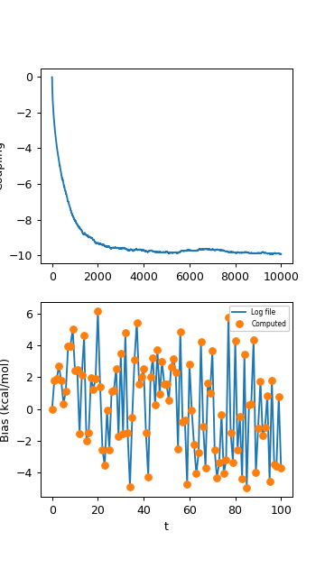
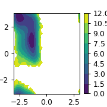
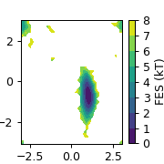

# PLUMED Masterclass 22.6: EDS module + Coarse-Grained directed simulations

## Origin 

This masterclass was authored by Glen Hocky and Andrew White on April 26, 2022

## Aims

This Masterclass describes how to bias simulations to agree with experimental data using experiment directed simulation.

## Objectives

Once this Masterclass is completed, you will know how to:

- How to bias collective variables to agree with set values
- Develop a deeper feeling how parameters in method change learning efficiency

## Prerequisites

We assume that you are familiar with PLUMED and enhanced sampling calculations. If you are not, the 2021 PLUMED Masterclass is a great place to start. In particular, you should be familiar with specifying collective variables.

Furthermore, some Python or other programming knowledge is required for this masterclass to generate plots and perform some analysis calculations.

## Overview

Experiment directed simulation (EDS) is a maximum entropy method for biasing specific collective variables (CVs) to agree with set values. These are typically from experimental data, like a known radius of gyration or NMR chemical shift. Biasing a CV is an under-determined problem because there are many ways to change the systems' potential energy to agree with a set point. If we further maximize ensemble entropy while matching the set point, the problem has a unique solution of

$$
U'(x) = U(x) + \lambda f(x)
$$

where $U(x)$ is the potential energy of the system, $f(x)$ is the CV, and $\lambda$ is a fit parameter. EDS is a time-dependent method that finds $\lambda$ while the simulation is running. It typically converges much faster than free-energy methods, but comes with the same caveats that insufficient sampling or rare events can affect the method. Another important detail is that EDS/maximum entropy biasing is for matching the set point on average (in expectation), rather than at every frame.

## Software and data

The only data needed to complete the exercises of this Masterclass can be found on an the following github page [data](https://github.com/hockyg/plumed-eds-masterclass), with alanine inputs being borrowed from an earlier one [GitHub-22-03](https://github.com/invemichele/masterclass-22-03.git/).
Simulations will be performed using PLUMED's pesmd module, and gromacs.

## Exercises

The exercises are presented below.

### Setup 1-dimensional system.

Set up a plumed file to use with pesmd that has a harmonic potential. Then run using the 1d input provided in the github. For example:


<div style="width: 100%; float:left">
<div style="width: 90%; float:left" id="value_details_INSTRUCTIONS.md_working_1.dat"> Click on the labels of the actions for more information on what each action computes </div>
<div style="width: 10%; float:left"><table><tr><td style="padding:1px"><a href="INSTRUCTIONS.md_working_1.dat.plumed.stderr"></a></td></tr><tr><td style="padding:1px"><a href="INSTRUCTIONS.md_working_1.dat.plumed_master.stderr"></a></td></tr></table></div></div>
<pre style="width=97%;">
<b name="INSTRUCTIONS.md_working_1.datd1" onclick='showPath("INSTRUCTIONS.md_working_1.dat","INSTRUCTIONS.md_working_1.datd1","INSTRUCTIONS.md_working_1.datd1","black")'>d1</b><span style="display:none;" id="INSTRUCTIONS.md_working_1.datd1">The DISTANCE action with label <b>d1</b> calculates the following quantities:<table  align="center" frame="void" width="95%" cellpadding="5%"><tr><td width="5%"><b> Quantity </b>  </td><td width="5%"><b> Type </b>  </td><td><b> Description </b> </td></tr><tr><td width="5%">d1.x</td><td width="5%"><font color="black">scalar</font></td><td>the x-component of the vector connecting the two atoms</td></tr><tr><td width="5%">d1.y</td><td width="5%"><font color="black">scalar</font></td><td>the y-component of the vector connecting the two atoms</td></tr><tr><td width="5%">d1.z</td><td width="5%"><font color="black">scalar</font></td><td>the z-component of the vector connecting the two atoms</td></tr></table></span>: <div class="tooltip" style="color:green">DISTANCE<div class="right">Calculate the distance between a pair of atoms. <a href="https://www.plumed.org/doc-master/user-doc/html/_d_i_s_t_a_n_c_e.html" style="color:green">More details</a><i></i></div></div> <div class="tooltip">ATOMS<div class="right">the pair of atom that we are calculating the distance between<i></i></div></div>=1,2 <div class="tooltip">COMPONENTS<div class="right"> calculate the x, y and z components of the distance separately and store them as label<i></i></div></div>
<b name="INSTRUCTIONS.md_working_1.datff" onclick='showPath("INSTRUCTIONS.md_working_1.dat","INSTRUCTIONS.md_working_1.datff","INSTRUCTIONS.md_working_1.datff","black")'>ff</b><span style="display:none;" id="INSTRUCTIONS.md_working_1.datff">The MATHEVAL action with label <b>ff</b> calculates the following quantities:<table  align="center" frame="void" width="95%" cellpadding="5%"><tr><td width="5%"><b> Quantity </b>  </td><td width="5%"><b> Type </b>  </td><td><b> Description </b> </td></tr><tr><td width="5%">ff</td><td width="5%"><font color="black">scalar</font></td><td>an arbitrary function</td></tr></table></span>: <div class="tooltip" style="color:green">MATHEVAL<div class="right">An alias to the CUSTOM function that can also be used to calaculate combinations of variables using a custom expression. <a href="https://www.plumed.org/doc-master/user-doc/html/_m_a_t_h_e_v_a_l.html" style="color:green">More details</a><i></i></div></div> <div class="tooltip">ARG<div class="right">the values input to this function<i></i></div></div>=<b name="INSTRUCTIONS.md_working_1.datd1">d1.x</b> <div class="tooltip">PERIODIC<div class="right">if the output of your function is periodic then you should specify the periodicity of the function<i></i></div></div>=NO <div class="tooltip">FUNC<div class="right">the function you wish to evaluate<i></i></div></div>=0.5*10*(x^2
<b name="INSTRUCTIONS.md_working_1.datbb" onclick='showPath("INSTRUCTIONS.md_working_1.dat","INSTRUCTIONS.md_working_1.datbb","INSTRUCTIONS.md_working_1.datbb","black")'>bb</b><span style="display:none;" id="INSTRUCTIONS.md_working_1.datbb">The BIASVALUE action with label <b>bb</b> calculates the following quantities:<table  align="center" frame="void" width="95%" cellpadding="5%"><tr><td width="5%"><b> Quantity </b>  </td><td width="5%"><b> Type </b>  </td><td><b> Description </b> </td></tr><tr><td width="5%">bb.bias</td><td width="5%"><font color="black">scalar</font></td><td>the instantaneous value of the bias potential</td></tr><tr><td width="5%">bb.ff_bias</td><td width="5%"><font color="black">scalar</font></td><td>one or multiple instances of this quantity can be referenced elsewhere in the input file. these quantities will named with  the arguments of the bias followed by the character string _bias. These quantities tell the user how much the bias is due to each of the colvars. This particular component measures this quantity for the input CV named ff</td></tr></table></span>: <div class="tooltip" style="color:green">BIASVALUE<div class="right">Takes the value of one variable and use it as a bias <a href="https://www.plumed.org/doc-master/user-doc/html/_b_i_a_s_v_a_l_u_e.html" style="color:green">More details</a><i></i></div></div> <div class="tooltip">ARG<div class="right">the labels of the scalar/vector arguments whose values will be used as a bias on the system<i></i></div></div>=<b name="INSTRUCTIONS.md_working_1.datff">ff</b>
<br/><div class="tooltip" style="color:green">PRINT<div class="right">Print quantities to a file. <a href="https://www.plumed.org/doc-master/user-doc/html/_p_r_i_n_t.html" style="color:green">More details</a><i></i></div></div> <div class="tooltip">ARG<div class="right">the labels of the values that you would like to print to the file<i></i></div></div>=<b name="INSTRUCTIONS.md_working_1.datd1">d1.x</b> <div class="tooltip">STRIDE<div class="right"> the frequency with which the quantities of interest should be output<i></i></div></div>=25 <div class="tooltip">FILE<div class="right">the name of the file on which to output these quantities<i></i></div></div>=_PREFIX_.colvars.dat
</pre>
  

````
plumed pesmd < harmonic_1d.in
````

Histogram your data, and see if it fits the ideal Boltzmann distribution for this harmonic oscillator. Make sure to normalize your distribution properly!

Now try adding a harmonic bias using the RESTRAINT function, so that the data becomes centered near $x=1$.

Finally, we will add an EDS bias. Make your EDS bias also be centered at 1.


<div style="width: 100%; float:left">
<div style="width: 90%; float:left" id="value_details_work/plumed_ex1.dat"> Click on the labels of the actions for more information on what each action computes </div>
<div style="width: 10%; float:left"><table><tr><td style="padding:1px"><a href="work/plumed_ex1.dat.plumed.stderr"></a></td></tr><tr><td style="padding:1px"><a href="work/plumed_ex1.dat.plumed_master.stderr"></a></td></tr><tr><td style="padding:0px"></td></tr>
</table></div></div>
<div id="work/plumed_ex1.dat_short">
<pre style="width=97%;">
<b name="work/plumed_ex1.datd1" onclick='showPath("work/plumed_ex1.dat","work/plumed_ex1.datd1","work/plumed_ex1.datd1","brown")'>d1</b>: <div class="tooltip" style="color:green">DISTANCE<div class="right">Calculate the distance between a pair of atoms. <a href="https://www.plumed.org/doc-master/user-doc/html/_d_i_s_t_a_n_c_e.html" style="color:green">More details</a><i></i></div></div> <div class="tooltip">ATOMS<div class="right">the pair of atom that we are calculating the distance between<i></i></div></div>=1,2 <div class="tooltip">COMPONENTS<div class="right"> calculate the x, y and z components of the distance separately and store them as label<i></i></div></div>
<span style="display:none;" id="work/plumed_ex1.datd1">The DISTANCE action with label <b>d1</b> calculates the following quantities:<table  align="center" frame="void" width="95%" cellpadding="5%"><tr><td width="5%"><b> Quantity </b>  </td><td><b> Description </b> </td></tr><tr><td width="5%">d1.x</td><td>the x-component of the vector connecting the two atoms</td></tr><tr><td width="5%">d1.y</td><td>the y-component of the vector connecting the two atoms</td></tr><tr><td width="5%">d1.z</td><td>the z-component of the vector connecting the two atoms</td></tr><tr><td width="5%">d1.value</td><td>the DISTANCE between this pair of atoms</td></tr></table></span><b name="work/plumed_ex1.datff" onclick='showPath("work/plumed_ex1.dat","work/plumed_ex1.datff","work/plumed_ex1.datff","brown")'>ff</b>: <div class="tooltip" style="color:green">MATHEVAL<div class="right">An alias to the CUSTOM function that can also be used to calaculate combinations of variables using a custom expression. <a href="https://www.plumed.org/doc-master/user-doc/html/_m_a_t_h_e_v_a_l.html" style="color:green">More details</a><i></i></div></div> <div class="tooltip">ARG<div class="right">the values input to this function<i></i></div></div>=<b name="work/plumed_ex1.datd1">d1.x</b> <div class="tooltip">PERIODIC<div class="right">if the output of your function is periodic then you should specify the periodicity of the function<i></i></div></div>=NO <div class="tooltip">FUNC<div class="right">the function you wish to evaluate<i></i></div></div>=0.5*10*(x^2
<span style="display:none;" id="work/plumed_ex1.datff">The MATHEVAL action with label <b>ff</b> calculates the following quantities:<table  align="center" frame="void" width="95%" cellpadding="5%"><tr><td width="5%"><b> Quantity </b>  </td><td><b> Description </b> </td></tr><tr><td width="5%">ff.value</td><td>an arbitrary function</td></tr></table></span><b name="work/plumed_ex1.datbb" onclick='showPath("work/plumed_ex1.dat","work/plumed_ex1.datbb","work/plumed_ex1.datbb","brown")'>bb</b>: <div class="tooltip" style="color:green">BIASVALUE<div class="right">Takes the value of one variable and use it as a bias <a href="https://www.plumed.org/doc-master/user-doc/html/_b_i_a_s_v_a_l_u_e.html" style="color:green">More details</a><i></i></div></div> <div class="tooltip">ARG<div class="right">the labels of the scalar/vector arguments whose values will be used as a bias on the system<i></i></div></div>=<b name="work/plumed_ex1.datff">ff</b>
<br/><span style="display:none;" id="work/plumed_ex1.datbb">The BIASVALUE action with label <b>bb</b> calculates the following quantities:<table  align="center" frame="void" width="95%" cellpadding="5%"><tr><td width="5%"><b> Quantity </b>  </td><td><b> Description </b> </td></tr><tr><td width="5%">bb.bias</td><td>the instantaneous value of the bias potential</td></tr><tr><td width="5%">bb._bias</td><td>one or multiple instances of this quantity can be referenced elsewhere in the input file</td></tr></table></span><b name="work/plumed_ex1.dateds" onclick='showPath("work/plumed_ex1.dat","work/plumed_ex1.dateds","work/plumed_ex1.dateds","brown")'>eds</b>: <div class="tooltip" style="color:green">EDS<div class="right">Add a linear bias on a set of observables. <a href="https://www.plumed.org/doc-master/user-doc/html/_e_d_s.html" style="color:green">More details</a><i></i></div></div> <div class="tooltip">ARG<div class="right">the labels of the scalars on which the bias will act<i></i></div></div>=<b name="work/plumed_ex1.datd1">d1.x</b> <div class="tooltip">CENTER<div class="right">The desired centers (equilibrium values) which will be sought during the adaptive linear biasing<i></i></div></div>=<span style="background-color:yellow">__FILL__</span> <div class="tooltip">PERIOD<div class="right">Steps over which to adjust bias for adaptive or ramping<i></i></div></div>=<span style="background-color:yellow">__FILL__</span> <div class="tooltip">OUT_RESTART<div class="right">Output file for all information needed to continue EDS simulation<i></i></div></div>=<span style="background-color:yellow">__FILL__</span> <div class="tooltip">TEMP<div class="right">The system temperature<i></i></div></div>=1.0 <div class="tooltip">BIAS_SCALE<div class="right">A divisor to set the units of the bias<i></i></div></div>=1
<span style="display:none;" id="work/plumed_ex1.dateds">The EDS action with label <b>eds</b> calculates the following quantities:<table  align="center" frame="void" width="95%" cellpadding="5%"><tr><td width="5%"><b> Quantity </b>  </td><td><b> Description </b> </td></tr><tr><td width="5%">eds.bias</td><td>the instantaneous value of the bias potential</td></tr><tr><td width="5%">eds.force2</td><td>squared value of force from the bias</td></tr><tr><td width="5%">eds.pressure</td><td>If using virial keyword, this is the current sum of virial terms</td></tr><tr><td width="5%">eds._coupling</td><td>For each named CV biased, there will be a corresponding output CV_coupling storing the current linear bias prefactor</td></tr></table></span><div class="tooltip" style="color:green">PRINT<div class="right">Print quantities to a file. <a href="https://www.plumed.org/doc-master/user-doc/html/_p_r_i_n_t.html" style="color:green">More details</a><i></i></div></div> <div class="tooltip">ARG<div class="right">the labels of the values that you would like to print to the file<i></i></div></div> <div class="tooltip">STRIDE<div class="right"> the frequency with which the quantities of interest should be output<i></i></div></div>=100 <div class="tooltip">FILE<div class="right">the name of the file on which to output these quantities<i></i></div></div>=_PREFIX_.colvars.dat
</pre></div>
<div style="display:none;" id="work/plumed_ex1.dat_long"><pre style="width=97%;">
<b name="work/plumed_ex1.dat_sold1" onclick='showPath("work/plumed_ex1.dat","work/plumed_ex1.dat_sold1","work/plumed_ex1.dat_sold1","brown")'>d1</b>: <div class="tooltip" style="color:green">DISTANCE<div class="right">Calculate the distance between a pair of atoms. <a href="https://www.plumed.org/doc-master/user-doc/html/_d_i_s_t_a_n_c_e.html" style="color:green">More details</a><i></i></div></div> <div class="tooltip">ATOMS<div class="right">the pair of atom that we are calculating the distance between<i></i></div></div>=1,2 <div class="tooltip">COMPONENTS<div class="right"> calculate the x, y and z components of the distance separately and store them as label<i></i></div></div>
<span style="display:none;" id="work/plumed_ex1.dat_sold1">The DISTANCE action with label <b>d1</b> calculates the following quantities:<table  align="center" frame="void" width="95%" cellpadding="5%"><tr><td width="5%"><b> Quantity </b>  </td><td><b> Description </b> </td></tr><tr><td width="5%">d1.x</td><td>the x-component of the vector connecting the two atoms</td></tr><tr><td width="5%">d1.y</td><td>the y-component of the vector connecting the two atoms</td></tr><tr><td width="5%">d1.z</td><td>the z-component of the vector connecting the two atoms</td></tr><tr><td width="5%">d1.value</td><td>the DISTANCE between this pair of atoms</td></tr></table></span><b name="work/plumed_ex1.dat_solff" onclick='showPath("work/plumed_ex1.dat","work/plumed_ex1.dat_solff","work/plumed_ex1.dat_solff","brown")'>ff</b>: <div class="tooltip" style="color:green">MATHEVAL<div class="right">An alias to the CUSTOM function that can also be used to calaculate combinations of variables using a custom expression. <a href="https://www.plumed.org/doc-master/user-doc/html/_m_a_t_h_e_v_a_l.html" style="color:green">More details</a><i></i></div></div> <div class="tooltip">ARG<div class="right">the values input to this function<i></i></div></div>=<b name="work/plumed_ex1.dat_sold1">d1.x</b> <div class="tooltip">PERIODIC<div class="right">if the output of your function is periodic then you should specify the periodicity of the function<i></i></div></div>=NO <div class="tooltip">FUNC<div class="right">the function you wish to evaluate<i></i></div></div>=0.5*10*(x^2
<span style="display:none;" id="work/plumed_ex1.dat_solff">The MATHEVAL action with label <b>ff</b> calculates the following quantities:<table  align="center" frame="void" width="95%" cellpadding="5%"><tr><td width="5%"><b> Quantity </b>  </td><td><b> Description </b> </td></tr><tr><td width="5%">ff.value</td><td>an arbitrary function</td></tr></table></span><b name="work/plumed_ex1.dat_solbb" onclick='showPath("work/plumed_ex1.dat","work/plumed_ex1.dat_solbb","work/plumed_ex1.dat_solbb","brown")'>bb</b>: <div class="tooltip" style="color:green">BIASVALUE<div class="right">Takes the value of one variable and use it as a bias <a href="https://www.plumed.org/doc-master/user-doc/html/_b_i_a_s_v_a_l_u_e.html" style="color:green">More details</a><i></i></div></div> <div class="tooltip">ARG<div class="right">the labels of the scalar/vector arguments whose values will be used as a bias on the system<i></i></div></div>=<b name="work/plumed_ex1.dat_solff">ff</b>
<br/><span style="display:none;" id="work/plumed_ex1.dat_solbb">The BIASVALUE action with label <b>bb</b> calculates the following quantities:<table  align="center" frame="void" width="95%" cellpadding="5%"><tr><td width="5%"><b> Quantity </b>  </td><td><b> Description </b> </td></tr><tr><td width="5%">bb.bias</td><td>the instantaneous value of the bias potential</td></tr><tr><td width="5%">bb._bias</td><td>one or multiple instances of this quantity can be referenced elsewhere in the input file</td></tr></table></span><b name="work/plumed_ex1.dat_soleds" onclick='showPath("work/plumed_ex1.dat","work/plumed_ex1.dat_soleds","work/plumed_ex1.dat_soleds","brown")'>eds</b>: <div class="tooltip" style="color:green">EDS<div class="right">Add a linear bias on a set of observables. <a href="https://www.plumed.org/doc-master/user-doc/html/_e_d_s.html" style="color:green">More details</a><i></i></div></div> <div class="tooltip">ARG<div class="right">the labels of the scalars on which the bias will act<i></i></div></div>=<b name="work/plumed_ex1.dat_sold1">d1.x</b> <div class="tooltip">CENTER<div class="right">The desired centers (equilibrium values) which will be sought during the adaptive linear biasing<i></i></div></div>=1.0 <div class="tooltip">PERIOD<div class="right">Steps over which to adjust bias for adaptive or ramping<i></i></div></div>=200 <div class="tooltip">OUT_RESTART<div class="right">Output file for all information needed to continue EDS simulation<i></i></div></div>=harmonic_1d_eds.restart.dat <div class="tooltip">TEMP<div class="right">The system temperature<i></i></div></div>=1.0 <div class="tooltip">BIAS_SCALE<div class="right">A divisor to set the units of the bias<i></i></div></div>=1
<span style="display:none;" id="work/plumed_ex1.dat_soleds">The EDS action with label <b>eds</b> calculates the following quantities:<table  align="center" frame="void" width="95%" cellpadding="5%"><tr><td width="5%"><b> Quantity </b>  </td><td><b> Description </b> </td></tr><tr><td width="5%">eds.bias</td><td>the instantaneous value of the bias potential</td></tr><tr><td width="5%">eds.force2</td><td>squared value of force from the bias</td></tr><tr><td width="5%">eds.pressure</td><td>If using virial keyword, this is the current sum of virial terms</td></tr><tr><td width="5%">eds._coupling</td><td>For each named CV biased, there will be a corresponding output CV_coupling storing the current linear bias prefactor</td></tr></table></span><div class="tooltip" style="color:green">PRINT<div class="right">Print quantities to a file. <a href="https://www.plumed.org/doc-master/user-doc/html/_p_r_i_n_t.html" style="color:green">More details</a><i></i></div></div> <div class="tooltip">ARG<div class="right">the labels of the values that you would like to print to the file<i></i></div></div> <div class="tooltip">STRIDE<div class="right"> the frequency with which the quantities of interest should be output<i></i></div></div>=100 <div class="tooltip">FILE<div class="right">the name of the file on which to output these quantities<i></i></div></div>=harmonic_1d_eds.colvars.dat
</pre></div>

  

Note, we have to add TEMP=1 because pesmd does not provide the temperature to the EDS module.

 
 

Now look at how the bias factor changes with time. Can you also compute the bias from this value, and the value of the position versus time? Look in the colvar file and the restart file to see what values are there.

 

### Setup and bias a 2-dimensional system.

Now we will move on to a 2d harmonic oscillator. This way we can see the effect of biasing x, y, or a combination. Note, there is a different pesmd input file for this.


<div style="width: 100%; float:left">
<div style="width: 90%; float:left" id="value_details_work/plumed_ex2.dat"> Click on the labels of the actions for more information on what each action computes </div>
<div style="width: 10%; float:left"><table><tr><td style="padding:1px"><a href="work/plumed_ex2.dat.plumed.stderr"></a></td></tr><tr><td style="padding:1px"><a href="work/plumed_ex2.dat.plumed_master.stderr"></a></td></tr><tr><td style="padding:0px"></td></tr>
</table></div></div>
<div id="work/plumed_ex2.dat_short">
<pre style="width=97%;">
<b name="work/plumed_ex2.datd1" onclick='showPath("work/plumed_ex2.dat","work/plumed_ex2.datd1","work/plumed_ex2.datd1","brown")'>d1</b>: <div class="tooltip" style="color:green">DISTANCE<div class="right">Calculate the distance between a pair of atoms. <a href="https://www.plumed.org/doc-master/user-doc/html/_d_i_s_t_a_n_c_e.html" style="color:green">More details</a><i></i></div></div> <div class="tooltip">ATOMS<div class="right">the pair of atom that we are calculating the distance between<i></i></div></div>=1,2 <div class="tooltip">COMPONENTS<div class="right"> calculate the x, y and z components of the distance separately and store them as label<i></i></div></div>
<span style="display:none;" id="work/plumed_ex2.datd1">The DISTANCE action with label <b>d1</b> calculates the following quantities:<table  align="center" frame="void" width="95%" cellpadding="5%"><tr><td width="5%"><b> Quantity </b>  </td><td><b> Description </b> </td></tr><tr><td width="5%">d1.x</td><td>the x-component of the vector connecting the two atoms</td></tr><tr><td width="5%">d1.y</td><td>the y-component of the vector connecting the two atoms</td></tr><tr><td width="5%">d1.z</td><td>the z-component of the vector connecting the two atoms</td></tr><tr><td width="5%">d1.value</td><td>the DISTANCE between this pair of atoms</td></tr></table></span><b name="work/plumed_ex2.datff" onclick='showPath("work/plumed_ex2.dat","work/plumed_ex2.datff","work/plumed_ex2.datff","brown")'>ff</b>: <div class="tooltip" style="color:green">MATHEVAL<div class="right">An alias to the CUSTOM function that can also be used to calaculate combinations of variables using a custom expression. <a href="https://www.plumed.org/doc-master/user-doc/html/_m_a_t_h_e_v_a_l.html" style="color:green">More details</a><i></i></div></div> <div class="tooltip">ARG<div class="right">the values input to this function<i></i></div></div>=<span style="background-color:yellow">__FILL__</span> <div class="tooltip">PERIODIC<div class="right">if the output of your function is periodic then you should specify the periodicity of the function<i></i></div></div>=NO <div class="tooltip">FUNC<div class="right">the function you wish to evaluate<i></i></div></div>=<span style="background-color:yellow">__FILL__</span>
<span style="display:none;" id="work/plumed_ex2.datff">The MATHEVAL action with label <b>ff</b> calculates the following quantities:<table  align="center" frame="void" width="95%" cellpadding="5%"><tr><td width="5%"><b> Quantity </b>  </td><td><b> Description </b> </td></tr><tr><td width="5%">ff.value</td><td>an arbitrary function</td></tr></table></span><b name="work/plumed_ex2.datbb" onclick='showPath("work/plumed_ex2.dat","work/plumed_ex2.datbb","work/plumed_ex2.datbb","brown")'>bb</b>: <div class="tooltip" style="color:green">BIASVALUE<div class="right">Takes the value of one variable and use it as a bias <a href="https://www.plumed.org/doc-master/user-doc/html/_b_i_a_s_v_a_l_u_e.html" style="color:green">More details</a><i></i></div></div> <div class="tooltip">ARG<div class="right">the labels of the scalar/vector arguments whose values will be used as a bias on the system<i></i></div></div>=<b name="work/plumed_ex2.datff">ff</b>
<br/><span style="display:none;" id="work/plumed_ex2.datbb">The BIASVALUE action with label <b>bb</b> calculates the following quantities:<table  align="center" frame="void" width="95%" cellpadding="5%"><tr><td width="5%"><b> Quantity </b>  </td><td><b> Description </b> </td></tr><tr><td width="5%">bb.bias</td><td>the instantaneous value of the bias potential</td></tr><tr><td width="5%">bb._bias</td><td>one or multiple instances of this quantity can be referenced elsewhere in the input file</td></tr></table></span><div class="tooltip" style="color:green">PRINT<div class="right">Print quantities to a file. <a href="https://www.plumed.org/doc-master/user-doc/html/_p_r_i_n_t.html" style="color:green">More details</a><i></i></div></div> <div class="tooltip">ARG<div class="right">the labels of the values that you would like to print to the file<i></i></div></div>=<span style="background-color:yellow">__FILL__</span> <div class="tooltip">STRIDE<div class="right"> the frequency with which the quantities of interest should be output<i></i></div></div>=25 <div class="tooltip">FILE<div class="right">the name of the file on which to output these quantities<i></i></div></div>=_PREFIX_.colvars.dat
</pre></div>
<div style="display:none;" id="work/plumed_ex2.dat_long"><pre style="width=97%;">
<b name="work/plumed_ex2.dat_sold1" onclick='showPath("work/plumed_ex2.dat","work/plumed_ex2.dat_sold1","work/plumed_ex2.dat_sold1","brown")'>d1</b>: <div class="tooltip" style="color:green">DISTANCE<div class="right">Calculate the distance between a pair of atoms. <a href="https://www.plumed.org/doc-master/user-doc/html/_d_i_s_t_a_n_c_e.html" style="color:green">More details</a><i></i></div></div> <div class="tooltip">ATOMS<div class="right">the pair of atom that we are calculating the distance between<i></i></div></div>=1,2 <div class="tooltip">COMPONENTS<div class="right"> calculate the x, y and z components of the distance separately and store them as label<i></i></div></div>
<span style="display:none;" id="work/plumed_ex2.dat_sold1">The DISTANCE action with label <b>d1</b> calculates the following quantities:<table  align="center" frame="void" width="95%" cellpadding="5%"><tr><td width="5%"><b> Quantity </b>  </td><td><b> Description </b> </td></tr><tr><td width="5%">d1.x</td><td>the x-component of the vector connecting the two atoms</td></tr><tr><td width="5%">d1.y</td><td>the y-component of the vector connecting the two atoms</td></tr><tr><td width="5%">d1.z</td><td>the z-component of the vector connecting the two atoms</td></tr><tr><td width="5%">d1.value</td><td>the DISTANCE between this pair of atoms</td></tr></table></span><b name="work/plumed_ex2.dat_solff" onclick='showPath("work/plumed_ex2.dat","work/plumed_ex2.dat_solff","work/plumed_ex2.dat_solff","brown")'>ff</b>: <div class="tooltip" style="color:green">MATHEVAL<div class="right">An alias to the CUSTOM function that can also be used to calaculate combinations of variables using a custom expression. <a href="https://www.plumed.org/doc-master/user-doc/html/_m_a_t_h_e_v_a_l.html" style="color:green">More details</a><i></i></div></div> <div class="tooltip">ARG<div class="right">the values input to this function<i></i></div></div>=<b name="work/plumed_ex2.dat_sold1">d1.x</b>,<b name="work/plumed_ex2.dat_sold1">d1.y</b> <div class="tooltip">PERIODIC<div class="right">if the output of your function is periodic then you should specify the periodicity of the function<i></i></div></div>=NO <div class="tooltip">FUNC<div class="right">the function you wish to evaluate<i></i></div></div>=0.5*10*(x^2+y^2
<span style="display:none;" id="work/plumed_ex2.dat_solff">The MATHEVAL action with label <b>ff</b> calculates the following quantities:<table  align="center" frame="void" width="95%" cellpadding="5%"><tr><td width="5%"><b> Quantity </b>  </td><td><b> Description </b> </td></tr><tr><td width="5%">ff.value</td><td>an arbitrary function</td></tr></table></span><b name="work/plumed_ex2.dat_solbb" onclick='showPath("work/plumed_ex2.dat","work/plumed_ex2.dat_solbb","work/plumed_ex2.dat_solbb","brown")'>bb</b>: <div class="tooltip" style="color:green">BIASVALUE<div class="right">Takes the value of one variable and use it as a bias <a href="https://www.plumed.org/doc-master/user-doc/html/_b_i_a_s_v_a_l_u_e.html" style="color:green">More details</a><i></i></div></div> <div class="tooltip">ARG<div class="right">the labels of the scalar/vector arguments whose values will be used as a bias on the system<i></i></div></div>=<b name="work/plumed_ex2.dat_solff">ff</b>
<br/><span style="display:none;" id="work/plumed_ex2.dat_solbb">The BIASVALUE action with label <b>bb</b> calculates the following quantities:<table  align="center" frame="void" width="95%" cellpadding="5%"><tr><td width="5%"><b> Quantity </b>  </td><td><b> Description </b> </td></tr><tr><td width="5%">bb.bias</td><td>the instantaneous value of the bias potential</td></tr><tr><td width="5%">bb._bias</td><td>one or multiple instances of this quantity can be referenced elsewhere in the input file</td></tr></table></span><div class="tooltip" style="color:green">PRINT<div class="right">Print quantities to a file. <a href="https://www.plumed.org/doc-master/user-doc/html/_p_r_i_n_t.html" style="color:green">More details</a><i></i></div></div> <div class="tooltip">ARG<div class="right">the labels of the values that you would like to print to the file<i></i></div></div> <div class="tooltip">STRIDE<div class="right"> the frequency with which the quantities of interest should be output<i></i></div></div>=25 <div class="tooltip">FILE<div class="right">the name of the file on which to output these quantities<i></i></div></div>=harmonic_2d_unbiased.colvars.dat
</pre></div>

  

Try to bias either the x or y directions separately. Try biasing a combination of them.
We biased the average of x*y to be = 1. Use the CUSTOM command to try that out. What do you think it should look like?
Write a python program to histogram the x and y data and see. It should look like below.


### Alanine dipeptide

Bias alanine dipeptide using gromacs and the input files provided in the github.


<div style="width: 100%; float:left">
<div style="width: 90%; float:left" id="value_details_work/plumed_ex3.dat"> Click on the labels of the actions for more information on what each action computes </div>
<div style="width: 10%; float:left"><table><tr><td style="padding:1px"><a href="work/plumed_ex3.dat.plumed.stderr"></a></td></tr><tr><td style="padding:1px"><a href="work/plumed_ex3.dat.plumed_master.stderr"></a></td></tr><tr><td style="padding:0px"></td></tr>
</table></div></div>
<div id="work/plumed_ex3.dat_short">
<pre style="width=97%;">
<div class="tooltip" style="color:green">MOLINFO<div class="right">This command is used to provide information on the molecules that are present in your system. <a href="https://www.plumed.org/doc-master/user-doc/html/_m_o_l_i_n_f_o.html" style="color:green">More details</a><i></i></div></div> <div class="tooltip">STRUCTURE<div class="right">a file in pdb format containing a reference structure<i></i></div></div>=./input.ala2.pdb
<span style="display:none;" id="work/plumed_ex3.dat">The MOLINFO action with label <b></b> calculates something</span><b name="work/plumed_ex3.datphi" onclick='showPath("work/plumed_ex3.dat","work/plumed_ex3.datphi","work/plumed_ex3.datphi","brown")'>phi</b>: <div class="tooltip" style="color:green">TORSION<div class="right">Calculate a torsional angle. <a href="https://www.plumed.org/doc-master/user-doc/html/_t_o_r_s_i_o_n.html" style="color:green">More details</a><i></i></div></div> <div class="tooltip">ATOMS<div class="right">the four atoms involved in the torsional angle<i></i></div></div>=<div class="tooltip">@phi-2<div class="right">the four atoms that are required to calculate the phi dihedral for residue 2. <a href="https://www.plumed.org/doc-master/user-doc/html/_m_o_l_i_n_f_o.html">Click here</a> for more information. <i></i></div></div>
<span style="display:none;" id="work/plumed_ex3.datphi">The TORSION action with label <b>phi</b> calculates the following quantities:<table  align="center" frame="void" width="95%" cellpadding="5%"><tr><td width="5%"><b> Quantity </b>  </td><td><b> Description </b> </td></tr><tr><td width="5%">phi.value</td><td>the TORSION involving these atoms</td></tr></table></span><b name="work/plumed_ex3.datpsi" onclick='showPath("work/plumed_ex3.dat","work/plumed_ex3.datpsi","work/plumed_ex3.datpsi","brown")'>psi</b>: <div class="tooltip" style="color:green">TORSION<div class="right">Calculate a torsional angle. <a href="https://www.plumed.org/doc-master/user-doc/html/_t_o_r_s_i_o_n.html" style="color:green">More details</a><i></i></div></div> <div class="tooltip">ATOMS<div class="right">the four atoms involved in the torsional angle<i></i></div></div>=<div class="tooltip">@psi-2<div class="right">the four atoms that are required to calculate the psi dihedral for residue 2. <a href="https://www.plumed.org/doc-master/user-doc/html/_m_o_l_i_n_f_o.html">Click here</a> for more information. <i></i></div></div>
<br/><span style="display:none;" id="work/plumed_ex3.datpsi">The TORSION action with label <b>psi</b> calculates the following quantities:<table  align="center" frame="void" width="95%" cellpadding="5%"><tr><td width="5%"><b> Quantity </b>  </td><td><b> Description </b> </td></tr><tr><td width="5%">psi.value</td><td>the TORSION involving these atoms</td></tr></table></span><b name="work/plumed_ex3.dateds" onclick='showPath("work/plumed_ex3.dat","work/plumed_ex3.dateds","work/plumed_ex3.dateds","brown")'>eds</b>: <div class="tooltip" style="color:green">EDS<div class="right">Add a linear bias on a set of observables. <a href="https://www.plumed.org/doc-master/user-doc/html/_e_d_s.html" style="color:green">More details</a><i></i></div></div> <div class="tooltip">ARG<div class="right">the labels of the scalars on which the bias will act<i></i></div></div>=<span style="background-color:yellow">__FILL__</span> <div class="tooltip">CENTER<div class="right">The desired centers (equilibrium values) which will be sought during the adaptive linear biasing<i></i></div></div>=<span style="background-color:yellow">__FILL__</span> <div class="tooltip">PERIOD<div class="right">Steps over which to adjust bias for adaptive or ramping<i></i></div></div>=<span style="background-color:yellow">__FILL__</span> <div class="tooltip">OUT_RESTART<div class="right">Output file for all information needed to continue EDS simulation<i></i></div></div>=_PREFIX_.restart.dat <div class="tooltip">BIAS_SCALE<div class="right">A divisor to set the units of the bias<i></i></div></div>=1
<br/><span style="display:none;" id="work/plumed_ex3.dateds">The EDS action with label <b>eds</b> calculates the following quantities:<table  align="center" frame="void" width="95%" cellpadding="5%"><tr><td width="5%"><b> Quantity </b>  </td><td><b> Description </b> </td></tr><tr><td width="5%">eds.bias</td><td>the instantaneous value of the bias potential</td></tr><tr><td width="5%">eds.force2</td><td>squared value of force from the bias</td></tr><tr><td width="5%">eds.pressure</td><td>If using virial keyword, this is the current sum of virial terms</td></tr><tr><td width="5%">eds._coupling</td><td>For each named CV biased, there will be a corresponding output CV_coupling storing the current linear bias prefactor</td></tr></table></span><div class="tooltip" style="color:green">PRINT<div class="right">Print quantities to a file. <a href="https://www.plumed.org/doc-master/user-doc/html/_p_r_i_n_t.html" style="color:green">More details</a><i></i></div></div> <div class="tooltip">ARG<div class="right">the labels of the values that you would like to print to the file<i></i></div></div> <div class="tooltip">STRIDE<div class="right"> the frequency with which the quantities of interest should be output<i></i></div></div>=500 <div class="tooltip">FILE<div class="right">the name of the file on which to output these quantities<i></i></div></div>=_PREFIX_.colvars.dat
</pre></div>
<div style="display:none;" id="work/plumed_ex3.dat_long"><pre style="width=97%;">
<div class="tooltip" style="color:green">MOLINFO<div class="right">This command is used to provide information on the molecules that are present in your system. <a href="https://www.plumed.org/doc-master/user-doc/html/_m_o_l_i_n_f_o.html" style="color:green">More details</a><i></i></div></div> <div class="tooltip">STRUCTURE<div class="right">a file in pdb format containing a reference structure<i></i></div></div>=./input.ala2.pdb
<span style="display:none;" id="work/plumed_ex3.dat_sol">The MOLINFO action with label <b></b> calculates something</span><b name="work/plumed_ex3.dat_solphi" onclick='showPath("work/plumed_ex3.dat","work/plumed_ex3.dat_solphi","work/plumed_ex3.dat_solphi","brown")'>phi</b>: <div class="tooltip" style="color:green">TORSION<div class="right">Calculate a torsional angle. <a href="https://www.plumed.org/doc-master/user-doc/html/_t_o_r_s_i_o_n.html" style="color:green">More details</a><i></i></div></div> <div class="tooltip">ATOMS<div class="right">the four atoms involved in the torsional angle<i></i></div></div>=<div class="tooltip">@phi-2<div class="right">the four atoms that are required to calculate the phi dihedral for residue 2. <a href="https://www.plumed.org/doc-master/user-doc/html/_m_o_l_i_n_f_o.html">Click here</a> for more information. <i></i></div></div>
<span style="display:none;" id="work/plumed_ex3.dat_solphi">The TORSION action with label <b>phi</b> calculates the following quantities:<table  align="center" frame="void" width="95%" cellpadding="5%"><tr><td width="5%"><b> Quantity </b>  </td><td><b> Description </b> </td></tr><tr><td width="5%">phi.value</td><td>the TORSION involving these atoms</td></tr></table></span><b name="work/plumed_ex3.dat_solpsi" onclick='showPath("work/plumed_ex3.dat","work/plumed_ex3.dat_solpsi","work/plumed_ex3.dat_solpsi","brown")'>psi</b>: <div class="tooltip" style="color:green">TORSION<div class="right">Calculate a torsional angle. <a href="https://www.plumed.org/doc-master/user-doc/html/_t_o_r_s_i_o_n.html" style="color:green">More details</a><i></i></div></div> <div class="tooltip">ATOMS<div class="right">the four atoms involved in the torsional angle<i></i></div></div>=<div class="tooltip">@psi-2<div class="right">the four atoms that are required to calculate the psi dihedral for residue 2. <a href="https://www.plumed.org/doc-master/user-doc/html/_m_o_l_i_n_f_o.html">Click here</a> for more information. <i></i></div></div>
<br/><span style="display:none;" id="work/plumed_ex3.dat_solpsi">The TORSION action with label <b>psi</b> calculates the following quantities:<table  align="center" frame="void" width="95%" cellpadding="5%"><tr><td width="5%"><b> Quantity </b>  </td><td><b> Description </b> </td></tr><tr><td width="5%">psi.value</td><td>the TORSION involving these atoms</td></tr></table></span><b name="work/plumed_ex3.dat_soleds" onclick='showPath("work/plumed_ex3.dat","work/plumed_ex3.dat_soleds","work/plumed_ex3.dat_soleds","brown")'>eds</b>: <div class="tooltip" style="color:green">EDS<div class="right">Add a linear bias on a set of observables. <a href="https://www.plumed.org/doc-master/user-doc/html/_e_d_s.html" style="color:green">More details</a><i></i></div></div> <div class="tooltip">ARG<div class="right">the labels of the scalars on which the bias will act<i></i></div></div>=<b name="work/plumed_ex3.dat_solphi">phi</b>,<b name="work/plumed_ex3.dat_solpsi">psi</b> <div class="tooltip">CENTER<div class="right">The desired centers (equilibrium values) which will be sought during the adaptive linear biasing<i></i></div></div>=1.0,1.0 <div class="tooltip">PERIOD<div class="right">Steps over which to adjust bias for adaptive or ramping<i></i></div></div>=500 <div class="tooltip">OUT_RESTART<div class="right">Output file for all information needed to continue EDS simulation<i></i></div></div>=ala2_eds_phipsi_slow.restart.dat <div class="tooltip">BIAS_SCALE<div class="right">A divisor to set the units of the bias<i></i></div></div>=1,1
<br/><span style="display:none;" id="work/plumed_ex3.dat_soleds">The EDS action with label <b>eds</b> calculates the following quantities:<table  align="center" frame="void" width="95%" cellpadding="5%"><tr><td width="5%"><b> Quantity </b>  </td><td><b> Description </b> </td></tr><tr><td width="5%">eds.bias</td><td>the instantaneous value of the bias potential</td></tr><tr><td width="5%">eds.force2</td><td>squared value of force from the bias</td></tr><tr><td width="5%">eds.pressure</td><td>If using virial keyword, this is the current sum of virial terms</td></tr><tr><td width="5%">eds._coupling</td><td>For each named CV biased, there will be a corresponding output CV_coupling storing the current linear bias prefactor</td></tr></table></span><div class="tooltip" style="color:green">PRINT<div class="right">Print quantities to a file. <a href="https://www.plumed.org/doc-master/user-doc/html/_p_r_i_n_t.html" style="color:green">More details</a><i></i></div></div> <div class="tooltip">ARG<div class="right">the labels of the values that you would like to print to the file<i></i></div></div> <div class="tooltip">STRIDE<div class="right"> the frequency with which the quantities of interest should be output<i></i></div></div>=500 <div class="tooltip">FILE<div class="right">the name of the file on which to output these quantities<i></i></div></div>=ala2_eds_phipsi_slow.colvars.dat
</pre></div>

  

Try biasing phi and psi independently. Try biasing them at the same time. What is a good PERIOD to choose?






### Free explore

Take a protein of interest, or alanine 2, and bias more than one variable. To try CGDS, choose the center of mass of some different parts of your protein. Can you bias the distance between these COMs and the angle between them at the same time? Does using COVAR or LM affect the speed of convergence?
