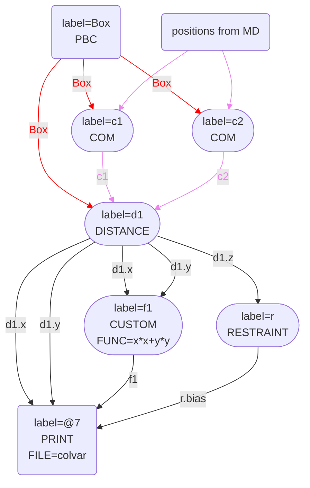
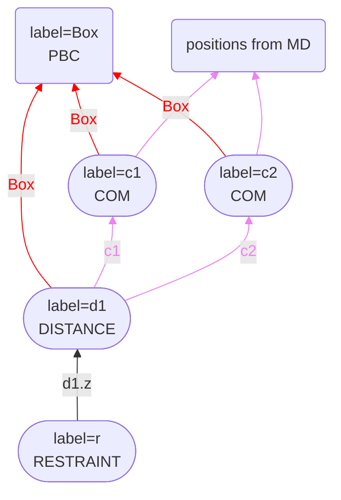

# Representing PLUMED inputs using flowcharts

Ever since we wrote the PLUMED paper in 2014, I have wondered if we can automate the process of generating diagrams
similar to the ones in that paper that show how Values and forces are passed between the various actions in the PLUMED input.
If we could automate the generation of these diagrams, we could have similar charts for all the entries 
in the PLUMED nest. We could also have these diagrams for the example inputs in the tutorials and manuals.

The time to implement these diagrams is now when we have changed the code so that actions can also pass vectors,
scalars and grids between them, as discussed [here](Passing.md). I have thus written a command line tool that allows one to 
generate a graph from a plumed input. Consequentially, if I take the contents of the file plumed.dat below:


<div style="width: 100%; float:left">
<div style="width: 90%; float:left" id="value_details_this_input_should_work.dat"> Click on the labels of the actions for more information on what each action computes </div>
<div style="width: 10%; float:left"><table><tr><td style="padding:1px"><a href="this_input_should_work.dat.plumed.stderr"></a></td></tr><tr><td style="padding:1px"><a href="this_input_should_work.dat.plumed_master.stderr"></a></td></tr></table></div></div>
<pre style="width=97%;">
<b name="this_input_should_work.datc1" onclick='showPath("this_input_should_work.dat","this_input_should_work.datc1")'>c1</b>: <div class="tooltip" style="color:green">COM<div class="right">Calculate the center of mass for a group of atoms. <a href="https://www.plumed.org/doc-master/user-doc/html/_c_o_m.html" style="color:green">More details</a><i></i></div></div> <div class="tooltip">ATOMS<div class="right">the list of atoms which are involved the virtual atom's definition<i></i></div></div>=1-10
<b name="this_input_should_work.datc2" onclick='showPath("this_input_should_work.dat","this_input_should_work.datc2")'>c2</b>: <div class="tooltip" style="color:green">COM<div class="right">Calculate the center of mass for a group of atoms. <a href="https://www.plumed.org/doc-master/user-doc/html/_c_o_m.html" style="color:green">More details</a><i></i></div></div> <div class="tooltip">ATOMS<div class="right">the list of atoms which are involved the virtual atom's definition<i></i></div></div>=11-20
<b name="this_input_should_work.datd1" onclick='showPath("this_input_should_work.dat","this_input_should_work.datd1")'>d1</b>: <div class="tooltip" style="color:green">DISTANCE<div class="right">Calculate the distance between a pair of atoms. <a href="https://www.plumed.org/doc-master/user-doc/html/_d_i_s_t_a_n_c_e.html" style="color:green">More details</a><i></i></div></div> <div class="tooltip">ATOMS<div class="right">the pair of atom that we are calculating the distance between<i></i></div></div>=<b name="this_input_should_work.datc1">c1</b>,<b name="this_input_should_work.datc2">c2</b> <div class="tooltip">COMPONENTS<div class="right"> calculate the x, y and z components of the distance separately and store them as label<i></i></div></div>
<span style="display:none;" id="this_input_should_work.datd1">The DISTANCE action with label <b>d1</b> calculates the following quantities:<table  align="center" frame="void" width="95%" cellpadding="5%"><tr><td width="5%"><b> Quantity </b>  </td><td><b> Description </b> </td></tr><tr><td width="5%">d1.x</td><td>the x-component of the vector connecting the two atoms</td></tr><tr><td width="5%">d1.y</td><td>the y-component of the vector connecting the two atoms</td></tr><tr><td width="5%">d1.z</td><td>the z-component of the vector connecting the two atoms</td></tr></table></span><b name="this_input_should_work.datr" onclick='showPath("this_input_should_work.dat","this_input_should_work.datr")'>r</b>: <div class="tooltip" style="color:green">RESTRAINT<div class="right">Adds harmonic and/or linear restraints on one or more variables. <a href="https://www.plumed.org/doc-master/user-doc/html/_r_e_s_t_r_a_i_n_t.html" style="color:green">More details</a><i></i></div></div> <div class="tooltip">ARG<div class="right">the input for this action is the scalar output from one or more other actions<i></i></div></div>=<b name="this_input_should_work.datd1">d1.z</b> <div class="tooltip">AT<div class="right">the position of the restraint<i></i></div></div>=1 <div class="tooltip">KAPPA<div class="right"> specifies that the restraint is harmonic and what the values of the force constants on each of the variables are<i></i></div></div>=1 
<span style="display:none;" id="this_input_should_work.datr">The RESTRAINT action with label <b>r</b> calculates the following quantities:<table  align="center" frame="void" width="95%" cellpadding="5%"><tr><td width="5%"><b> Quantity </b>  </td><td><b> Description </b> </td></tr><tr><td width="5%">r.bias</td><td>the instantaneous value of the bias potential</td></tr><tr><td width="5%">r.force2</td><td>the instantaneous value of the squared force due to this bias potential</td></tr></table></span><b name="this_input_should_work.datf1" onclick='showPath("this_input_should_work.dat","this_input_should_work.datf1")'>f1</b>: <div class="tooltip" style="color:green">CUSTOM<div class="right">Calculate a combination of variables using a custom expression. <a href="https://www.plumed.org/doc-master/user-doc/html/_c_u_s_t_o_m.html" style="color:green">More details</a><i></i></div></div> <div class="tooltip">ARG<div class="right">the input for this action is the scalar output from one or more other actions<i></i></div></div>=<b name="this_input_should_work.datd1">d1.x</b>,<b name="this_input_should_work.datd1">d1.y</b> <div class="tooltip">FUNC<div class="right">the function you wish to evaluate<i></i></div></div>=x*x+y*y <div class="tooltip">PERIODIC<div class="right">if the output of your function is periodic then you should specify the periodicity of the function<i></i></div></div>=NO
<span style="display:none;" id="this_input_should_work.datf1">The CUSTOM action with label <b>f1</b> calculates a scalar quantity</span><div class="tooltip" style="color:green">PRINT<div class="right">Print quantities to a file. <a href="https://www.plumed.org/doc-master/user-doc/html/_p_r_i_n_t.html" style="color:green">More details</a><i></i></div></div> <div class="tooltip">ARG<div class="right">the input for this action is the scalar output from one or more other actions<i></i></div></div>=<b name="this_input_should_work.datd1">d1.x</b>,<b name="this_input_should_work.datd1">d1.y</b>,<b name="this_input_should_work.datf1">f1</b>,<b name="this_input_should_work.datr">r.bias</b> <div class="tooltip">FILE<div class="right">the name of the file on which to output these quantities<i></i></div></div>=colvar
</pre>
  

And run the command:

````
plumed show_graph --plumed plumed.dat --out graph.md
````

I can generate the graph shown below:



The file `graph.md` output by the command above is renderable using [mermaid](https://mermaid.js.org/syntax/flowchart.html). You can see the resulting flow chart if you copy and paste the file's contents 
[here](https://mermaid.live/). I used Mermaid to build the charts, as you can insert Mermaid syntax into GitHub markdown. The rendered diagrams then
appear when GitHub shows the rendered markdown online.

Each node in the diagram above represents one of the actions from the PLUMED input file. The arrows then indicate how PLMD::Value
objects are passed between the actions.  

The shape of the node tells you about the type of action:

* Rectangular nodes with only outwards arrows are PUT actions containing data passed from the MD code. These nodes cannot take PLMD::Value objects created in PLUMED as input.
* Rectangular nodes are actions like PRINT that only take PLMD::Value as arguments. These nodes cannot create PLMD::Value objects and pass them to other actions.
* Rounded nodes are actions that can take PLMD::Value objects created within PLUMED as input and pass on such objects as output.

The arrows connecting the actions provide information about the PLMD::Value object being passed.

* Passing of __scalars__ is indicated using __black arrows__ 
* Passing of __vectors__ is indicated using __blue arrows__
* Passing of __matrices__ is indicated using __red arrows__
* Passing of __grids__ is indicated using __greeen arrows__
* Passing of __atomic positions__ is indicated using __violet arrows__.  An atomic position is just five PLMD::Value objects that are all vectors. These five vectors contain the x, y and z positions of the atoms and the masses and charges of the atoms.

You can also show how forces are passed between actions by using the command:

````
plumed show_graph --plumed plumed.dat --out graph.md --force
````

When I run the command above on the plumed input above, I obtain the following flowchart:



Notice that fewer actions are shown in this new graph. This is because the graph above only shows actions that play some role in the force calculation.

I have found these diagrammatic representations of PLUMED input files enormously beneficial when dealing with complicated PLUMED input files. I will thus use them extensively in these notes about the work that I have done in refining PLUMED.
