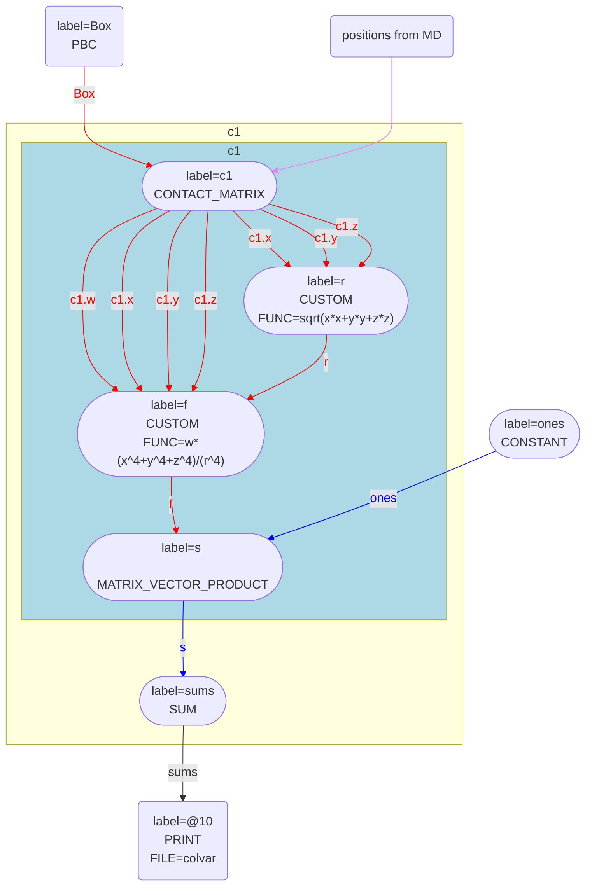

# Calculating symmetry functions

In the other blog articles on these pages I have written a great deal about how you can calculate coordination numbers 
using inputs such as the one below:


<div style="width: 100%; float:left">
<div style="width: 90%; float:left" id="value_details_this_input_should_work.dat"> Click on the labels of the actions for more information on what each action computes </div>
<div style="width: 10%; float:left"><table><tr><td style="padding:1px"><a href="this_input_should_work.dat.plumed.stderr"></a></td></tr><tr><td style="padding:1px"><a href="this_input_should_work.dat.plumed_master.stderr"></a></td></tr></table></div></div>
<pre style="width=97%;">
<span style="color:blue"># Calculate the contact matrix.  This is a square 7x7 matrix</span>
<b name="this_input_should_work.datc1" onclick='showPath("this_input_should_work.dat","this_input_should_work.datc1")'>c1</b>: <div class="tooltip" style="color:green">CONTACT_MATRIX<div class="right">Adjacency matrix in which two atoms are adjacent if they are within a certain cutoff. <a href="https://www.plumed.org/doc-master/user-doc/html/_c_o_n_t_a_c_t__m_a_t_r_i_x.html" style="color:green">More details</a><i></i></div></div> GROUP=1-7 <div class="tooltip">SWITCH<div class="right">This keyword is used if you want to employ an alternative to the continuous switching function defined above<i></i></div></div>={RATIONAL R_0=2.6 NN=6 MM=12}
<span style="color:blue"># Calculate the coordination numbers for the 7 atoms by a vector that contains all ones</span>
<span style="display:none;" id="this_input_should_work.datc1">The CONTACT_MATRIX action with label <b>c1</b> calculates a scalar quantity</span><b name="this_input_should_work.datones" onclick='showPath("this_input_should_work.dat","this_input_should_work.datones")'>ones</b>: <div class="tooltip" style="color:green">ONES<div class="right">This action is not part of PLUMED and was included by using a LOAD command <a href="https://www.plumed.org/doc-master/user-doc/html/_l_o_a_d.html" style="color:green">More details</a><i></i></div></div> SIZE=7
<b name="this_input_should_work.datcc" onclick='showPath("this_input_should_work.dat","this_input_should_work.datcc")'>cc</b>: <div class="tooltip" style="color:green">MATRIX_VECTOR_PRODUCT<div class="right">This action is not part of PLUMED and was included by using a LOAD command <a href="https://www.plumed.org/doc-master/user-doc/html/_l_o_a_d.html" style="color:green">More details</a><i></i></div></div> ARG=<b name="this_input_should_work.datc1">c1.w</b>,<b name="this_input_should_work.datones">ones</b>
<span style="color:blue"># And output the 7 coordination numbers for the atoms</span>
<div class="tooltip" style="color:green">PRINT<div class="right">Print quantities to a file. <a href="https://www.plumed.org/doc-master/user-doc/html/_p_r_i_n_t.html" style="color:green">More details</a><i></i></div></div> <div class="tooltip">ARG<div class="right">the input for this action is the scalar output from one or more other actions<i></i></div></div>=<b name="this_input_should_work.datcc">cc</b> <div class="tooltip">FILE<div class="right">the name of the file on which to output these quantities<i></i></div></div>=colvar
</pre>
  

In this article I want to explain how we can use PLUMED input files that are similar to the one above to calculate 
other input files.

## CONTACT_MATRIX and the COMPONENTS flag

In the input at the top of this file I used a CONTACT_MATRIX.  This command outputs a matrix, $\mathbf{A}$, in which element $i,j$ is given by:

$$
A_{ij} = \sigma(r_{ij})
$$

where $\sigma$ is a switching function and $r_{ij}$ is the distance between atom $i$ and atom $j$.  

Switching functions like $\sigma(r_{ij})$ are used in the definitions symmetry functions such as those used in the FCCUBIC, TETRAHEDRAL and SIMPLECUBIC actions.  These functions have the following general form:

$$
s_i = \sum_{j\ne i } f(x_{ij},y_{ij},z_{ij})\sigma(r_{ij})
$$

where $f$ is some function of the $x_{ij}$, $y_{ij}$ and $z_{ij}$ components of the vector that connects atom $i$ to atom $j$.  To make it easy to implement such functions I have introduced a 
COMPONENTS flag on the CONTACT_MATRIX command that can be used as shown below:


<div style="width: 100%; float:left">
<div style="width: 90%; float:left" id="value_details_this_input_should_work.dat"> Click on the labels of the actions for more information on what each action computes </div>
<div style="width: 10%; float:left"><table><tr><td style="padding:1px"><a href="this_input_should_work.dat.plumed.stderr"></a></td></tr><tr><td style="padding:1px"><a href="this_input_should_work.dat.plumed_master.stderr"></a></td></tr></table></div></div>
<pre style="width=97%;">
<span style="color:blue"># Calculate the contact matrix and the three matrices that contain the components of the vectors connecting atom i and atom j.  In other words, calculate four 7x7 matrices</span>
<b name="this_input_should_work.datc1" onclick='showPath("this_input_should_work.dat","this_input_should_work.datc1")'>c1</b>: <div class="tooltip" style="color:green">CONTACT_MATRIX<div class="right">Adjacency matrix in which two atoms are adjacent if they are within a certain cutoff. <a href="https://www.plumed.org/doc-master/user-doc/html/_c_o_n_t_a_c_t__m_a_t_r_i_x.html" style="color:green">More details</a><i></i></div></div> COMPONENTS GROUP=1-7 <div class="tooltip">SWITCH<div class="right">This keyword is used if you want to employ an alternative to the continuous switching function defined above<i></i></div></div>={RATIONAL R_0=2.6 NN=6 MM=12}
<span style="color:blue"># Output the four 7x7 matrices calculated by the command above to a file.</span>
<span style="display:none;" id="this_input_should_work.datc1">The CONTACT_MATRIX action with label <b>c1</b> calculates a scalar quantity</span><div class="tooltip" style="color:green">PRINT<div class="right">Print quantities to a file. <a href="https://www.plumed.org/doc-master/user-doc/html/_p_r_i_n_t.html" style="color:green">More details</a><i></i></div></div> <div class="tooltip">ARG<div class="right">the input for this action is the scalar output from one or more other actions<i></i></div></div>=<b name="this_input_should_work.datc1">c1.w</b>,<b name="this_input_should_work.datc1">c1.x</b>,<b name="this_input_should_work.datc1">c1.y</b>,<b name="this_input_should_work.datc1">c1.z</b> <div class="tooltip">FILE<div class="right">the name of the file on which to output these quantities<i></i></div></div>=colvar
</pre>
  

The COMPONENTS flag for the CONTACT_MATRIX action is specfically designed to make calculating symmetry functions such as $s_i$ striaghforward.  The elements of the matrix `c1.x` are 
thus calculated as:

$$
X_{ij} = \begin{cases}
x_{ij} & \textrm{if} \quad \sigma(r_{ij})>0 \\
0 & \textrm{otherwise}
\end{cases}
$$

The elements of `c1.y` and `c1.z` are also calculated in a similar fashion.  __In other words, the $i,j$ element of these three matrices are only non-zero if atom $j$ is within the first coordination sphere 
of atom $i$.__

## Combining CONTACT_MATRIX and CUSTOM

We can use the CONTACT_MATRIX command with the COMPONENTS keyword to calculate a function similar to $s_i$ above as follows:


<div style="width: 100%; float:left">
<div style="width: 90%; float:left" id="value_details_this_input_should_work.dat"> Click on the labels of the actions for more information on what each action computes </div>
<div style="width: 10%; float:left"><table><tr><td style="padding:1px"><a href="this_input_should_work.dat.plumed.stderr"></a></td></tr><tr><td style="padding:1px"><a href="this_input_should_work.dat.plumed_master.stderr"></a></td></tr></table></div></div>
<pre style="width=97%;">
<span style="color:blue"># Calculate the contact matrix and the three matrices that contain the components of the vectors connecting atom i and atom j.  In other words, calculate four 7x7 matrices</span>
<b name="this_input_should_work.datc1" onclick='showPath("this_input_should_work.dat","this_input_should_work.datc1")'>c1</b>: <div class="tooltip" style="color:green">CONTACT_MATRIX<div class="right">Adjacency matrix in which two atoms are adjacent if they are within a certain cutoff. <a href="https://www.plumed.org/doc-master/user-doc/html/_c_o_n_t_a_c_t__m_a_t_r_i_x.html" style="color:green">More details</a><i></i></div></div> COMPONENTS GROUP=1-7 <div class="tooltip">SWITCH<div class="right">This keyword is used if you want to employ an alternative to the continuous switching function defined above<i></i></div></div>={RATIONAL R_0=2.6 NN=6 MM=12}
<span style="color:blue"># This applies the function to the three input matrices element-wise and thus outputs a 7x7 matrix</span>
<span style="display:none;" id="this_input_should_work.datc1">The CONTACT_MATRIX action with label <b>c1</b> calculates a scalar quantity</span><b name="this_input_should_work.datr" onclick='showPath("this_input_should_work.dat","this_input_should_work.datr")'>r</b>: <div class="tooltip" style="color:green">CUSTOM<div class="right">Calculate a combination of variables using a custom expression. <a href="https://www.plumed.org/doc-master/user-doc/html/_c_u_s_t_o_m.html" style="color:green">More details</a><i></i></div></div> <div class="tooltip">ARG<div class="right">the input for this action is the scalar output from one or more other actions<i></i></div></div>=<b name="this_input_should_work.datc1">c1.x</b>,<b name="this_input_should_work.datc1">c1.y</b>,<b name="this_input_should_work.datc1">c1.z</b> <div class="tooltip">FUNC<div class="right">the function you wish to evaluate<i></i></div></div>=sqrt(x*x+y*y+z*z <div class="tooltip">PERIODIC<div class="right">if the output of your function is periodic then you should specify the periodicity of the function<i></i></div></div>=NO
<span style="color:blue"># Again we are applying the function element wise to the five input matrices and thus outputting a 7x7 matrix</span>
<span style="display:none;" id="this_input_should_work.datr">The CUSTOM action with label <b>r</b> calculates a scalar quantity</span><b name="this_input_should_work.datf" onclick='showPath("this_input_should_work.dat","this_input_should_work.datf")'>f</b>: <div class="tooltip" style="color:green">CUSTOM<div class="right">Calculate a combination of variables using a custom expression. <a href="https://www.plumed.org/doc-master/user-doc/html/_c_u_s_t_o_m.html" style="color:green">More details</a><i></i></div></div> <div class="tooltip">ARG<div class="right">the input for this action is the scalar output from one or more other actions<i></i></div></div>=<b name="this_input_should_work.datc1">c1.w</b>,<b name="this_input_should_work.datc1">c1.x</b>,<b name="this_input_should_work.datc1">c1.y</b>,<b name="this_input_should_work.datc1">c1.z</b>,<b name="this_input_should_work.datr">r</b> <div class="tooltip">FUNC<div class="right">the function you wish to evaluate<i></i></div></div>=w*(x^4+y^4+z^4)/(r^4 <div class="tooltip">VAR<div class="right">the names to give each of the arguments in the function<i></i></div></div>=w,x,y,z,<b name="this_input_should_work.datr">r</b> <div class="tooltip">PERIODIC<div class="right">if the output of your function is periodic then you should specify the periodicity of the function<i></i></div></div>=NO
<span style="color:blue"># We now multiply the 7x7 by a vector of ones to calculate the symmetry function</span>
<span style="display:none;" id="this_input_should_work.datf">The CUSTOM action with label <b>f</b> calculates a scalar quantity</span><b name="this_input_should_work.datones" onclick='showPath("this_input_should_work.dat","this_input_should_work.datones")'>ones</b>: <div class="tooltip" style="color:green">ONES<div class="right">This action is not part of PLUMED and was included by using a LOAD command <a href="https://www.plumed.org/doc-master/user-doc/html/_l_o_a_d.html" style="color:green">More details</a><i></i></div></div> SIZE=7
<b name="this_input_should_work.dats" onclick='showPath("this_input_should_work.dat","this_input_should_work.dats")'>s</b>: <div class="tooltip" style="color:green">MATRIX_VECTOR_PRODUCT<div class="right">This action is not part of PLUMED and was included by using a LOAD command <a href="https://www.plumed.org/doc-master/user-doc/html/_l_o_a_d.html" style="color:green">More details</a><i></i></div></div> ARG=<b name="this_input_should_work.datf">f</b>,<b name="this_input_should_work.datones">ones</b> 
<span style="color:blue"># And print the sum of the symmetry function to a file</span>
<b name="this_input_should_work.datsums" onclick='showPath("this_input_should_work.dat","this_input_should_work.datsums")'>sums</b>: <div class="tooltip" style="color:green">SUM<div class="right">This action is not part of PLUMED and was included by using a LOAD command <a href="https://www.plumed.org/doc-master/user-doc/html/_l_o_a_d.html" style="color:green">More details</a><i></i></div></div> ARG=<b name="this_input_should_work.dats">s</b> PERIODIC=NO
<div class="tooltip" style="color:green">PRINT<div class="right">Print quantities to a file. <a href="https://www.plumed.org/doc-master/user-doc/html/_p_r_i_n_t.html" style="color:green">More details</a><i></i></div></div> <div class="tooltip">ARG<div class="right">the input for this action is the scalar output from one or more other actions<i></i></div></div>=<b name="this_input_should_work.datsums">sums</b> <div class="tooltip">FILE<div class="right">the name of the file on which to output these quantities<i></i></div></div>=colvar
</pre>
  

The graph for this input is shown below:



Notice that all the commands are done in a single chain.  There is no need to store any matrix elements as the functions in `r` and `f` are applied to the elements of the matrices calculated
by `c1` immediately after they are calculated.  Furthermore, if one were to sum the elements of the vector `s` and add a bias upon the sum, the forces on `s` are passed back through the code as
shown below:

```mermaid
flowchart BT 
10(["label=#64;10 
 BIASVALUE 
"])
10 -- sums --> sums
subgraph subc1 [c1]
subgraph subc1_mat [c1]
c1(["label=c1 
 CONTACT_MATRIX 
"])
r(["label=r 
 CUSTOM
FUNC=sqrt(x*x+y*y+z*z) 
"])
f(["label=f 
 CUSTOM
FUNC=w*(x^4+y^4+z^4)/(r^4) 
"])
s(["label=s 
 MATRIX_VECTOR_PRODUCT 
"])
end
style subc1_mat fill:lightblue
c1 -. c1.x .-> r
linkStyle 1 stroke:red,color:red;
c1 -. c1.y .-> r
linkStyle 2 stroke:red,color:red;
c1 -. c1.z .-> r
linkStyle 3 stroke:red,color:red;
c1 -. c1.w .-> f
linkStyle 4 stroke:red,color:red;
c1 -. c1.x .-> f
linkStyle 5 stroke:red,color:red;
c1 -. c1.y .-> f
linkStyle 6 stroke:red,color:red;
c1 -. c1.z .-> f
linkStyle 7 stroke:red,color:red;
r -. r .-> f
linkStyle 8 stroke:red,color:red;
f -. f .-> s
linkStyle 9 stroke:red,color:red;
sums(["label=sums 
 SUM 
"])
s -. s .-> sums
linkStyle 10 stroke:blue,color:blue;
end
sums == sums ==> c1
sums == sums ==> s
subgraph subc1 [c1]
end
s -- ones --> ones
linkStyle 13 stroke:blue,color:blue;
ones(["label=ones 
 CONSTANT 
"])
Box("label=Box 
 PBC 
")
c1 -- Box --> Box
linkStyle 14 stroke:red,color:red;
c1 --> MD
linkStyle 15 stroke:violet,color:violet;
MD(positions from MD)
```

This is possible because the chain of actions the $(i,j)$ matrix elements for `r` and `f` (and their derivatives with respect to the atomic positions) are calculated immediately after $(i,j)$ matrix elements
for `c1.w`, `c1.x`, `c1.y` and `c1.z`.  In other words, in calculating `sums` we do a single loop over $i$ and $j$ and can thus accumulate values and derivatives without storing any matrices or vectors.

## Extending these symmetry functions

There are ways of defining the neighbourhood of atom $i$ that do not involve using the CONTACT_MATRIX keyword.  For example, you can define a matrix in which element $i,j$ is only non-zero if there is a hydrogen
bond between atom $i$ and atom $j$ (HBOND_MATRIX or HBPAMM_MATRIX) or, if you have molecules, you can say that molecule $i$ and $j$ are connected if they are within a cutoff of each other and if the two molecules
have some favourable orientation with respect to each other.  In all these cases you can also use a COMPONENTS keywords to get the direction of the bonds in the first coordination sphere as I have described in the 
article above.  You are thus not forced to use a switching function to define the $\sigma(r_{ij})$ part of the symmetry function that was defined above.  You can use other methods to determine whether atom $i$ and 
atom $j$ are adjacent or not.  Consequently, the implementation of these symmetry function in PLUMED is quite flexible and allows users to try many things without modifying the code.
