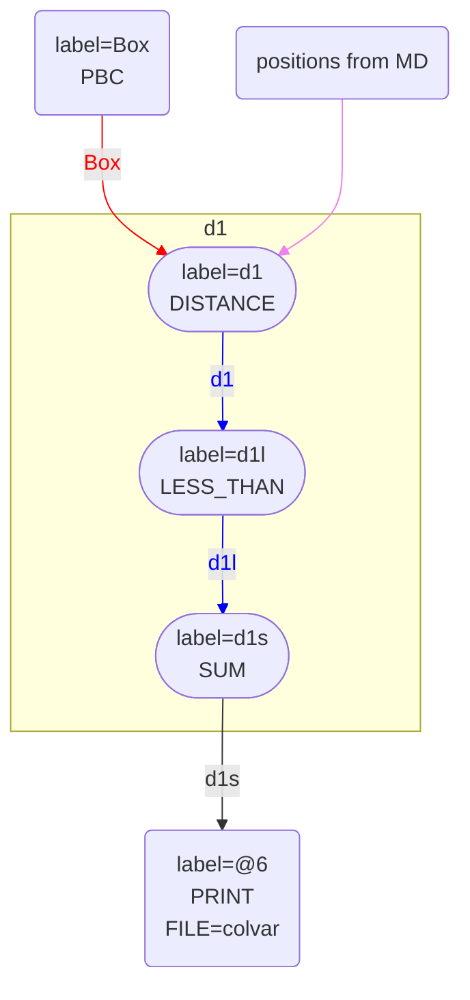
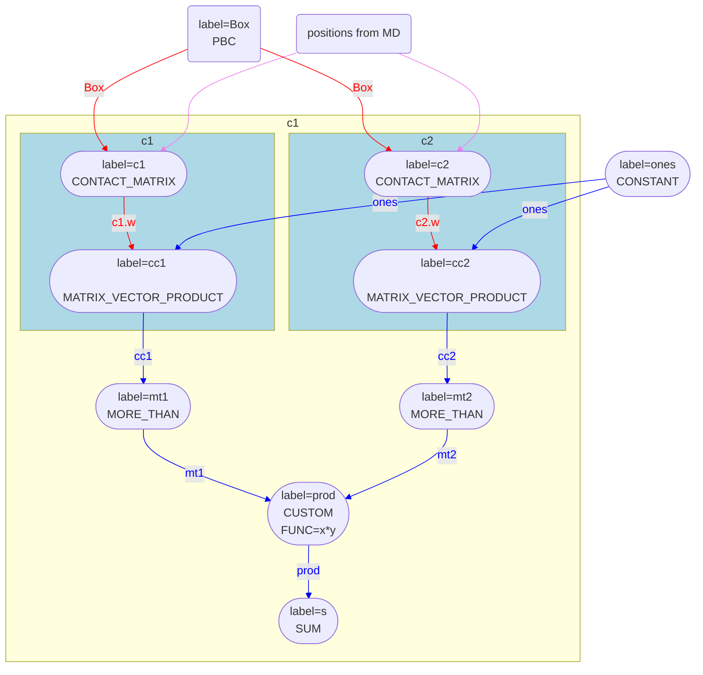

# The task loop in detail

In some of the articles previous to this one we have discussed how we can use PLUMED to compute and print the number of distances
less than a threshold using an input similar to this one:


<div style="width: 100%; float:left">
<div style="width: 90%; float:left" id="value_details_this_input_should_work.dat"> Click on the labels of the actions for more information on what each action computes </div>
<div style="width: 10%; float:left"><table><tr><td style="padding:1px"><a href="this_input_should_work.dat.plumed.stderr"></a></td></tr><tr><td style="padding:1px"><a href="this_input_should_work.dat.plumed_master.stderr"></a></td></tr></table></div></div>
<pre style="width=97%;">
<b name="this_input_should_work.datd1" onclick='showPath("this_input_should_work.dat","this_input_should_work.datd1")'>d1</b>: <div class="tooltip" style="color:green">DISTANCE<div class="right">Calculate the distance between a pair of atoms. <a href="https://www.plumed.org/doc-master/user-doc/html/_d_i_s_t_a_n_c_e.html" style="color:green">More details</a><i></i></div></div> <div class="tooltip">ATOMS1<div class="right">the pair of atom that we are calculating the distance between<i></i></div></div>=1,2 <div class="tooltip">ATOMS2<div class="right">the pair of atom that we are calculating the distance between<i></i></div></div>=3,4 <div class="tooltip">ATOMS3<div class="right">the pair of atom that we are calculating the distance between<i></i></div></div>=5,6
<span style="display:none;" id="this_input_should_work.datd1">The DISTANCE action with label <b>d1</b> calculates a scalar quantity</span><b name="this_input_should_work.datd1l" onclick='showPath("this_input_should_work.dat","this_input_should_work.datd1l")'>d1l</b>: <div class="tooltip" style="color:green">LESS_THAN<div class="right">This action is not part of PLUMED and was included by using a LOAD command <a href="https://www.plumed.org/doc-master/user-doc/html/_l_o_a_d.html" style="color:green">More details</a><i></i></div></div> ARG=<b name="this_input_should_work.datd1">d1</b> SWITCH={RATIONAL R_0=0.1}
<b name="this_input_should_work.datd1s" onclick='showPath("this_input_should_work.dat","this_input_should_work.datd1s")'>d1s</b>: <div class="tooltip" style="color:green">SUM<div class="right">This action is not part of PLUMED and was included by using a LOAD command <a href="https://www.plumed.org/doc-master/user-doc/html/_l_o_a_d.html" style="color:green">More details</a><i></i></div></div> ARG=<b name="this_input_should_work.datd1l">d1l</b> PERIODIC=NO
<div class="tooltip" style="color:green">PRINT<div class="right">Print quantities to a file. <a href="https://www.plumed.org/doc-master/user-doc/html/_p_r_i_n_t.html" style="color:green">More details</a><i></i></div></div> <div class="tooltip">ARG<div class="right">the input for this action is the scalar output from one or more other actions<i></i></div></div>=<b name="this_input_should_work.datd1s">d1s</b> <div class="tooltip">FILE<div class="right">the name of the file on which to output these quantities<i></i></div></div>=colvar
</pre>
  

In this article we are going to discuss how PLUMED does this calculation in a little more detail.  Lets therefore start by looking 
at the graph that shows how data passes through the code in this calculation:


```mermaid
flowchart TB
MD(positions from MD)
Box("label=Box 
 PBC
")
Box -- Box --> d1
linkStyle 0 stroke:red,color:red;
MD --> d1
linkStyle 1 stroke:violet,color:violet;
subgraph subd1 [d1]
d1(["label=d1
 DISTANCE
"])
d1l(["label=d1l
 LESS_THAN
"])
d1s(["label=d1s
 SUM
"])
end
d1 -- d1 --> d1l
linkStyle 2 stroke:blue,color:blue;
d1l -- d1l --> d1s
linkStyle 3 stroke:blue,color:blue;
d1s -- d1s --> 6
6("label=#64;6
 PRINT
FILE=colvar
")
```

You can cleearly see that the actions d1, d1l and d1s are all in the same subgraph.  The calculation parts of these actions are thu all 
performed when you call the calculate method for d1.  The calculate methods for d1l and d1s do nothing.

Within d1's calculate method we call a function in ActionWithVector that is called runAllTasks, which includes the following c++ code:

```c++
#pragma omp parallel num_threads(nt)
{
  std::vector<double> omp_buffer;
  if( nt>1 ) omp_buffer.resize( bufsize, 0.0 );
  MultiValue myvals( nquants, nderivatives, nmatrices, maxcol, nbooks );
  myvals.clearAll(true);

  #pragma omp for nowait
  for(unsigned i=rank; i<nactive_tasks; i+=stride) {
    // Calculate the stuff in the loop for this action
    runTask( partialTaskList[i], myvals );

    // Now transfer the data to the actions that accumulate values from the calculated quantities
    if( nt>1 ) gatherAccumulators( partialTaskList[i], myvals, omp_buffer );
    else gatherAccumulators( partialTaskList[i], myvals, buffer );

    // Clear the value
    myvals.clearAll(true);
  }
  #pragma omp critical
  gatherThreads( nt, bufsize, omp_buffer, buffer, myvals );
}

// MPI Gather everything
if( !serial && buffer.size()>0 ) gatherProcesses( buffer );
finishComputations( buffer );
```

We can understand this code better once we recognise that d1s is calculating:

$$
s = \sigma( d_{12} ) + \sigma( d_{34} ) + \sigma( d_{56} )
$$

In this expression $d_{12}$, $d_{34}$ and $d_{56}$ are the distances between the pairs of atoms and $\sigma$ is the switching function that is used in the LESS_THAN action 
d1l. 

Each of the tasks that the loop in the c++ code runs above runs over computes one of the terms in this series.  Remember that the loop above is triggered when the calculate 
method for the action d1 is called.  Consequently, the calls to runTask are calls to the runTask method for the action d1.  The code for this method is as follows:

```c++
void ActionWithVector::runTask( const unsigned& current, MultiValue& myvals ) const {
  if( isActive() ) {
    myvals.setTaskIndex(current); myvals.vector_call=true; performTask( current, myvals );
  } 
  if( action_to_do_after ) action_to_do_after->runTask( current, myvals );
}   
``` 

This code calls the performTask method for d1 (which computes the disance). The runTask method for the action after this one in the chain, which is the runTask method for d1s.
This method transforms the distance by the switching function and then calls the runTask method for d1s, which adds the transformed distance to the scalar that we are accumulating 
here.

Notice that the derivatives of the final scalar $s$ that we are computing here with respect to each of the atomic positions $x_i$ is given by:

$$
\frac{\partial s}{\partial x_i} = \frac{\partial \sigma}{\partial d_{12}}\frac{\partial d_{12}}{\partial x_i} + \frac{\partial \sigma}{\partial d_{34}}\frac{\partial d_{34}}{\partial x_i} + \frac{\partial \sigma}{\partial d_{56}}\frac{\partial d_{56}}{\partial x_i}
$$  

If these derivatives are required (i.e. if there is a force on s) then they are also computed when we call runTask.  The information on the values and derivatives of the elements of the 
vectors d1 and d1l are passed between actions in `myvals`, which is an object of type MultiValue.  The information in myvals on each element of the vector is deleted before the start of the next iteration
through the loop when `myvals.clearAll` is called.

Information that is to be passed to Actions that are not in the chain is stored in the std::vector `buffer`.  The method `gatherAccumulators` transfers data from `myvals` to the appropriate elements of buffer.
Furthermore, if the loop is parallelised data in buffer from different threads is gathered when we call `gatherThreads` and data from different MPI processes is gathered when we call `gatherProcesses`.  The method
`finishComputations` then transfers the data from buffer to the PLMD::Value objects of the various Actions in the chain.  Notice that the methods `gatherAccumulators` and `finishComputations` have calls 
to `action_to_do_after->gatherAccumulators` and `action_to_do_after->finishComputations` at the end of them.  We thus call all these methods for all the actions in the chain when we call these actions.

## The task loop for an input with matrices

Lets now consider a second example input:


<div style="width: 100%; float:left">
<div style="width: 90%; float:left" id="value_details_this_input_should_work.dat"> Click on the labels of the actions for more information on what each action computes </div>
<div style="width: 10%; float:left"><table><tr><td style="padding:1px"><a href="this_input_should_work.dat.plumed.stderr"></a></td></tr><tr><td style="padding:1px"><a href="this_input_should_work.dat.plumed_master.stderr"></a></td></tr></table></div></div>
<pre style="width=97%;">
<b name="this_input_should_work.datones" onclick='showPath("this_input_should_work.dat","this_input_should_work.datones")'>ones</b>: <div class="tooltip" style="color:green">ONES<div class="right">This action is not part of PLUMED and was included by using a LOAD command <a href="https://www.plumed.org/doc-master/user-doc/html/_l_o_a_d.html" style="color:green">More details</a><i></i></div></div> SIZE=100
<b name="this_input_should_work.datc1" onclick='showPath("this_input_should_work.dat","this_input_should_work.datc1")'>c1</b>: <div class="tooltip" style="color:green">CONTACT_MATRIX<div class="right">Adjacency matrix in which two atoms are adjacent if they are within a certain cutoff. <a href="https://www.plumed.org/doc-master/user-doc/html/_c_o_n_t_a_c_t__m_a_t_r_i_x.html" style="color:green">More details</a><i></i></div></div> GROUPA=1-10 GROUPB=11-110 <div class="tooltip">SWITCH<div class="right">This keyword is used if you want to employ an alternative to the continuous switching function defined above<i></i></div></div>={RATIONAL R_0=0.3 D_MAX=0.5}
<span style="display:none;" id="this_input_should_work.datc1">The CONTACT_MATRIX action with label <b>c1</b> calculates a scalar quantity</span><b name="this_input_should_work.datcc1" onclick='showPath("this_input_should_work.dat","this_input_should_work.datcc1")'>cc1</b>: <div class="tooltip" style="color:green">MATRIX_VECTOR_PRODUCT<div class="right">This action is not part of PLUMED and was included by using a LOAD command <a href="https://www.plumed.org/doc-master/user-doc/html/_l_o_a_d.html" style="color:green">More details</a><i></i></div></div> ARG=<b name="this_input_should_work.datc1">c1.w</b>,<b name="this_input_should_work.datones">ones</b>
<b name="this_input_should_work.datmt1" onclick='showPath("this_input_should_work.dat","this_input_should_work.datmt1")'>mt1</b>: <div class="tooltip" style="color:green">MORE_THAN<div class="right">This action is not part of PLUMED and was included by using a LOAD command <a href="https://www.plumed.org/doc-master/user-doc/html/_l_o_a_d.html" style="color:green">More details</a><i></i></div></div> ARG=<b name="this_input_should_work.datcc1">cc1</b> SWITCH={RATIONAL R_0=1}
<br/><b name="this_input_should_work.datc2" onclick='showPath("this_input_should_work.dat","this_input_should_work.datc2")'>c2</b>: <div class="tooltip" style="color:green">CONTACT_MATRIX<div class="right">Adjacency matrix in which two atoms are adjacent if they are within a certain cutoff. <a href="https://www.plumed.org/doc-master/user-doc/html/_c_o_n_t_a_c_t__m_a_t_r_i_x.html" style="color:green">More details</a><i></i></div></div> GROUPA=1-10 GROUPB=101-200 <div class="tooltip">SWITCH<div class="right">This keyword is used if you want to employ an alternative to the continuous switching function defined above<i></i></div></div>={RATIONAL R_0=0.1 D_MAX=0.3}
<span style="display:none;" id="this_input_should_work.datc2">The CONTACT_MATRIX action with label <b>c2</b> calculates a scalar quantity</span><b name="this_input_should_work.datcc2" onclick='showPath("this_input_should_work.dat","this_input_should_work.datcc2")'>cc2</b>: <div class="tooltip" style="color:green">MATRIX_VECTOR_PRODUCT<div class="right">This action is not part of PLUMED and was included by using a LOAD command <a href="https://www.plumed.org/doc-master/user-doc/html/_l_o_a_d.html" style="color:green">More details</a><i></i></div></div> ARG=<b name="this_input_should_work.datc2">c2.w</b>,<b name="this_input_should_work.datones">ones</b>
<b name="this_input_should_work.datmt2" onclick='showPath("this_input_should_work.dat","this_input_should_work.datmt2")'>mt2</b>: <div class="tooltip" style="color:green">MORE_THAN<div class="right">This action is not part of PLUMED and was included by using a LOAD command <a href="https://www.plumed.org/doc-master/user-doc/html/_l_o_a_d.html" style="color:green">More details</a><i></i></div></div> ARG=<b name="this_input_should_work.datcc2">cc2</b> SWITCH={RATIONAL R_0=4}
<br/><b name="this_input_should_work.datprod" onclick='showPath("this_input_should_work.dat","this_input_should_work.datprod")'>prod</b>: <div class="tooltip" style="color:green">CUSTOM<div class="right">Calculate a combination of variables using a custom expression. <a href="https://www.plumed.org/doc-master/user-doc/html/_c_u_s_t_o_m.html" style="color:green">More details</a><i></i></div></div> <div class="tooltip">ARG<div class="right">the input for this action is the scalar output from one or more other actions<i></i></div></div>=<b name="this_input_should_work.datmt1">mt1</b>,<b name="this_input_should_work.datmt2">mt2</b> <div class="tooltip">FUNC<div class="right">the function you wish to evaluate<i></i></div></div>=x*y <div class="tooltip">PERIODIC<div class="right">if the output of your function is periodic then you should specify the periodicity of the function<i></i></div></div>=NO
<span style="display:none;" id="this_input_should_work.datprod">The CUSTOM action with label <b>prod</b> calculates a scalar quantity</span><b name="this_input_should_work.dats" onclick='showPath("this_input_should_work.dat","this_input_should_work.dats")'>s</b>: <div class="tooltip" style="color:green">SUM<div class="right">This action is not part of PLUMED and was included by using a LOAD command <a href="https://www.plumed.org/doc-master/user-doc/html/_l_o_a_d.html" style="color:green">More details</a><i></i></div></div> ARG=<b name="this_input_should_work.datprod">prod</b> PERIODIC=NO
</pre>
  

The CV here can be expressed as:

$$
s = \sum_{i=1}^{10} \sigma_{mt1}\left( \sum_{j=11}^{100} \sigma_{c1}(r_{ij}) \right)\sigma_{mt2}\left( \sum_{k=101}^{200} \sigma_{c2}(r_{ik}) \right) 
$$

where $r_{ij}$ is the distance between atoms $i$ and $j$ and $\sigma_l$ is the sigmoid function that is defined in the action with label $l$.

You can see the graph that shows how data passes through the code below:


```mermaid
flowchart TB 
MD(positions from MD)
Box("label=Box 
 PBC 
")
ones(["label=ones 
 CONSTANT 
"])
Box -- Box --> c1
linkStyle 0 stroke:red,color:red;
MD --> c1
linkStyle 1 stroke:violet,color:violet;
subgraph subc1 [c1]
subgraph subc1_mat [c1]
c1(["label=c1 
 CONTACT_MATRIX 
"])
cc1(["label=cc1 
 MATRIX_VECTOR_PRODUCT 
"])
end
style subc1_mat fill:lightblue
mt1(["label=mt1 
 MORE_THAN 
"])
subgraph subc2_mat [c2]
c2(["label=c2 
 CONTACT_MATRIX 
"])
cc2(["label=cc2 
 MATRIX_VECTOR_PRODUCT 
"])
end
style subc2_mat fill:lightblue
mt2(["label=mt2 
 MORE_THAN 
"])
prod(["label=prod 
 CUSTOM
FUNC=x*y 
"])
s(["label=s 
 SUM 
"])
end
c1 -- c1.w --> cc1
linkStyle 2 stroke:red,color:red;
ones -- ones --> cc1
linkStyle 3 stroke:blue,color:blue;
cc1 -- cc1 --> mt1
linkStyle 4 stroke:blue,color:blue;
Box -- Box --> c2
linkStyle 5 stroke:red,color:red;
MD --> c2
linkStyle 6 stroke:violet,color:violet;
c2 -- c2.w --> cc2
linkStyle 7 stroke:red,color:red;
ones -- ones --> cc2
linkStyle 8 stroke:blue,color:blue;
cc2 -- cc2 --> mt2
linkStyle 9 stroke:blue,color:blue;
mt1 -- mt1 --> prod
linkStyle 10 stroke:blue,color:blue;
mt2 -- mt2 --> prod
linkStyle 11 stroke:blue,color:blue;
prod -- prod --> s
linkStyle 12 stroke:blue,color:blue;
```

This graph tells us that the whole calculation above is done when we call the calculate method for the action with label c1.  This method calls `runAllTasks` and the 
task in the c++ loop that was shown above are the various terms in the sum over $i$ in the expression above.

The code for the `performTask` methods for the CONTACT_MATRIX actions in the above input is the one from ActionWithMatrix that looks as follows:

```c++
void ActionWithMatrix::performTask( const unsigned& task_index, MultiValue& myvals ) const {
  std::vector<unsigned> & indices( myvals.getIndices() );
  if( !doInnerLoop && actionInChain() ) {
      plumed_dbg_assert( myvals.inVectorCall() );
      runEndOfRowJobs( task_index, indices, myvals );
      return;
  }
  setupForTask( task_index, indices, myvals );

  // Now loop over the row of the matrix
  unsigned ntwo_atoms = myvals.getSplitIndex();
  for(unsigned i=0;i<ntwo_atoms;++i) {
      // This does everything in the stream that is done with single matrix elements
      runTask( getLabel(), task_index, indices[i], myvals );
      // Now clear only elements that are not accumulated over whole row
      clearMatrixElements( myvals );
  }
  // This updates the jobs that need to be completed when we get to the end of a row of the matrix 
  runEndOfRowJobs( task_index, indices, myvals );
}
```

The loop here runs over the columns of the matrix, although the method `setupForTask` uses linked lists and neighbour lists to ensure that we skip any matrix elements that we know to be zero.
Notice that when we call `runTask` within this loop this calls every method that requires the matrix elements.  In our example above, there will be a call to the runTask method in cc1 after 
each element of the c1 matrix is computed so that we can calculate the matrix vector product.

Notice, also, however, that PLUMED is clever enough to know that cc2 should not be called when we run over the elements of the c1 matrix.  The blue subgragraphs indicate the actions that PLUMED
will run over when it works through the various elements in each column of the matrix.

## Conclusion

This article is not exaustive.  A lot of the implementation detail in the code is rather complicated.  This code is necessary for ensuring that PLUMED keeps track of the non zero elements of the derivatives. 
I hope that this article at least explains how this code is supposed to work and that the interested reader can work out the remaining details by reading the code.  
