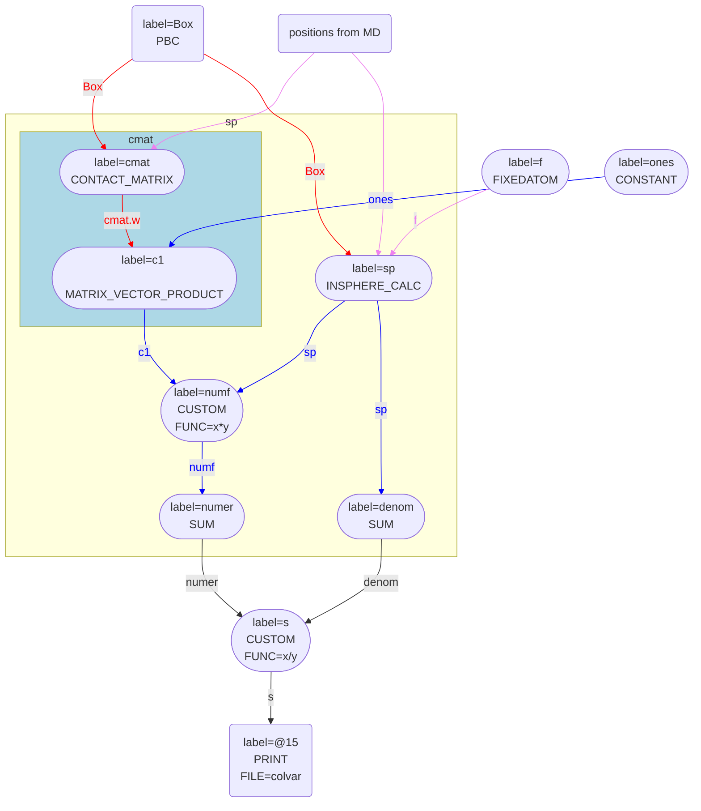

# Calculating the number of atoms/average CV in a part of the cell

There are times when you want to study how many atoms are in a particular part of the simulation cell.  For example, you might 
want to investigate how many gas atoms are within one of the pores of a zeolite.  Alternatively, you might be interested in the 
number of ions that have penetrated into the inner envelope of a membrane.  It is relatively easy to calculate such CVs in PLUMED.
For example, if you want to calculate the number of atoms that are within a sphere with radius 1.0 nm around atom 1 you can use an 
input something like this:



 Click on the labels of the actions for more information on what each action computes 

<table><tr><td style="padding:1px"></td></tr><tr><td style="padding:1px"></td></tr></table>

<pre style="width=97%;">
# This will output a vector with 99 components.  Each component of this vector is calculated
# by applying a switching function on the distance between atom 1 and one of the atoms in the system
<b name="this_input_should_work.datsp" onclick='showPath("this_input_should_work.dat","this_input_should_work.datsp")'>sp</b>: 
INSPHERE
This quantity can be used to calculate functions of the distribution of collective variables for the atoms that lie in a particular, user-specified part of of the cell. <a href="https://www.plumed.org/doc-master/user-doc/html/_i_n_s_p_h_e_r_e.html" style="color:green">More details</a><i></i>

 
ATOMS
the atom whose vicinity we are interested in examining<i></i>

=2-100 CENTER=1 
RADIUS
the switching function that tells us the extent of the spherical region of interest<i></i>

={SWITCH R_0=1.0}
# This adds together all the elements of sp
The INSPHERE action with label <b>sp</b> calculates a scalar quantity<b name="this_input_should_work.datsumsp" onclick='showPath("this_input_should_work.dat","this_input_should_work.datsumsp")'>sumsp</b>: 
SUM
This action is not part of PLUMED and was included by using a LOAD command <a href="https://www.plumed.org/doc-master/user-doc/html/_l_o_a_d.html" style="color:green">More details</a><i></i>

 ARG=<b name="this_input_should_work.datsp">sp</b> PERIODIC=NO
# And this prints the final scalar quantity that tells you how many atoms are in the sphere to a file.

PRINT
Print quantities to a file. <a href="https://www.plumed.org/doc-master/user-doc/html/_p_r_i_n_t.html" style="color:green">More details</a><i></i>

 
ARG
the input for this action is the scalar output from one or more other actions<i></i>

=<b name="this_input_should_work.datsumsp">sumsp</b> 
FILE
the name of the file on which to output these quantities<i></i>

=colvar
</pre>
  

This input is relatively simple and illustrates the procedure that PLUMED follows in calculating this quantity pretty clearly.

1. A vector `sp` is calculated.  Each element in this vector is between 0 and 1 and the $i$th element is one if atom $i$ is in the region of interest.
2. The elements of the vector are all added together.

Step 2 in this procedure is fixed but there are a variety of differnt ways of completing step 1 as there are a variety of ways of defining the region 
of interest.  The particular methods that are currently available are:

* INSPHERE - calculate whether atoms are within a spherical region centered on a particular atom.
* AROUND - calcualte the vector $(x,y,x)$ connecting each atom to a user-specified atom that is at the origin.  Then determine if $x_l < x < x_u$, $y_l < y < y_u$ and $z_l < z < z_u$, where $x_l$, $x_u$, $y_l$, $y_u, $z_l$ and $z_u$ are user specified parameters.
* INCYLINDER - calculate whether atoms are within a cylindrical region that has its long axis aligned with the $x$, $y$ or $z$ axis of the lab frame and that is centerd on a particular atom.
* CAVITY - calculate whether atoms are within a orthrhombic box whose orientation and size is determined based on the position of four atoms.
* TETRAPORE - calculate whether atoms are within a orthrhombic box whose orientation and size is determined based on the position of four atoms (the calculation of the box is done differently to the way it is done with CAVITY).
* INENVELOPE - use kernel density estimation to calculate the density of a particular atom type.  Then for each of the atoms, $i$, in a second (different) set to the one that was used to calculate the density determine if they are in a region where the density of the first atom type is large.  This action could be used to determine whether ions are in a membrane. 

## Using FIXEDATOM

You will notice that when we use these commands for calculating the number of atoms a part of the box there is always at least one atom that defines the position of the origin.  We do not use 
the positions that are calculated from the MD code directly and instead calculate the position of the atom of interest with respect to some other atom.  Calculating these vectors connecting 
pairs of atoms is essential.  If we were to use the positions that are passed from the MD code directly our CV would not be translationally invariant.  In other words, if we use the position that 
are passed from the MD code when the position of the center of mass of the atoms changes the values of the CV changes.

Using the position of atom 1 as the position of the ORIGIN as I did above might be useful in some cases.  If you want to look at what is going on in a particular part of the cell it is usually simpler
to define a virtual atom at the origin using FIXEDATOM like this:



 Click on the labels of the actions for more information on what each action computes 

<table><tr><td style="padding:1px"></td></tr><tr><td style="padding:1px"></td></tr></table>

<pre style="width=97%;">
<b name="this_input_should_work.datf" onclick='showPath("this_input_should_work.dat","this_input_should_work.datf")'>f</b>: 
FIXEDATOM
Add a virtual atom in a fixed position. <a href="https://www.plumed.org/doc-master/user-doc/html/_f_i_x_e_d_a_t_o_m.html" style="color:green">More details</a><i></i>

 
AT
coordinates of the virtual atom<i></i>

=0,0,0
<b name="this_input_should_work.datsp" onclick='showPath("this_input_should_work.dat","this_input_should_work.datsp")'>sp</b>: 
INSPHERE
This quantity can be used to calculate functions of the distribution of collective variables for the atoms that lie in a particular, user-specified part of of the cell. <a href="https://www.plumed.org/doc-master/user-doc/html/_i_n_s_p_h_e_r_e.html" style="color:green">More details</a><i></i>

 CENTER=<b name="this_input_should_work.datf">f</b> 
ATOMS
the atom whose vicinity we are interested in examining<i></i>

=1-100 
RADIUS
the switching function that tells us the extent of the spherical region of interest<i></i>

={SWITCH R_0=1.0}
The INSPHERE action with label <b>sp</b> calculates a scalar quantity<b name="this_input_should_work.datsumsp" onclick='showPath("this_input_should_work.dat","this_input_should_work.datsumsp")'>sumsp</b>: 
SUM
This action is not part of PLUMED and was included by using a LOAD command <a href="https://www.plumed.org/doc-master/user-doc/html/_l_o_a_d.html" style="color:green">More details</a><i></i>

 ARG=<b name="this_input_should_work.datsp">sp</b> PERIODIC=NO

PRINT
Print quantities to a file. <a href="https://www.plumed.org/doc-master/user-doc/html/_p_r_i_n_t.html" style="color:green">More details</a><i></i>

 
ARG
the input for this action is the scalar output from one or more other actions<i></i>

=<b name="this_input_should_work.datsumsp">sumsp</b>
</pre>
  

As PBCs are applied on the distances calculated in the action `sp` using the FIXEDATOM `f` at (0,0,0) ensures that the sphere is centered on the center of the simulation cell.

## Calculating the average value of a CV in a region

You may be wondering why, in the inputs that I have shown thus far, vectors that tell us whether each atom is inside or outside the region of interest are computed and exposed in the input.
The reason is that these vectors are useful in other cases.  For example, we can calculate the average value of the coordination numbers of the atoms that are within a sphere.  This quantity would 
be defined as:

$$
c_v = \frac{ \sum_i v_i c_i }{ \sum_i v_i }
$$

In this expression the sum runs over all atoms.  $c_i$ is the coordination number of atom $i$ and $v_i$ is a scalar that tells you that atom $i$ is within the region of interest.
You can implement this CV in PLUMED using the following input:



 Click on the labels of the actions for more information on what each action computes 

<table><tr><td style="padding:1px"></td></tr><tr><td style="padding:1px"></td></tr></table>

<pre style="width=97%;">
<b name="this_input_should_work.datf" onclick='showPath("this_input_should_work.dat","this_input_should_work.datf")'>f</b>: 
FIXEDATOM
Add a virtual atom in a fixed position. <a href="https://www.plumed.org/doc-master/user-doc/html/_f_i_x_e_d_a_t_o_m.html" style="color:green">More details</a><i></i>

 
AT
coordinates of the virtual atom<i></i>

=0,0,0
# Calculate the coordination numbers in the usual way
<b name="this_input_should_work.datcmat" onclick='showPath("this_input_should_work.dat","this_input_should_work.datcmat")'>cmat</b>: 
CONTACT_MATRIX
Adjacency matrix in which two atoms are adjacent if they are within a certain cutoff. <a href="https://www.plumed.org/doc-master/user-doc/html/_c_o_n_t_a_c_t__m_a_t_r_i_x.html" style="color:green">More details</a><i></i>

 GROUP=1-100 
SWITCH
This keyword is used if you want to employ an alternative to the continuous switching function defined above<i></i>

={RATIONAL R_0=0.1}
The CONTACT_MATRIX action with label <b>cmat</b> calculates a scalar quantity<b name="this_input_should_work.datones" onclick='showPath("this_input_should_work.dat","this_input_should_work.datones")'>ones</b>: 
ONES
This action is not part of PLUMED and was included by using a LOAD command <a href="https://www.plumed.org/doc-master/user-doc/html/_l_o_a_d.html" style="color:green">More details</a><i></i>

 SIZE=100
<b name="this_input_should_work.datc1" onclick='showPath("this_input_should_work.dat","this_input_should_work.datc1")'>c1</b>: 
MATRIX_VECTOR_PRODUCT
This action is not part of PLUMED and was included by using a LOAD command <a href="https://www.plumed.org/doc-master/user-doc/html/_l_o_a_d.html" style="color:green">More details</a><i></i>

 ARG=<b name="this_input_should_work.datcmat">cmat.w</b>,<b name="this_input_should_work.datones">ones</b>
# Now calculate whether each atom is within the region of interest.  These is the vector of 100 v_i values in the expression above.
<b name="this_input_should_work.datsp" onclick='showPath("this_input_should_work.dat","this_input_should_work.datsp")'>sp</b>: 
INSPHERE
This quantity can be used to calculate functions of the distribution of collective variables for the atoms that lie in a particular, user-specified part of of the cell. <a href="https://www.plumed.org/doc-master/user-doc/html/_i_n_s_p_h_e_r_e.html" style="color:green">More details</a><i></i>

 
ATOMS
the atom whose vicinity we are interested in examining<i></i>

=1-100 CENTER=<b name="this_input_should_work.datf">f</b> 
RADIUS
the switching function that tells us the extent of the spherical region of interest<i></i>

={RATIONAL R_0=1.0}
# Now calculate another vector of v_i c_i values.  This action returns a vector with 100 elements.
The INSPHERE action with label <b>sp</b> calculates a scalar quantity<b name="this_input_should_work.datnumf" onclick='showPath("this_input_should_work.dat","this_input_should_work.datnumf")'>numf</b>: 
CUSTOM
Calculate a combination of variables using a custom expression. <a href="https://www.plumed.org/doc-master/user-doc/html/_c_u_s_t_o_m.html" style="color:green">More details</a><i></i>

 
ARG
the input for this action is the scalar output from one or more other actions<i></i>

=<b name="this_input_should_work.datsp">sp</b>,<b name="this_input_should_work.datc1">c1</b> 
FUNC
the function you wish to evaluate<i></i>

=x*y 
PERIODIC
if the output of your function is periodic then you should specify the periodicity of the function<i></i>

=NO
# Calculate the sum in the numeration of the expression above.
The CUSTOM action with label <b>numf</b> calculates a scalar quantity<b name="this_input_should_work.datnumer" onclick='showPath("this_input_should_work.dat","this_input_should_work.datnumer")'>numer</b>: 
SUM
This action is not part of PLUMED and was included by using a LOAD command <a href="https://www.plumed.org/doc-master/user-doc/html/_l_o_a_d.html" style="color:green">More details</a><i></i>

 ARG=<b name="this_input_should_work.datnumf">numf</b> PERIODIC=NO
# Calculate the sum in the denominator of the expression above
<b name="this_input_should_work.datdenom" onclick='showPath("this_input_should_work.dat","this_input_should_work.datdenom")'>denom</b>: 
SUM
This action is not part of PLUMED and was included by using a LOAD command <a href="https://www.plumed.org/doc-master/user-doc/html/_l_o_a_d.html" style="color:green">More details</a><i></i>

 ARG=<b name="this_input_should_work.datsp">sp</b> PERIODIC=NO
# And calculate the final quotient of interest
<b name="this_input_should_work.dats" onclick='showPath("this_input_should_work.dat","this_input_should_work.dats")'>s</b>: 
CUSTOM
Calculate a combination of variables using a custom expression. <a href="https://www.plumed.org/doc-master/user-doc/html/_c_u_s_t_o_m.html" style="color:green">More details</a><i></i>

 
ARG
the input for this action is the scalar output from one or more other actions<i></i>

=<b name="this_input_should_work.datnumer">numer</b>,<b name="this_input_should_work.datdenom">denom</b> 
FUNC
the function you wish to evaluate<i></i>

=x/y 
PERIODIC
if the output of your function is periodic then you should specify the periodicity of the function<i></i>

=NO
# Print the final scalar value of the CV to a file
The CUSTOM action with label <b>s</b> calculates a scalar quantity
PRINT
Print quantities to a file. <a href="https://www.plumed.org/doc-master/user-doc/html/_p_r_i_n_t.html" style="color:green">More details</a><i></i>

 
ARG
the input for this action is the scalar output from one or more other actions<i></i>

=<b name="this_input_should_work.dats">s</b> 
FILE
the name of the file on which to output these quantities<i></i>

=colvar
</pre>
  

If you look at the graph for this input you can see that the numerator and denominator of the quotient above are calculating using a single loop over $i$

```mermaid
flowchart TB 
MD(positions from MD)
Box("label=Box 
 PBC 
")
f(["label=f 
 FIXEDATOM 
"])
Box -- Box --> cmat
linkStyle 0 stroke:red,color:red;
MD --> cmat
linkStyle 1 stroke:violet,color:violet;
ones(["label=ones 
 CONSTANT 
"])
cmat -- cmat.w --> c1
linkStyle 2 stroke:red,color:red;
ones -- ones --> c1
linkStyle 3 stroke:blue,color:blue;
Box -- Box --> sp
linkStyle 4 stroke:red,color:red;
MD --> sp
linkStyle 5 stroke:violet,color:violet;
f -- f --> sp
linkStyle 6 stroke:violet,color:violet;
subgraph subsp [sp]
sp(["label=sp 
 INSPHERE_CALC 
"])
subgraph subcmat_mat [cmat]
cmat(["label=cmat 
 CONTACT_MATRIX 
"])
c1(["label=c1 
 MATRIX_VECTOR_PRODUCT 
"])
end
style subcmat_mat fill:lightblue
numf(["label=numf 
 CUSTOM
FUNC=x*y 
"])
numer(["label=numer 
 SUM 
"])
denom(["label=denom 
 SUM 
"])
end
sp -- sp --> numf
linkStyle 7 stroke:blue,color:blue;
c1 -- c1 --> numf
linkStyle 8 stroke:blue,color:blue;
numf -- numf --> numer
linkStyle 9 stroke:blue,color:blue;
sp -- sp --> denom
linkStyle 10 stroke:blue,color:blue;
numer -- numer --> s
denom -- denom --> s
s(["label=s 
 CUSTOM
FUNC=x/y 
"])
s -- s --> 15
15("label=#64;15 
 PRINT
FILE=colvar 
")
```

There is no passing of vectors between actions here.  The $i$th element of the vectors `sp` and `numf` are calculated immediately after the $i$th element of `c1` has been computed.
Furthremore, to make this code is made even more rapid as we use the INSPHERE action to determine which coordination numbers need to be calculated.  In other words, PLUMED only calculates
the coordination numbers of those atoms thare are within the region of interest.  Those that are not within this region, which we do not need to calculate the CV, are not computed. 

## Conclusions

The functionality described above can be used to calculate the average value of any quantity in a region of interest.  It will also work with CVs such as LOCAL_Q6 or the LOCAL_AVERAGE
of a symmetry function.  Furthermore, even in these cases the task list is optimised so that CVs that do not contribute to the final CV value are not computed.
