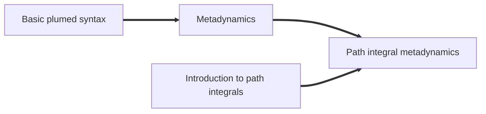

# Path integral metadynamics

Path integrals simulatins are able to describe the quantum thermodynamics
of distinguishable particles at finite temperature, and are the most accurate
approach to describe the behavior of light nuclei (e.g. hydrogen) at 
room temperature and above. 

They can be combined with metadynamics to accelerate the sampling of rare
events, and compute a "quantum free energies" that reflect (in an approximate
way) the effect of zero-point energy and tunneling on reaction rates. 

## Free-energy of the Zundel cation

This lecture provide a hands-on interactive tutorial (that you can also 
download and run locally) that uses the [i-PI code](http://ipi-code.org)
to perform path-integral simulations for the Zundel cation, a protonated
water dimer. PLUMED is used to compute appropriate collective variables,
using an input as follows



 Click on the labels of the actions for more information on what each action computes 

<table><tr><td style="padding:1px"></td></tr><tr><td style="padding:1px"></td></tr></table>

<pre style="width=97%;">
# default units are LENGTH=nm ENERGY=kJ/mol TIME=ps
<b name="NAVIGATION.md_working_1.datdoo" onclick='showPath("NAVIGATION.md_working_1.dat","NAVIGATION.md_working_1.datdoo","NAVIGATION.md_working_1.datdoo","black")'>doo</b>The DISTANCE action with label <b>doo</b> calculates the following quantities:<table  align="center" frame="void" width="95%" cellpadding="5%"><tr><td width="5%"><b> Quantity </b>  </td><td width="5%"><b> Type </b>  </td><td><b> Description </b> </td></tr><tr><td width="5%">doo</td><td width="5%">scalar</td><td>the DISTANCE between this pair of atoms</td></tr></table>: 
DISTANCE
Calculate the distance between a pair of atoms. <a href="https://www.plumed.org/doc-master/user-doc/html/_d_i_s_t_a_n_c_e.html" style="color:green">More details</a><i></i>

 
ATOMS
the pair of atom that we are calculating the distance between<i></i>

=1,2 
<b name="NAVIGATION.md_working_1.datco1" onclick='showPath("NAVIGATION.md_working_1.dat","NAVIGATION.md_working_1.datco1","NAVIGATION.md_working_1.datco1_shortcut","blue")'>co1</b>The DISTANCES action with label <b>co1</b> calculates the following quantities:<table  align="center" frame="void" width="95%" cellpadding="5%"><tr><td width="5%"><b> Quantity </b>  </td><td width="5%"><b> Type </b>  </td><td><b> Description </b> </td></tr><tr><td width="5%">co1</td><td width="5%">vector</td><td>the DISTANCES between the each pair of atoms that were specified</td></tr><tr><td width="5%">co1_lessthan</td><td width="5%">scalar</td><td>the number of colvars that have a value less than a threshold</td></tr></table>: 
DISTANCES
Calculate the distances between multiple piars of atoms This action is <a class="toggler" href='javascript:;' onclick='toggleDisplay("NAVIGATION.md_working_1.datco1");'>a shortcut</a>. <a href="https://www.plumed.org/doc-master/user-doc/html/_d_i_s_t_a_n_c_e_s.html">More details</a><i></i>

 
GROUPA
Calculate the distances between all the atoms in GROUPA and all the atoms in GROUPB<i></i>

=1 
GROUPB
Calculate the distances between all the atoms in GROUPA and all the atoms in GROUPB<i></i>

=3-7 
LESS_THAN
calculate the number of variables that are less than a certain target value<i></i>

={RATIONAL R_0=0.14}
# PLUMED interprets the command:
# co1: DISTANCES GROUPA=1 GROUPB=3-7 LESS_THAN={RATIONAL R_0=0.14}
# as follows (Click the red comment above to revert to the short version of the input):
<b name="NAVIGATION.md_working_1.datco1_vatom1" onclick='showPath("NAVIGATION.md_working_1.dat","NAVIGATION.md_working_1.datco1_vatom1","NAVIGATION.md_working_1.datco1_vatom1","violet")'>co1_vatom1</b>The CENTER_FAST action with label <b>co1_vatom1</b> calculates the following quantities:<table  align="center" frame="void" width="95%" cellpadding="5%"><tr><td width="5%"><b> Quantity </b>  </td><td width="5%"><b> Type </b>  </td><td><b> Description </b> </td></tr><tr><td width="5%">co1_vatom1</td><td width="5%">atoms</td><td>virtual atom calculated by CENTER_FAST action</td></tr></table>: 
CENTER
Calculate the center for a group of atoms, with arbitrary weights. <a href="https://www.plumed.org/doc-master/user-doc/html/_c_e_n_t_e_r.html" style="color:green">More details</a><i></i>

 
ATOMS
the group of atoms that you are calculating the Gyration Tensor for<i></i>

=1,3 
<b name="NAVIGATION.md_working_1.datco1_vatom2" onclick='showPath("NAVIGATION.md_working_1.dat","NAVIGATION.md_working_1.datco1_vatom2","NAVIGATION.md_working_1.datco1_vatom2","violet")'>co1_vatom2</b>The CENTER_FAST action with label <b>co1_vatom2</b> calculates the following quantities:<table  align="center" frame="void" width="95%" cellpadding="5%"><tr><td width="5%"><b> Quantity </b>  </td><td width="5%"><b> Type </b>  </td><td><b> Description </b> </td></tr><tr><td width="5%">co1_vatom2</td><td width="5%">atoms</td><td>virtual atom calculated by CENTER_FAST action</td></tr></table>: 
CENTER
Calculate the center for a group of atoms, with arbitrary weights. <a href="https://www.plumed.org/doc-master/user-doc/html/_c_e_n_t_e_r.html" style="color:green">More details</a><i></i>

 
ATOMS
the group of atoms that you are calculating the Gyration Tensor for<i></i>

=1,4 
<b name="NAVIGATION.md_working_1.datco1_vatom3" onclick='showPath("NAVIGATION.md_working_1.dat","NAVIGATION.md_working_1.datco1_vatom3","NAVIGATION.md_working_1.datco1_vatom3","violet")'>co1_vatom3</b>The CENTER_FAST action with label <b>co1_vatom3</b> calculates the following quantities:<table  align="center" frame="void" width="95%" cellpadding="5%"><tr><td width="5%"><b> Quantity </b>  </td><td width="5%"><b> Type </b>  </td><td><b> Description </b> </td></tr><tr><td width="5%">co1_vatom3</td><td width="5%">atoms</td><td>virtual atom calculated by CENTER_FAST action</td></tr></table>: 
CENTER
Calculate the center for a group of atoms, with arbitrary weights. <a href="https://www.plumed.org/doc-master/user-doc/html/_c_e_n_t_e_r.html" style="color:green">More details</a><i></i>

 
ATOMS
the group of atoms that you are calculating the Gyration Tensor for<i></i>

=1,5 
<b name="NAVIGATION.md_working_1.datco1_vatom4" onclick='showPath("NAVIGATION.md_working_1.dat","NAVIGATION.md_working_1.datco1_vatom4","NAVIGATION.md_working_1.datco1_vatom4","violet")'>co1_vatom4</b>The CENTER_FAST action with label <b>co1_vatom4</b> calculates the following quantities:<table  align="center" frame="void" width="95%" cellpadding="5%"><tr><td width="5%"><b> Quantity </b>  </td><td width="5%"><b> Type </b>  </td><td><b> Description </b> </td></tr><tr><td width="5%">co1_vatom4</td><td width="5%">atoms</td><td>virtual atom calculated by CENTER_FAST action</td></tr></table>: 
CENTER
Calculate the center for a group of atoms, with arbitrary weights. <a href="https://www.plumed.org/doc-master/user-doc/html/_c_e_n_t_e_r.html" style="color:green">More details</a><i></i>

 
ATOMS
the group of atoms that you are calculating the Gyration Tensor for<i></i>

=1,6 
<b name="NAVIGATION.md_working_1.datco1_vatom5" onclick='showPath("NAVIGATION.md_working_1.dat","NAVIGATION.md_working_1.datco1_vatom5","NAVIGATION.md_working_1.datco1_vatom5","violet")'>co1_vatom5</b>The CENTER_FAST action with label <b>co1_vatom5</b> calculates the following quantities:<table  align="center" frame="void" width="95%" cellpadding="5%"><tr><td width="5%"><b> Quantity </b>  </td><td width="5%"><b> Type </b>  </td><td><b> Description </b> </td></tr><tr><td width="5%">co1_vatom5</td><td width="5%">atoms</td><td>virtual atom calculated by CENTER_FAST action</td></tr></table>: 
CENTER
Calculate the center for a group of atoms, with arbitrary weights. <a href="https://www.plumed.org/doc-master/user-doc/html/_c_e_n_t_e_r.html" style="color:green">More details</a><i></i>

 
ATOMS
the group of atoms that you are calculating the Gyration Tensor for<i></i>

=1,7 
<b name="NAVIGATION.md_working_1.datco1_grp" onclick='showPath("NAVIGATION.md_working_1.dat","NAVIGATION.md_working_1.datco1_grp","NAVIGATION.md_working_1.datco1_grp","violet")'>co1_grp</b>The GROUP action with label <b>co1_grp</b> calculates the following quantities:<table  align="center" frame="void" width="95%" cellpadding="5%"><tr><td width="5%"><b> Quantity </b>  </td><td width="5%"><b> Type </b>  </td><td><b> Description </b> </td></tr><tr><td width="5%">co1_grp</td><td width="5%">atoms</td><td>indices of atoms specified in GROUP</td></tr></table>: 
GROUP
Define a group of atoms so that a particular list of atoms can be referenced with a single label in definitions of CVs or virtual atoms. <a href="https://www.plumed.org/doc-master/user-doc/html/_g_r_o_u_p.html" style="color:green">More details</a><i></i>

 
ATOMS
the numerical indexes for the set of atoms in the group<i></i>

=<b name="NAVIGATION.md_working_1.datco1_vatom1">co1_vatom1</b>,<b name="NAVIGATION.md_working_1.datco1_vatom2">co1_vatom2</b>,<b name="NAVIGATION.md_working_1.datco1_vatom3">co1_vatom3</b>,<b name="NAVIGATION.md_working_1.datco1_vatom4">co1_vatom4</b>,<b name="NAVIGATION.md_working_1.datco1_vatom5">co1_vatom5</b> 
<b name="NAVIGATION.md_working_1.datco1" onclick='showPath("NAVIGATION.md_working_1.dat","NAVIGATION.md_working_1.datco1","NAVIGATION.md_working_1.datco1","blue")'>co1</b>The DISTANCE action with label <b>co1</b> calculates the following quantities:<table  align="center" frame="void" width="95%" cellpadding="5%"><tr><td width="5%"><b> Quantity </b>  </td><td width="5%"><b> Type </b>  </td><td><b> Description </b> </td></tr><tr><td width="5%">co1</td><td width="5%">vector</td><td>the DISTANCE for each set of specified atoms</td></tr></table>: 
DISTANCE
Calculate the distance between a pair of atoms. <a href="https://www.plumed.org/doc-master/user-doc/html/_d_i_s_t_a_n_c_e.html" style="color:green">More details</a><i></i>

 
ATOMS1
the pair of atom that we are calculating the distance between<i></i>

=1,3 
ATOMS2
the pair of atom that we are calculating the distance between<i></i>

=1,4 
ATOMS3
the pair of atom that we are calculating the distance between<i></i>

=1,5 
ATOMS4
the pair of atom that we are calculating the distance between<i></i>

=1,6 
ATOMS5
the pair of atom that we are calculating the distance between<i></i>

=1,7 
<b name="NAVIGATION.md_working_1.datco1_lt" onclick='showPath("NAVIGATION.md_working_1.dat","NAVIGATION.md_working_1.datco1_lt","NAVIGATION.md_working_1.datco1_lt","blue")'>co1_lt</b>The LESS_THAN action with label <b>co1_lt</b> calculates the following quantities:<table  align="center" frame="void" width="95%" cellpadding="5%"><tr><td width="5%"><b> Quantity </b>  </td><td width="5%"><b> Type </b>  </td><td><b> Description </b> </td></tr><tr><td width="5%">co1_lt</td><td width="5%">vector</td><td>the vector obtained by doing an element-wise application of a function that is one if the input is less than a threshold to the input vectors</td></tr></table>: 
LESS_THAN
Use a switching function to determine how many of the input variables are less than a certain cutoff. <a href="https://www.plumed.org/doc-master/user-doc/html/_l_e_s_s__t_h_a_n.html" style="color:green">More details</a><i></i>

 
ARG
the values input to this function<i></i>

=<b name="NAVIGATION.md_working_1.datco1">co1</b> 
SWITCH
This keyword is used if you want to employ an alternative to the continuous swiching function defined above<i></i>

={RATIONAL R_0=0.14}
<b name="NAVIGATION.md_working_1.datco1_lessthan" onclick='showPath("NAVIGATION.md_working_1.dat","NAVIGATION.md_working_1.datco1_lessthan","NAVIGATION.md_working_1.datco1_lessthan","black")'>co1_lessthan</b>The SUM action with label <b>co1_lessthan</b> calculates the following quantities:<table  align="center" frame="void" width="95%" cellpadding="5%"><tr><td width="5%"><b> Quantity </b>  </td><td width="5%"><b> Type </b>  </td><td><b> Description </b> </td></tr><tr><td width="5%">co1_lessthan</td><td width="5%">scalar</td><td>the sum of all the elements in the input vector</td></tr></table>: 
SUM
Calculate the sum of the arguments <a href="https://www.plumed.org/doc-master/user-doc/html/_s_u_m.html" style="color:green">More details</a><i></i>

 
ARG
the values input to this function<i></i>

=<b name="NAVIGATION.md_working_1.datco1_lt">co1_lt</b> 
PERIODIC
if the output of your function is periodic then you should specify the periodicity of the function<i></i>

=NO
# --- End of included input --- <b name="NAVIGATION.md_working_1.datco2" onclick='showPath("NAVIGATION.md_working_1.dat","NAVIGATION.md_working_1.datco2","NAVIGATION.md_working_1.datco2_shortcut","blue")'>co2</b>The DISTANCES action with label <b>co2</b> calculates the following quantities:<table  align="center" frame="void" width="95%" cellpadding="5%"><tr><td width="5%"><b> Quantity </b>  </td><td width="5%"><b> Type </b>  </td><td><b> Description </b> </td></tr><tr><td width="5%">co2</td><td width="5%">vector</td><td>the DISTANCES between the each pair of atoms that were specified</td></tr><tr><td width="5%">co2_lessthan</td><td width="5%">scalar</td><td>the number of colvars that have a value less than a threshold</td></tr></table>: 
DISTANCES
Calculate the distances between multiple piars of atoms This action is <a class="toggler" href='javascript:;' onclick='toggleDisplay("NAVIGATION.md_working_1.datco2");'>a shortcut</a>. <a href="https://www.plumed.org/doc-master/user-doc/html/_d_i_s_t_a_n_c_e_s.html">More details</a><i></i>

 
GROUPA
Calculate the distances between all the atoms in GROUPA and all the atoms in GROUPB<i></i>

=2 
GROUPB
Calculate the distances between all the atoms in GROUPA and all the atoms in GROUPB<i></i>

=3-7 
LESS_THAN
calculate the number of variables that are less than a certain target value<i></i>

={RATIONAL R_0=0.14}
# PLUMED interprets the command:
# co2: DISTANCES GROUPA=2 GROUPB=3-7 LESS_THAN={RATIONAL R_0=0.14}
# as follows (Click the red comment above to revert to the short version of the input):
<b name="NAVIGATION.md_working_1.datco2_vatom1" onclick='showPath("NAVIGATION.md_working_1.dat","NAVIGATION.md_working_1.datco2_vatom1","NAVIGATION.md_working_1.datco2_vatom1","violet")'>co2_vatom1</b>The CENTER_FAST action with label <b>co2_vatom1</b> calculates the following quantities:<table  align="center" frame="void" width="95%" cellpadding="5%"><tr><td width="5%"><b> Quantity </b>  </td><td width="5%"><b> Type </b>  </td><td><b> Description </b> </td></tr><tr><td width="5%">co2_vatom1</td><td width="5%">atoms</td><td>virtual atom calculated by CENTER_FAST action</td></tr></table>: 
CENTER
Calculate the center for a group of atoms, with arbitrary weights. <a href="https://www.plumed.org/doc-master/user-doc/html/_c_e_n_t_e_r.html" style="color:green">More details</a><i></i>

 
ATOMS
the group of atoms that you are calculating the Gyration Tensor for<i></i>

=2,3 
<b name="NAVIGATION.md_working_1.datco2_vatom2" onclick='showPath("NAVIGATION.md_working_1.dat","NAVIGATION.md_working_1.datco2_vatom2","NAVIGATION.md_working_1.datco2_vatom2","violet")'>co2_vatom2</b>The CENTER_FAST action with label <b>co2_vatom2</b> calculates the following quantities:<table  align="center" frame="void" width="95%" cellpadding="5%"><tr><td width="5%"><b> Quantity </b>  </td><td width="5%"><b> Type </b>  </td><td><b> Description </b> </td></tr><tr><td width="5%">co2_vatom2</td><td width="5%">atoms</td><td>virtual atom calculated by CENTER_FAST action</td></tr></table>: 
CENTER
Calculate the center for a group of atoms, with arbitrary weights. <a href="https://www.plumed.org/doc-master/user-doc/html/_c_e_n_t_e_r.html" style="color:green">More details</a><i></i>

 
ATOMS
the group of atoms that you are calculating the Gyration Tensor for<i></i>

=2,4 
<b name="NAVIGATION.md_working_1.datco2_vatom3" onclick='showPath("NAVIGATION.md_working_1.dat","NAVIGATION.md_working_1.datco2_vatom3","NAVIGATION.md_working_1.datco2_vatom3","violet")'>co2_vatom3</b>The CENTER_FAST action with label <b>co2_vatom3</b> calculates the following quantities:<table  align="center" frame="void" width="95%" cellpadding="5%"><tr><td width="5%"><b> Quantity </b>  </td><td width="5%"><b> Type </b>  </td><td><b> Description </b> </td></tr><tr><td width="5%">co2_vatom3</td><td width="5%">atoms</td><td>virtual atom calculated by CENTER_FAST action</td></tr></table>: 
CENTER
Calculate the center for a group of atoms, with arbitrary weights. <a href="https://www.plumed.org/doc-master/user-doc/html/_c_e_n_t_e_r.html" style="color:green">More details</a><i></i>

 
ATOMS
the group of atoms that you are calculating the Gyration Tensor for<i></i>

=2,5 
<b name="NAVIGATION.md_working_1.datco2_vatom4" onclick='showPath("NAVIGATION.md_working_1.dat","NAVIGATION.md_working_1.datco2_vatom4","NAVIGATION.md_working_1.datco2_vatom4","violet")'>co2_vatom4</b>The CENTER_FAST action with label <b>co2_vatom4</b> calculates the following quantities:<table  align="center" frame="void" width="95%" cellpadding="5%"><tr><td width="5%"><b> Quantity </b>  </td><td width="5%"><b> Type </b>  </td><td><b> Description </b> </td></tr><tr><td width="5%">co2_vatom4</td><td width="5%">atoms</td><td>virtual atom calculated by CENTER_FAST action</td></tr></table>: 
CENTER
Calculate the center for a group of atoms, with arbitrary weights. <a href="https://www.plumed.org/doc-master/user-doc/html/_c_e_n_t_e_r.html" style="color:green">More details</a><i></i>

 
ATOMS
the group of atoms that you are calculating the Gyration Tensor for<i></i>

=2,6 
<b name="NAVIGATION.md_working_1.datco2_vatom5" onclick='showPath("NAVIGATION.md_working_1.dat","NAVIGATION.md_working_1.datco2_vatom5","NAVIGATION.md_working_1.datco2_vatom5","violet")'>co2_vatom5</b>The CENTER_FAST action with label <b>co2_vatom5</b> calculates the following quantities:<table  align="center" frame="void" width="95%" cellpadding="5%"><tr><td width="5%"><b> Quantity </b>  </td><td width="5%"><b> Type </b>  </td><td><b> Description </b> </td></tr><tr><td width="5%">co2_vatom5</td><td width="5%">atoms</td><td>virtual atom calculated by CENTER_FAST action</td></tr></table>: 
CENTER
Calculate the center for a group of atoms, with arbitrary weights. <a href="https://www.plumed.org/doc-master/user-doc/html/_c_e_n_t_e_r.html" style="color:green">More details</a><i></i>

 
ATOMS
the group of atoms that you are calculating the Gyration Tensor for<i></i>

=2,7 
<b name="NAVIGATION.md_working_1.datco2_grp" onclick='showPath("NAVIGATION.md_working_1.dat","NAVIGATION.md_working_1.datco2_grp","NAVIGATION.md_working_1.datco2_grp","violet")'>co2_grp</b>The GROUP action with label <b>co2_grp</b> calculates the following quantities:<table  align="center" frame="void" width="95%" cellpadding="5%"><tr><td width="5%"><b> Quantity </b>  </td><td width="5%"><b> Type </b>  </td><td><b> Description </b> </td></tr><tr><td width="5%">co2_grp</td><td width="5%">atoms</td><td>indices of atoms specified in GROUP</td></tr></table>: 
GROUP
Define a group of atoms so that a particular list of atoms can be referenced with a single label in definitions of CVs or virtual atoms. <a href="https://www.plumed.org/doc-master/user-doc/html/_g_r_o_u_p.html" style="color:green">More details</a><i></i>

 
ATOMS
the numerical indexes for the set of atoms in the group<i></i>

=<b name="NAVIGATION.md_working_1.datco2_vatom1">co2_vatom1</b>,<b name="NAVIGATION.md_working_1.datco2_vatom2">co2_vatom2</b>,<b name="NAVIGATION.md_working_1.datco2_vatom3">co2_vatom3</b>,<b name="NAVIGATION.md_working_1.datco2_vatom4">co2_vatom4</b>,<b name="NAVIGATION.md_working_1.datco2_vatom5">co2_vatom5</b> 
<b name="NAVIGATION.md_working_1.datco2" onclick='showPath("NAVIGATION.md_working_1.dat","NAVIGATION.md_working_1.datco2","NAVIGATION.md_working_1.datco2","blue")'>co2</b>The DISTANCE action with label <b>co2</b> calculates the following quantities:<table  align="center" frame="void" width="95%" cellpadding="5%"><tr><td width="5%"><b> Quantity </b>  </td><td width="5%"><b> Type </b>  </td><td><b> Description </b> </td></tr><tr><td width="5%">co2</td><td width="5%">vector</td><td>the DISTANCE for each set of specified atoms</td></tr></table>: 
DISTANCE
Calculate the distance between a pair of atoms. <a href="https://www.plumed.org/doc-master/user-doc/html/_d_i_s_t_a_n_c_e.html" style="color:green">More details</a><i></i>

 
ATOMS1
the pair of atom that we are calculating the distance between<i></i>

=2,3 
ATOMS2
the pair of atom that we are calculating the distance between<i></i>

=2,4 
ATOMS3
the pair of atom that we are calculating the distance between<i></i>

=2,5 
ATOMS4
the pair of atom that we are calculating the distance between<i></i>

=2,6 
ATOMS5
the pair of atom that we are calculating the distance between<i></i>

=2,7 
<b name="NAVIGATION.md_working_1.datco2_lt" onclick='showPath("NAVIGATION.md_working_1.dat","NAVIGATION.md_working_1.datco2_lt","NAVIGATION.md_working_1.datco2_lt","blue")'>co2_lt</b>The LESS_THAN action with label <b>co2_lt</b> calculates the following quantities:<table  align="center" frame="void" width="95%" cellpadding="5%"><tr><td width="5%"><b> Quantity </b>  </td><td width="5%"><b> Type </b>  </td><td><b> Description </b> </td></tr><tr><td width="5%">co2_lt</td><td width="5%">vector</td><td>the vector obtained by doing an element-wise application of a function that is one if the input is less than a threshold to the input vectors</td></tr></table>: 
LESS_THAN
Use a switching function to determine how many of the input variables are less than a certain cutoff. <a href="https://www.plumed.org/doc-master/user-doc/html/_l_e_s_s__t_h_a_n.html" style="color:green">More details</a><i></i>

 
ARG
the values input to this function<i></i>

=<b name="NAVIGATION.md_working_1.datco2">co2</b> 
SWITCH
This keyword is used if you want to employ an alternative to the continuous swiching function defined above<i></i>

={RATIONAL R_0=0.14}
<b name="NAVIGATION.md_working_1.datco2_lessthan" onclick='showPath("NAVIGATION.md_working_1.dat","NAVIGATION.md_working_1.datco2_lessthan","NAVIGATION.md_working_1.datco2_lessthan","black")'>co2_lessthan</b>The SUM action with label <b>co2_lessthan</b> calculates the following quantities:<table  align="center" frame="void" width="95%" cellpadding="5%"><tr><td width="5%"><b> Quantity </b>  </td><td width="5%"><b> Type </b>  </td><td><b> Description </b> </td></tr><tr><td width="5%">co2_lessthan</td><td width="5%">scalar</td><td>the sum of all the elements in the input vector</td></tr></table>: 
SUM
Calculate the sum of the arguments <a href="https://www.plumed.org/doc-master/user-doc/html/_s_u_m.html" style="color:green">More details</a><i></i>

 
ARG
the values input to this function<i></i>

=<b name="NAVIGATION.md_working_1.datco2_lt">co2_lt</b> 
PERIODIC
if the output of your function is periodic then you should specify the periodicity of the function<i></i>

=NO
# --- End of included input --- <b name="NAVIGATION.md_working_1.datdc" onclick='showPath("NAVIGATION.md_working_1.dat","NAVIGATION.md_working_1.datdc","NAVIGATION.md_working_1.datdc","black")'>dc</b>The COMBINE action with label <b>dc</b> calculates the following quantities:<table  align="center" frame="void" width="95%" cellpadding="5%"><tr><td width="5%"><b> Quantity </b>  </td><td width="5%"><b> Type </b>  </td><td><b> Description </b> </td></tr><tr><td width="5%">dc</td><td width="5%">scalar</td><td>a linear compbination</td></tr></table>: 
COMBINE
Calculate a polynomial combination of a set of other variables. <a href="https://www.plumed.org/doc-master/user-doc/html/_c_o_m_b_i_n_e.html" style="color:green">More details</a><i></i>

 
ARG
the values input to this function<i></i>

=<b name="NAVIGATION.md_working_1.datco1">co1.lessthan</b>,<b name="NAVIGATION.md_working_1.datco2">co2.lessthan</b> 
COEFFICIENTS
 the coefficients of the arguments in your function<i></i>

=1,-1 
PERIODIC
if the output of your function is periodic then you should specify the periodicity of the function<i></i>

=NO
<b name="NAVIGATION.md_working_1.datmtd" onclick='showPath("NAVIGATION.md_working_1.dat","NAVIGATION.md_working_1.datmtd","NAVIGATION.md_working_1.datmtd","black")'>mtd</b>The METAD action with label <b>mtd</b> calculates the following quantities:<table  align="center" frame="void" width="95%" cellpadding="5%"><tr><td width="5%"><b> Quantity </b>  </td><td width="5%"><b> Type </b>  </td><td><b> Description </b> </td></tr><tr><td width="5%">mtd.bias</td><td width="5%">scalar</td><td>the instantaneous value of the bias potential</td></tr></table>:   
METAD
Used to performed metadynamics on one or more collective variables. <a href="https://www.plumed.org/doc-master/user-doc/html/_m_e_t_a_d.html" style="color:green">More details</a><i></i>

 
ARG
the labels of the scalars on which the bias will act<i></i>

=<b name="NAVIGATION.md_working_1.datdoo">doo</b>,<b name="NAVIGATION.md_working_1.datdc">dc</b> 
PACE
the frequency for hill addition<i></i>

=10 
SIGMA
the widths of the Gaussian hills<i></i>

=0.005,0.05 
HEIGHT
the heights of the Gaussian hills<i></i>

=4 
FILE
 a file in which the list of added hills is stored<i></i>

=HILLS-pimd 
BIASFACTOR
use well tempered metadynamics and use this bias factor<i></i>

=10 
TEMP
the system temperature - this is only needed if you are doing well-tempered metadynamics<i></i>

=300
<b name="NAVIGATION.md_working_1.datuwall" onclick='showPath("NAVIGATION.md_working_1.dat","NAVIGATION.md_working_1.datuwall","NAVIGATION.md_working_1.datuwall","black")'>uwall</b>The UPPER_WALLS action with label <b>uwall</b> calculates the following quantities:<table  align="center" frame="void" width="95%" cellpadding="5%"><tr><td width="5%"><b> Quantity </b>  </td><td width="5%"><b> Type </b>  </td><td><b> Description </b> </td></tr><tr><td width="5%">uwall.bias</td><td width="5%">scalar</td><td>the instantaneous value of the bias potential</td></tr><tr><td width="5%">uwall.force2</td><td width="5%">scalar</td><td>the instantaneous value of the squared force due to this bias potential</td></tr></table>: 
UPPER_WALLS
Defines a wall for the value of one or more collective variables, <a href="https://www.plumed.org/doc-master/user-doc/html/_u_p_p_e_r__w_a_l_l_s.html" style="color:green">More details</a><i></i>

 
ARG
the arguments on which the bias is acting<i></i>

=<b name="NAVIGATION.md_working_1.datdoo">doo</b> 
AT
the positions of the wall<i></i>

=0.4 
KAPPA
the force constant for the wall<i></i>

=250
 
PRINT
Print quantities to a file. <a href="https://www.plumed.org/doc-master/user-doc/html/_p_r_i_n_t.html" style="color:green">More details</a><i></i>

 
ARG
the labels of the values that you would like to print to the file<i></i>

=<b name="NAVIGATION.md_working_1.datdoo">doo</b>,<b name="NAVIGATION.md_working_1.datco1">co1.*</b>,<b name="NAVIGATION.md_working_1.datco2">co2.*</b>,<b name="NAVIGATION.md_working_1.datdc">dc</b>,<b name="NAVIGATION.md_working_1.datmtd">mtd.*</b>,<b name="NAVIGATION.md_working_1.datuwall">uwall</b> 
STRIDE
 the frequency with which the quantities of interest should be output<i></i>

=10 
FILE
the name of the file on which to output these quantities<i></i>

=COLVAR-pimd
The PRINT action with label <b></b> calculates something
FLUSH
This command instructs plumed to flush all the open files with a user specified frequency. <a href="https://www.plumed.org/doc-master/user-doc/html/_f_l_u_s_h.html" style="color:green">More details</a><i></i>

 
STRIDE
the frequency with which all the open files should be flushed<i></i>

=1
</pre>
  

Depending on your previous experience, you may want to follow the 
lessons on metadynamics, and the external tutorial on path integral
simulations.

