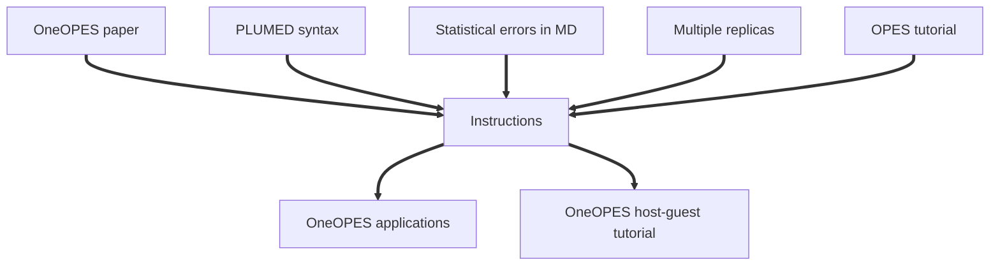

# Tutorial: Mastering Enhanced Sampling with OneOPES

This tutorial was first given at the [Next-Generation Molecular Modeling Summer School 2026](https://github.com/crs4/NGMM2026).

It is a self-contained tutorial that guides the user in performing enhanced sampling simulations, starting from the basics to dealing with suboptimal collective variables and introducing replica exchange.

Users are encouraged to read the main reference paper and to follow the suggested accessory tutorials, from the basics of PLUMED syntax until the OPES tutorial. These tasks are given as inputs in the flow chart below.

A number of OneOPES applications and a tutorial on OneOPES applied to host-guest systems are refereed as outputs in the flow chart.

## References
1. Invernizzi, Piaggi, and Parrinello, [Unified Approach to Enhanced Sampling](https://journals.aps.org/prx/abstract/10.1103/PhysRevX.10.041034), PRX (2020)
2. Invernizzi and Parrinello, [Exploration vs Convergence Speed in Adaptive-Bias Enhanced Sampling](https://pubs.acs.org/doi/10.1021/acs.jctc.2c00152), JCTC (2022)
3. Rizzi, Aureli, Ansari and Gervasio, [OneOPES, a Combined Enhanced Sampling Method to Rule Them All](https://pubs.acs.org/doi/10.1021/acs.jctc.3c00254), JCTC (2023)

<b><a href="https://www.plumed.org/doc-master/user-doc/html/actionlist/?actions=DISTANCE,TORSION,MOLINFO,PRINT,ENERGY,ENDPLUMED,OPES_EXPANDED,OPES_METAD_EXPLORE,ECV_MULTITHERMAL" target="_blank">Click here</a> to open manual pages for actions discussed in this tutorial.</b>

