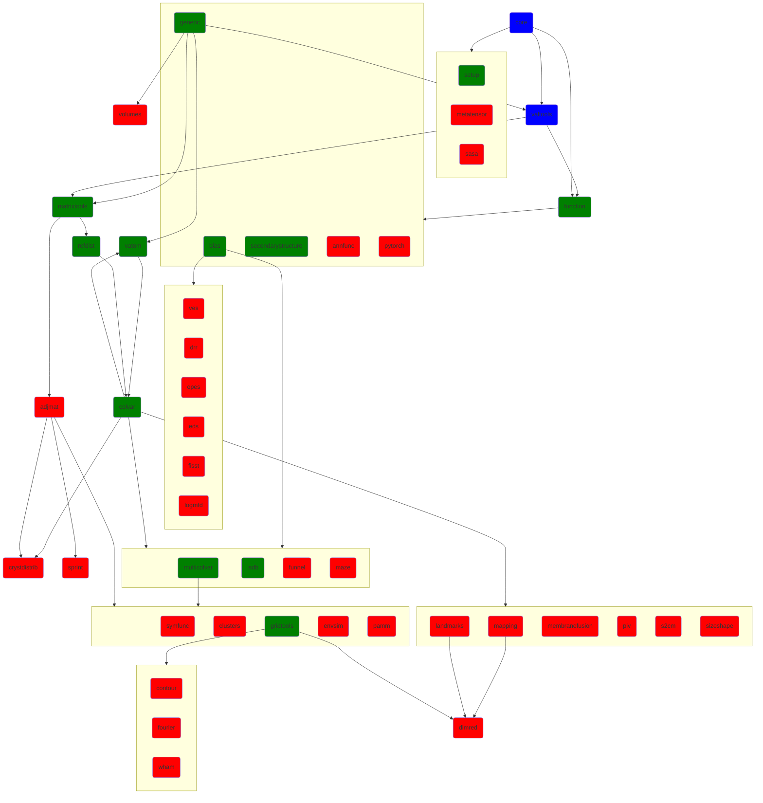

The PLUMED CODE
------------------------

PLUMED is a community-developed code that can be used to incorporate additional functionality into multiple molecular dynamics codes and for analysing 
trajectories. PLUMED is a composed of a modules that contain a variety of different functionalities but that share a common basic syntax. You can find 
a list of the modules that are available within PLUMED in the following graph. The graph also shows the interdependencies between the various modules. 
If you click on the modules in the graph module-specific information will open.  The colors of the nodes in the graph below indicate whether the module
is always compiled (blue), on by default (green) or off by default (red).  If you need a feature from a module that is by default off you need to explicitly tell
PLUMED to include it during the configure stage by using:

```bash
./configure --enable-module=module-name
```

Each module contains implementations of a number of [actions](action.md). You can find a list of all the actions implemented in in PLUMED [here](manual/actionlist.md).

Please also note that some developers prefer not to include their codes in PLUMED.  To use functionality that has been written by these developed you can use the LOAD command. 

If you are completely unfamiliar with PLUMED we would recommend that you start by working through [the following tutorial](https://www.plumed-tutorials.org/lessons/21/001/data/NAVIGATION.html).


